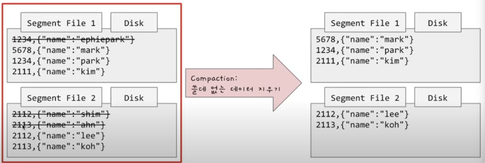
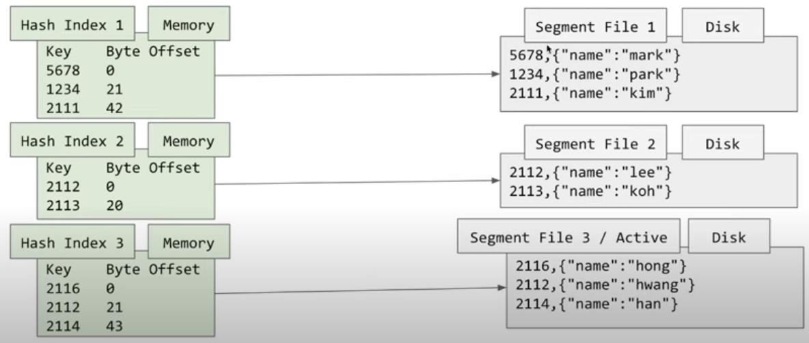
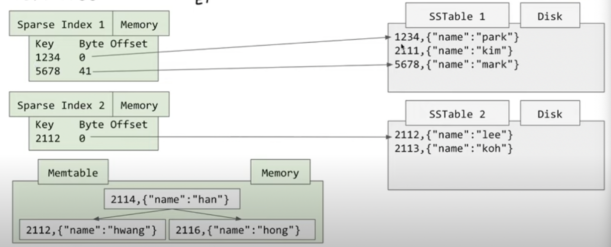
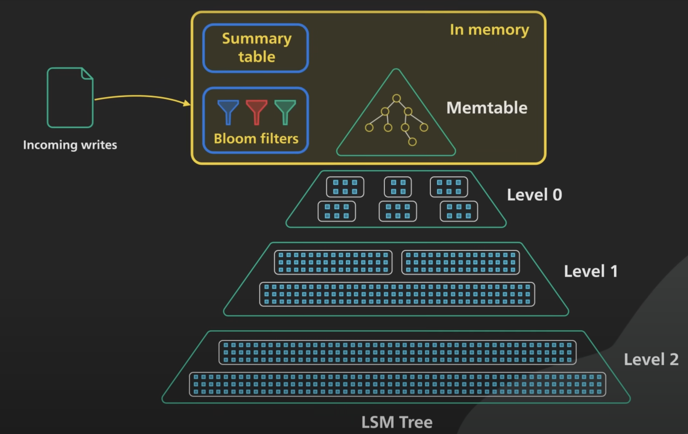

## Log Structured Storage Engine

LSM Tree에 대해 알아보기 전에 Log Structured Storage Engine에 대해 알아보자.

이를 단순히 설명하면 append-only만 가능한 Key value store라 할 수 있다.

```bash
#!/bin/bash

db_set() {
	echo "$1,$2" >> database
}

db_get() {
	grep "$1, " database | sed -e "s/^/^$1,//" | tail -n 1
}
```

위 bash script를 보자.

- `do_set()`은 단순히 파일의 다음 줄에 key-value 쌍을 계속해서 저장한다.
- 반면 `do_get()`은 파일을 읽어 키와 일치하는 마지막 value를 반환한다.

set 성능은 단순히 새로운 내용을 추가하는 동작이기에 빠르게 처리가 가능하지만, get 성능은 파일 전체를 스캔해야해서 매우 느리다고 할 수 있다. 읽기 성능을 개선하기 위해서는 별도의 Index가 필요하다.

### Index

간단하게 in memory hash map을 이용하여 Hash 인덱스를 구현할 수 있다.

**Memory**

|key|Byte Offset|
|---|---|
|1234|47|
|5678|26|

**Disk**

|key|value|
|---|---|
|1234|{”name”:”ephiepark”}|
|5678|{”name”:”mark”}|
|1234|{”name”:”park”}|

memory에서는 byte offset을 저장함으로써 Disk의 저장 위치에 곧바로 접근이 가능하다. 이를 이용해 동일한 키가 여러개 저장되어 있어도 풀스캔 없이 데이터를 조회할 수 있다.

### Segment File과 Compaction

여전히 남아있는 문제는 DB 업데이트가 많을수록 쓸데없는 데이터가 차지하는 용량이 점점 많아진다는 점이다.

이런 문제는 Disk에 하나의 큰 파일을 가지고 있는 대신, 일정 크기가 넘어갈 때마다 별도의 Segment File로 분리함으로써 해결할 수 있다. 분리된 Segment File은 추가적인 append 작업이 없다는게 보장되기 때문에 각 파일 내에서 중복 key를 지우는 Compaction 작업을 수행할 수 있다.



그 결과 완성된 모습은 아래와 같다.


각 Segment File마다 별도의 Hash Index를 가지고 있다.

Read 요청 시 다음 순서로 조회가 이루어진다.

1. 가장 최근 Hash Index에서 key 조회
2. key가 조회되면 바로 해당 Segment File (Disk) 조회
3. key가 조회되지 않으면 이전 Hash Index에서 key 조회
4. 반복
5. 마지막 Hash Index(가장 오래된 Index)에서 발견하지 못하면 존재하지 않는 데이터임

### Log Structured Storage Engine의 단점

- 존재하는 모든 key가 메모리(Hash Index)에 들어갈 수 있어야 한다.
    - ex) 하나라도 memory에 들어가지 못한다면? ⇒ 해당 key는 Full disk scan 필요
- Range 쿼리가 어렵다.

## LSM Tree

LSM Tree는 Sorted String Table(이하 SSTable)을 사용해서 방금 말한 단점을 개선시킨다.

SSTable은 파일 안의 값들이 key로 정렬되어있다. 어떻게 파일 내 정렬을 보장하면서 append-only 방식으로 데이터를 넣는것일까?

LSM Tree는 key-value 추가 시, SSTable에 바로 데이터를 넣는 대신 메모리에 있는 balanced binary tree에 데이터를 먼저 추가한다. 메모리 내의 이런 트리 구조를 Memtable이라 부른다.

### 데이터 추가

Memtable이 일정 사이즈를 넘어가면 SSTable로 일괄 작성한다.

- Memtable이 정렬상태이므로 SSTable 작성 시 append only 방식으로 빠르게 입력 가능

그러면 SSTable에 작성하기 전 DB에 crash가 발생하면 어떻게 될까? 이런 문제 발생 시, memory만으로는 데이터 유실 가능성이 있기 때문에 여기서 Log File이라는 것을 사용한다.

Log File은 단순히 유저가 데이터를 추가한 순서대로 임시 데이터를 보관한다.

- Log File은 SSTable이 정상적으로 작성될 때마다 지워진다.

### 데이터 조회

1. Memtable 조회
2. 없으면 SSTable들을 순차적으로 조회

이 때 Memtable 조회에서 데이터를 찾지 못하면 Disk 조회가 필요하다는 문제가 있다. 따라서 메모리에 추가적인 인덱스를 만들어 놓는다.



기존의 Hash Index와 유사한듯 하지만, Sparse Index는 SSTable의 시작, 끝 값에 대한 offset만 가지고 있다.즉 메모리에 모든 키를 저장하지 않아도 된다는 장점이 있다. (이는 SSTable 자체가 모두 정렬 상태로 저장되어 있기 때문이다.) 이를 통해 key가 있는 SSTable을 어느정도 특정할 수 있다는 장점이 있다.
- Sparse Index 범위를 벗어난 Key에 대해 SSTable I/O를 아예 없앨 수 있다.
- Sparse Index 범위에 속하는 경우는 항상 SSTable을 살펴봐야 한다. (I/O 발생)

###  Bloom Filter

Sparse Index는 I/O를 줄이는 보조 장치는 될 수 있다. 그러나 존재하지 않는 key를 찾기 위해 많은 수의 SSTable 조회를 발생시킬 수 있다는 문제가 있다.

##### 문제 사례 예시
1. Memtable에서 key 2015에 대해 조회 ⇒ 없음
2. Sparse Index 2를 확인 ⇒ start key가 2112이므로 SSTable 조회 ⇒ 없음
3. Sparse Index 1을 확인 ⇒ start key가 1234, end key가 5678이므로 SSTable 조회 ⇒ 없음
이런 경우 어디에도 존재하지 않는 key를 찾기 위해 2회의 Disk I/O가 발생했다.
이를 개선하기 위해서는 Bloom Filter를 사용할 수 있다. 

**Bloom Filter는 존재하지 않는 key를 걸러내기 위해 사용할 수 있는 자료구조이다.** 
Bit Array와 여러 개의 Hash 함수를 이용해 특정 데이터가 존재하는지를 확인하는데 사용한다.
자세한 정리는 [잘 정리된 블로그](https://gngsn.tistory.com/201)가 많으니 참고하자.

Bloom Filter의 특징은
- 공간/시간의 절약, 대신 일부 에러를 허용
- false positive 방식으로 키 존재 유무를 알려준다.
	- 없다고 하면 -> 확실히 없음
	- 있다고 하면 -> 있을 수도 없을 수도 있음

이런 특징을 통해 key가 존재하지 않는 SSTable을 *상당히* 걸러낼 수 있다.

## 전체 구조

Memory

1. Memtable
2. Sparse(Summary) Index
3. Bloom Filter

Disk

1. SSTable


위는 최종적으로 구성된 보편적인 LSM Tree의 모습이다.

1. 사용자가 등록한 데이터는 Memtable에 쓰이며 여기서는 데이터를 이진 트리 구조로 정렬한다.
2. Memtable이 가득 차면 SSTable로 flush되며 이 때 Summary table(Index)가 생성된다.
	- 각 Memtable은 정렬 상태이기 때문에 SSTable flush 시 쓰기 속도가 최적화된다.
3. 위 과정이 반복되며 SSTable이 점점 늘어나면 공간 확보를 위한 Compaction이 수행된다. 작은 SSTable들은 Compaction을 통해 다음 Level의 SSTable로 만들어진다.
	- 각 SSTable은 정렬상태이기 때문에 merge sort 동작방식으로 빠른 병합을 보장한다.
4. 각 Level 별로 bloom filter가 만들어진다. 이는 존재하지 않는 key 검색 부하 등을 낮추는데 사용된다.

### 더 알아보면 좋을 내용

1. 각 SSTable이 정렬되어 있더라도 Range 조회에서 이를 어떻게 활용하지?

---
참고

- [https://jaeyeong951.medium.com/색인-index-의-두-가지-형태-lsm-트리-b-트리-7a4ab7887db5](https://jaeyeong951.medium.com/%EC%83%89%EC%9D%B8-index-%EC%9D%98-%EB%91%90-%EA%B0%80%EC%A7%80-%ED%98%95%ED%83%9C-lsm-%ED%8A%B8%EB%A6%AC-b-%ED%8A%B8%EB%A6%AC-7a4ab7887db5)
- https://www.youtube.com/watch?v=I6jB0nM9SKU&t=388s
- [https://www.youtube.com/watch?v=i_vmkaR1x-I&t=322s](https://www.youtube.com/watch?v=i_vmkaR1x-I&t=322s)
- [https://www.datastax.com/blog/leveled-compaction-apache-cassandra](https://www.datastax.com/blog/leveled-compaction-apache-cassandra)
- https://gngsn.tistory.com/201