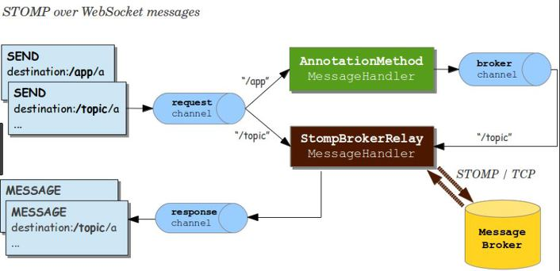

### Websocket

HTTP 환경에서 전이중 통신을 지원하기 위한 프로토콜

폴링 방식 및 Streaming 방식은 request-response의 지속적 수행 및 중복 패킷 전달 등 근본적인 문제를 지니고 있다. → 리소스 낭비가 큼

브라우저 환경에서는 TCP통신과 같은 **연결 지향 프로토콜**이 필요했다. 

- 웹 소켓은 HTTP를 통해 switching 및 Handshaking
- Binary 뿐만 아니라 Text 데이터 송수신 가능

### STOMP

- 단순 텍스트 기반 메세징 프로토콜
- 포맷은 아래와 같이 명령, 헤더, 바디(본문)로 이루어진다.

**클라이언트**

- 메세지를 보내기 위한 SEND, 수신 메세지를 구독하기 위한 SUBSCRIBE 명령 사용 가능
- destination 헤더를 통해 어디에 메세지를 전송하고, 구독할지 알려줄 수 있다. (pub/sub)

```
SUBSCRIBE
id:sub-0
destination:/chat/kBJeODHgyk64hMLOnXXE
```

```
SEND
Trace-Id:cadb8bc2a5a24a7ee55da7f5f5c439b1
API-Version:110
content-type:application/json;charset=utf-8
destination:/app/chat-api
content-length:223

{"tid":"cadb8bc2a5a24a7ee55da7f5f5c439b1","method":"/chat/sendMessage","params":{"Type":"NORMAL","content":"hello","attribute":"TEXT","optional":null}}
```

자주 쓰이는 destination prefix는 app, topic, queue 등이 있다.

- SUBSCRIBE의 destination에서 등록되지 않은 주제에 대해 구독하지 않도록 한다.

**서버**

```
MESSAGE
destination:/chat/cPdKAaq7iwTtMRCyJlxl
content-type:application/json;charset=UTF-8
subscription:sub-0
message-id:8eebc828-91e2-2890-1b4a-1eaa13827abb-3
content-length:380

{"tid":"cadb8bc2a5a24a7ee55da7f5f5c439b1","type":"MESSAGE","method":"/chat/sendMessage","jsonData":{~~~}}

MESSAGE
destination:/chat/cPdKAaq7iwTtMRCyJlxl
content-type:application/json;charset=UTF-8
subscription:sub-0
message-id:8eebc828-91e2-2890-1b4a-1eaa13827abb-2
content-length:141

{"tid":"cadb8bc2a5a24a7ee55da7f5f5c439b1","type":"RESPONSE","method":"/chat/sendMessage","jsonData":{~~~}}
```

메세지를 서버로 전송했을 때, 서버가 클라이언트로 보내는 RESPONSE와 구독자에게 보내는 MESSAGE까지 2개의 응답이 MESSAGE형식으로 확인된다.



SEND명령어를 사용할 때를 살펴보면 Prefix로 /app을 준 경우, request는 스프링 컨트롤러로 흘러가며 처리 과정을 통해 broker에게 전달된다. 반면, Prefix로 /topic을 준 경우 브로커에게 직접 접근한다. 이는 subscribe 과정에 사용될 수 있다.

다음은 spring docs의 상세한 예제이다.

```java
@Configuration
@EnableWebSocketMessageBroker
public class WebSocketConfig implements WebSocketMessageBrokerConfigurer {

    @Override
    public void registerStompEndpoints(StompEndpointRegistry registry) {
        registry.addEndpoint("/portfolio");
    }

    @Override
    public void configureMessageBroker(MessageBrokerRegistry registry) {
        registry.setApplicationDestinationPrefixes("/app");
        registry.enableSimpleBroker("/topic");
    }

}

@Controller
public class GreetingController {

    @MessageMapping("/greeting") {
    public String handle(String greeting) {
        return "[" + getTimestamp() + ": " + greeting;
    }

}
```

1. `"[http://localhost:8080/portfolio](http://localhost:8080/portfolio)"`으로 클라이언트 연결 활성화
2. 클라이언트가 `/topic/greeting`라는 destination 헤더 포함해 SUBSCRIBE 프레임 전송, 클라이언트 인바운드 채널로 전송되며 클라이언트 구독 정보를 저장하는 메세지 브로커로 라우팅
3. 클라이언트가 `/app/greeting`로 SEND 프레임 전송, `/app` prefix는 이를 annotated controller(GreetinCotroller)로 라우팅시킨다.
4. 컨트롤러의 리턴값은 spring 메세지로 변환 (리턴값의 페이로드, destination에 기초함)
5. 메세지브로커는 매치되는 구독자를 찾아 clientoutboundchannel을 통해 MESSAGE프레임 전송

다음은 스프링 프로젝트에서 필요한 STOMP관련 설정 예시이다.

WebsocketConfiguration

```java
@Override
protected void registerStompEndpoints(StompEndpointRegistry registry) {
    registry.addEndpoint("/stomp").setAllowedOrigins("*").setHandshakeHandler(HandshakeHandler).addInterceptors(stompHandshakeInterceptor);
}

@Override
public void configureMessageBroker(MessageBrokerRegistry config) {
    config.enableSimpleBroker("/chat").setTaskScheduler(heartBeatScheduler()).setHeartbeatValue(new long[]{10000, 10000});
    config.setApplicationDestinationPrefixes("/app");
    config.configureBrokerChannel().taskExecutor(brokerChannelTaskExecutor());
    config.setPreservePublishOrder(false);
    config.setUserRegistryOrder(99);
}
```

- `registry.addEndpoint("/stomp")`: 클라이언트에서 웹 소켓에 연결(connect)할 수 있는 엔드포인트 설정
- `enableSimpleBroker`: 해당 prefix를 갖는 메세지를 브로커에게 전달한다. 브로커는 클라이언트로 메세지를 전달할 때 이를 이용한다. 클라이언트 측에서는 해당 prefix을 갖는 destination을 SUBSCRIBE해야한다.
- `setApplicationDestinationPrefixes`: 클라이언트가 메세지를 전송할 때 prefix

클라이언트는 SEND나 SUBSCRIBE 명령을 통해 메시지의 내용과 수신 대상을 설명하는 “destination” 헤더와 함께 메시지에 대해 전송이나 구독한다. 이것은 브로커를 통해 연결된 다른 클라이언트로 메시지를 보내거나 서버로 메시지를 보내 일부 작업을 수행하도록 요청할 수 있는 pub/sub 메커니즘을 가능하게 한다.

웹소켓 설정

1. Receive Client
    - 메세지를 받기 위해 특정 토픽이 사전에 서버에 subscribe 되어야함
2. Send Client
    - 서버와 연결된 클라이언트는 특정 path로 메세지를 전달한다.
3. Broker
    - 메세지 브로커는 kafka, rabbitmq, activemq 등의 오픈소스들 처럼 MQ이며, pub/seb 모델을 따른다. 토픽에 따라 사용자를 구분한다.
    - 연결된 클라이언트 세션 관리
    - 특정 토픽 - 메세지 매핑 통해, 토픽을 구독하는 세션에 존재하는 클라이언트에 메세지 전달