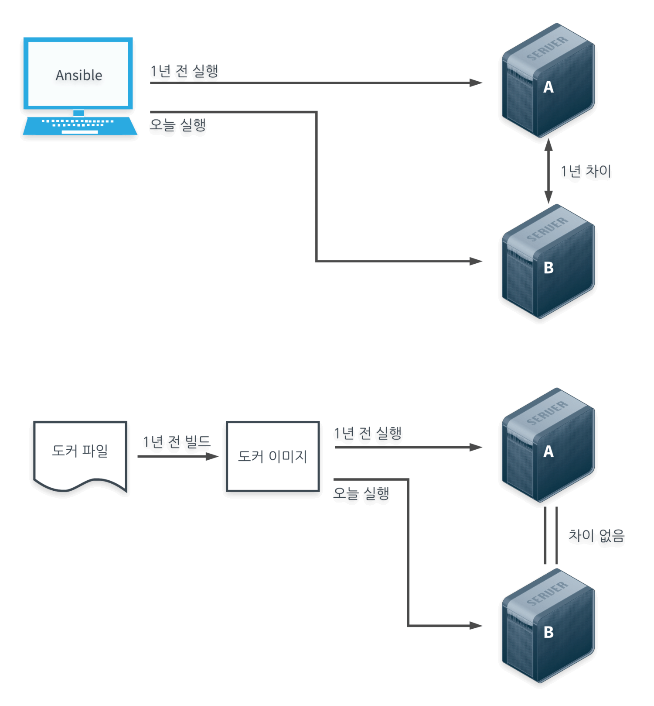

**서버를 코드로 구성하고 관리하는 방법으로써 장점을 갖는다.**

서버는 구성 시점에 따라 컴파일러, 설치된 패키지 등 차이가 발생하게 된다. 

*1년전 구성한 A 서버와 최근 새로 구성한 B 서버에 특정 도구 **C**를 설치한 뒤 웹 서비스를 업데이트해 배포했다. 이때 장애가 발생하면 원인은 다음과 같을 수 있다.*

1. 각 서버에 설치된 **C**의 버전이 다르다.
2. **C**가 의존하는 라이브러리 버전이 다르다.
3. 웹 서비스에서 **C**의 최신 버전 기능을 사용했다.
4. 웹 서비스의 업데이트 코드에 버그가 있다.

A 서버를 구성한 사람이 팀을 옮긴 경우 B 서버를 구성한 작업자는 A 서버가 구성되고 운영된 모든 과정을 파악하려 할 것이다.

→ 이런 상황에 있어서 도커는 개선책이 될 수 있다.

### 서버의 동일성 보장

- 도커 파일 = 서버 운용 기록
- 도커 이미지 = 도커 파일 + 실행 시점

실행 시점에 구애받지 않고 작업자가 구성 시점을 고정할 수 있다.

→ 서버를 항상 똑같은 상태로 만들 수 있다.

### 서비스 장애 없이 서버 수정 가능

도커 파일을 이미지로 빌드하며 미리 실패를 경험하고, 수정 작업을 진행할 수 있다. 실 서비스에서 발생할 장애를 방지한다.

### 도커 파일과 도커 이미지

도커 이미지로는 언제든 동일한 형태의 서버(컨테이너)를 실행할 수 있다.

그러나 서버에는 분명 바뀌어야 할 부분도 있다. 이 때 각 서버에서 바뀌어야할 부분은 환경변수를 통해 관리한다.

즉, **도커 컨테이너 = 도커 이미지 + 환경 변수** 가 된다.

### 코드화의 장점

1. 서버 견고성, 유연성
2. 다른 이가 만든 서버(이미지)를 SW처럼 가져다 사용할 수 있음
3. 하나의 이미지로 여러 컨테이너를 만드는 확장성