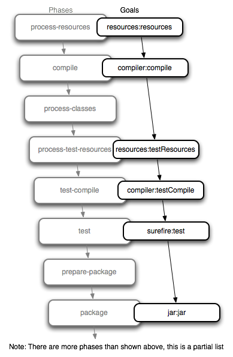

## 1. Maven

### 1-1. Maven이란

java 진영에서 사용되는 프로젝트 빌드, 관리 도구이다.

특징

- 빌드 절차 간소화
- 동일한 빌드 시스템 제공
- 프로젝트 정보 제공


### 1-2. Maven 구성요소

- `<groupId>` : 프로젝트의 패키지 명칭
- `<artifactId>` : artifact 이름, groupId 내에서 유일해야 한다.

    ```
      <groupId>org.springframework</groupId>
      <artifactId>spring-webmvc</artifactId>
    ```

- `<version>` : artifact 의 현재버전 ex. 1.0-SNAPSHOT
- `<name>` : 어플리케이션 명칭
- `<packaging>` : 패키징 유형(jar, war 등)
- `<distributionManagement>` : artifact가 배포될 저장소 정보와 설정
- `<parent>` : 프로젝트의 계층 정보
- `<dependencyManagement>` : 의존성 처리에 대한 기본 설정 영역
- `<dependencies>` : 의존성 정의 영역
- `<repositories>` : 이거 안쓰면 공식 maven 저장소를 활용하지만, 사용하면 거기 저장소를 사용
- `<build>` : 빌드에 사용할 플러그인 목록을 나열
- `<reporting>` : 리포팅에 사용할 플러그인 목록을 나열
- `<properties>` : 버전 값 등 static한 인자들을 관리할 때 사용

## 2. Maven build

### 2-1. Goal

실제 작업, Maven 최소 실행 단위

### 2-2. Plugin

Maven에서 제공되는 모든 기능들은 Plugin 단위로 제공된다. 각 플러그인은 1개 이상의 goal을 포함하고 있다.  (Maven의 핵심은 Plugin을 관리하고 Goal을 구동해주는 것이다.)


**플러그인은 하나 이상의 Goal의 집합체이다.**

### 2-3. Phase, Lifecycle

**Phase**는 Lifecycle를 구성하는 단위이다. 이는 0개 이상의 Goal을 바인딩하고 있다. 필수적인 Goal들은 미리 특정 Phase에 바인딩되어 있으며 이외에도 추가 바인딩이 가능하다.

**Lifecycle**은 프로젝트 개발에서 필요한 과정들을 미리 추상화시켜 정의해놓은 개념이다. 일련의 순서를 갖는 Phase들을 묶어놓은 것으로 볼 수 있다. clean, default(build), site 세가지로 정의된다.

실제 사용 시 **Plugin**에 속하는 특정 **Goal**을 특정 **Phase**에 바인딩하면, **Phase**가 속한 **Lifecycle**의 단계에 따라 해당 **Phase**까지 순차적으로 모든 **Goal**을 실행시킨다.



**실행 방법**

1. mvn <phase 명>
2. mvn <plugin 명>:<goal 명>
3. mvn <phase 명> <plugin 명>:<goal 명> <phase 명>

**빌드 예시**

- mvn compiler:compile

    의존성 phase인 "**process-resouces**" phase 실행 없이 compile goal만 수행한다.

- mvn test

    test phse의 의존 phase순서대로 **process-resouces** → **compile** → **process-test-resources** → **test-compile** → **test**  phase를 수행한다.

### 2-4. Lifecycle & Binding

**Lifecycle**

clean : 빌드 시 생성되었던 산출물을 삭제

1. pre-clean : clean 작업 전에 사전작업
2. clean : 이전 빌드에서 생성된 모든 파일 삭제
3. post-clean : 사후작업

default : 프로젝트 배포절차, 패키지 타입별로 다르게 정의됌

1. validate : 프로젝트 상태 점검, 빌드에 필요한 정보 존재유무 체크
2. initialize : 빌드 상태를 초기화, 속성 설정, 작업 디렉터리 생성
3. generate-sources : 컴파일에 필요한 소스 생성
4. process-sources : 소스코드를 처리
5. generate-resources : 패키지에 포함될 자원 생성
6. process-resources : 목표 디렉토리에 리소스 복사 및 가공, 패키징 준비
7. compile : 프로젝트의 소스코드를 컴파일
8. process-classes : 컴파일 후 후처리
9. generate-test-source : 테스트를 위한 소스 코드를 생성
10. process-test-source : 테스트 소스코드를 처리
11. generate-test-resources : 테스팅을 위한 자원 생성
12. process-test-resources : 테스트 대상 디렉터리에 자원을 복사하고 가공
13. test-compile : 테스트 코드를 컴파일
14. process-test-classes : 컴파일 후 후처리
15. test : 단위 테스트 프레임워크를 이용해 테스트 수행
16. prepare-package : 패키지 생성 전 사전작업
17. package : 개발자가 선택한 war, jar 등의 패키징 수행
18. pre-integration-test : 통합테스팅 전 사전작업
19. integration-test : 통합테스트
20. post-integration : 통합테스팅 후 사후작업
21. verify : 패키지가 품질 기준에 적합한지 검사
22. install : 패키지를 로컬 저장소에 설치
23. deploy : 패키지를 원격 저장소에 배포

site : 프로젝트 문서화 절차

1. pre-site : 사전작업
2. site : 사이트문서 생성
3. post-site : 사후작업 및 배포 전 사전작업
4. site-deploy : 생성된 문서를 웹 서버에 배포

**Default Lifecycle Bindings - Packaging (jar or etc...)**

mvn **process-resources** : resources:resources의 실행으로 resource 디렉토리에 있는 내용을 target/classes로 복사

mvn **compile** : compiler:compile의 실행으로 src/java 밑의 모든 자바 소스를 컴파일해서 target/classes로 복사

mvn **process-test-resources** : resources:testResources의 실행으로 test/java 하위 resource를 target/test-classes로 복사

mvn **test-compile** : compiler:testCompil의 실행으로 test/java의 소스 컴파일해서 target/test-classes로 복사

mvn **test** : surefire:test의 실행으로 target/test-classes에 있는 테스트케이스의 단위테스트를 진행한다. 결과를 target/surefire-reports에 생성한다.

mvn **package** : jar:jar (or etc...)실행, target디렉토리 하위에 jar, war, ear등 패키지파일을 생성

mvn **install** : install:install 실행, 로컬 저장소로 배포

mvn **deploy** : deploy:deploy, 원격 저장소로 배포

**Clean Lifecycle Bindings**

mvn **clean** : clean:clean 실행, 빌드 과정에서 생긴 target 디렉토리 내용 삭제

**Site Lifecycle Bindings**

mvn **site** : site:site 실행, target/site에 문서 사이트 생성

mvn **site-deploy** : site:deploy 실행, 문서 사이트를 서버로 배포

## 3. 빌드 수행을 위한 설정

빌드/배포를 위한 pom.xml을 구성한다는 말은 곧 여러 plugin의 goal을 원하는 phase에 바인딩하는 일이라고 말할 수 있다.

### 3-1. <build> **구성**

- pom.xml 내에서 여러 플러그인들의 실행에 관련된 설정을 지정한다.
- `<build></build>`에 여러 플러그인을 설정할 수 있다.

### 3-2. <plugins> 구성

- 플러그인 설정자로 여타 maven 구성요소와 같이 `<groupId>`, `<artifactId>`, `<version>`을 가진다.
- maven에서 제공하는 기본 플러그인에 대한 메뉴얼은 Available Plugins를 참조한다.
- `<plugin>`은 실행 시 옵션인 `<configuration>`과 언제 실행될지에 대한 설정인 `<execution>`으로 구분된다.

`<configuration>`

- 플러그인의 goal이 실행될 때의 실행옵션을 설정한다. 각 플러그인 별 옵션이 상이하다.
- `<plugin>` 바로 하위의 `<configuration>`은 해당 플러그인 내 여러 goal의 수행시 기본 옵션
- `<execution>` 하위의 `<configuration>`은 해당 execution 내에서만 유효하며, default configuration을 오버라이딩 한다.

`<execution>`

- 해당 plugin이 언제, 어떤 configuration으로 실행될지에 대한 기술
→ 즉 plugin의 goal을 maven의 phase에 바인딩하는 설정
- `<goal>`: 플러그인의 어느 goal을 실행할지 지정한다.
- `<phase>`: goal을 어느 phase에 바인딩할 지 지정한다.
- `<id>`: 해당 실행(execution) 설정에 대한 식별자
- 하나의 플러그인에 복수의 execution 설정이 가능하며 이는 `<executions>`로 묶인다.

### 3-3. 구성 예시

```xml
<project>
    <build>
        <plugins>
            <plugin>
                <artifactId>maven-compiler-plugin</artifactId>
                <version>3.8.0</version>
                <configuration>
                    <verbose>true</verbose>
                    <encoding>UTF-8</encoding>
                </configuration>
 
                <executions>
                    <execution>
                        <id>another compile in package compile</id>
                        <phase>package</phase>
                        <goals>
                            <goal>compile</goal>
                        </goals>
                        <configuration>
                            <verbose>true</verbose>
                            <encoding>MS949</encoding>
                        </configuration>
                    </execution>
                </executions>
            </plugin>
		    </plugins>
		</build>
</project>
```

- maven-compiler-plugin의 `compile` goal은 기본 설정으로 **compile phase**에 바인딩 되어있다.
- 이 때 **compile phase**에서 실행되는 compile은 기본 설정 옵션인 
verbose = true, encoding = UTF-8로 수행된다.
- execution에 추가로 설정된 `compile` goal은 **package phase**에 바인딩 되어있다.
- **package phase**에서 실행되는 compile 옵션은 encoding = MS949로 수행된다.

이 설정에 기반해 mvn package 명령을 수행하면 아래와 같은 순서로 실행된다.

1. **package phase** **선행** phase 순차적 실행

    **compile phase에서는 default configuration을 사용, execution id는 default-compile이다.**

2. **package phase 실행**

    기본 바인딩된 jar:jar가 실행된다. (패키지 유형을 별도 명시하지 않으면 jar가 설정됨)

3. **compiler:compile 실행**

    package phase에 바인딩 된 compile이 한번 더 수행된다. execution 하위의 configuration은 default configuration에 오버라이딩된다. 실행 id는 another compile in package compile이다.

만약 기본으로 바인딩 된 compile 페이즈의 compiler:compile을 실행하지 않으려면 다음과 같이 설정하면 된다.

```xml
<...>
		<plugin>
		    <artifactId>maven-compiler-plugin</artifactId>
		    <version>3.8.0</version>
		    <executions>
		        <execution>
		            <id>default-compile</id>
		            <phase>none</phase>
		            <goals>
		                <goal>compile</goal>
		            </goals>
		        </execution>
		    </executions>
		</plugin>
<...>
```

### 3-4. <profile> 사용

Maven은 profile 구성을 통해 동일 속성에 서로 다른 값을 부여할 수 있다.

Profile을 이용한 mvn 명령에서는 -P 옵션을 사용한다.

- mvn <plugin명>:<goal명> -P <Profile id>

```xml
<project>
    <...>
    <profiles>
        <profile>
            <id>dev</id>
            <properties>
                <compile-encoding>MS949</compile-encoding>
            </properties>
        </profile>
        <profile>
            <id>prd</id>
            <properties>
                <compile-encoding>UTF-8</compile-encoding>
            </properties>
        </profile>
    </profiles>
 
  <plugins>
        <plugin>
            <artifactId>maven-compiler-plugin</artifactId>
            <version>3.8.0</version>
            <configuration>
                <verbose>true</verbose>
                <encoding>${compile-encoding}</encoding>
            </configuration>
        </plugin>
    </plugins>
     
</project>
```

이제 어떤 profile을 인자로 주느냐에 따라 compile goal에서 참조하는 encoding 값이 달라진다.

`<profile>` 하위로 별도의 `<build>`를 구성하여 단순 값 뿐만 아니라 수행하는 빌드도 다르게 구성 가능하다.

## 4. 의존성 관리

특정 아티팩트를 추가했을 때, 같이 딸려온 의존성을 Transtive Dependency (의존성 전이)라고 한다. 의존성 전이 알고리즘 및 의존성 전이와 관련된 버전 관리에 대해 알아본다.

### 4-1. Dependency Mediation

의존관계 트리에서 동일 아티팩트의 다수 버전이 존재할 경우 버전 선택 알고리즘

먼저, 다음과 같은 경우

MyProject

- A
    - **X 1.0**
- B
    - C
        - X 2.0

가장 깊이가 얕은 곳 (의존트리의 상단)에 위치한 X 1.0으로 선택한다.

다음으로 깊이가 동일한 경우

MyProject

- A
    - **X 1.0**
- C
    - X 2.0

먼저 선언된 X 1.0으로 선택한다.

### 4-2. 버전 고정 `<dependencyManagement>`

위와같은 상황에서 버전 불일치를 해결하기 위해 버전을 하나로 고정하고 싶을 수 있다. 이 때 `<dependencyManagement>`설정하면 특정 아티팩트에 딸려온 의존성을 포함해 모든 의존성 버전을 고정할 수 있다.

```xml
<dependencyManagement>
    <dependencies>
        <dependency>
            <groupId>com.example</groupId>
            <artifactId>X</artifactId>
            <version>2.0</version>
        </dependency>
    </dependencies>
</dependencyManagement>
```

MyProject

- A
    - ~~X 1.0~~ **X 2.0**
- B
    - C
        - X 2.0

### 4-3. `<dependencyManagement>`의 활용: BOM

규모가 큰 라이브러리는 여러 모듈로 쪼개져서 배포되는 경우가 있다. 

ex) Jackson → `jackson-core`, `jackson-databind`, `jackson-dataformat-yaml`

이렇게 나눠진 모듈 간 버전이 맞지 않는 경우 에러를 유발하는 원인이 된다. 이렇게 쪼개진 라이브러리들은 대부분 **bill of materials**를 함께 배포한다. 이를 import하는 경우 해당 라이브러리의 모든 모듈을 특정 버전으로 고정할 수 있다.

```xml
<dependencyManagement>
    <dependencies>
        <dependency>
            <groupId>com.fasterxml.jackson</groupId>
            <artifactId>jackson-bom</artifactId>
            <version>2.9.0</version>
            <scope>import</scope>
            <type>pom</type>
        </dependency>
    </dependencies>
</dependencyManagement>
```

스프링 클라우드 BOM예시

```xml
<dependencyManagement>
    <dependencies>
        <dependency>
            <groupId>org.springframework.cloud</groupId>
            <artifactId>spring-cloud-dependencies</artifactId>
            <version>${spring-cloud.version}</version>
            <type>pom</type>
            <scope>import</scope>
        </dependency>
    </dependencies>
</dependencyManagement>
```

**<parent> vs <dependencyManagement>**

spring-boot dependency를 제어할 때 둘 다 사용이 가능하지만 차이점이 있다. <parent>를 사용하면 필요한 dependency들을 가져오는 것은 물론 java 버전, 인코딩 방식 세팅 및 리소스를 읽는 등 다양한 기능을 지원한다.

반면에 dependencyManagement는 순수한 의존성 고정 기능만 제공한다.

### 4-4. 의존관계 제한 기능

의존성의 범위와 의존 관계에 대해 구체적으로 설정하는 의존관계 제한 기능을 알아본다.

**Dependency scope**

1. compile :
    - 기본 scope. 미입력시에도 기본 적용
    - 모든 상황에서 classpath에 추가한다.
2. provided :
    - 컴파일 시점에 필요하지만 패키징에 포함되지 않는다. (런타임에 불필요)
    - 다른 외부 컨테이너에서 기본 제공되는 API인경우가 예시이다. 
    ex) tomcat에서 기본적으로 servlet api를 제공하기 때문에 servlet api를 provided로 지정하면 패키징시 제외된다.

3. runtime :
    - 컴파일 시에는 불필요 실행시에 필요한 경우.
    - 런타임 및 테스트 시 classpath에 추가 되지만, 컴파일시에는 추가 되지 않음
4. test : 테스트시에만 사용
5. system :
    - provided와 유사
    - system의 특정 path를 참조하도록 지정
    - Maven의 central repository를 사용하지 않음, 저장소 없이 직접 관리하는 jar 지정
6. import :
    - dependencyManagement 섹션에서 pom의 의존관계에 대해 사용
    - 다른 pom 설정을 가져온다.

**Excluded dependencies**

임의 모듈에서 참조하는 특정 하위 모듈을 명시적 제외

**Optional dependencies**

임의 모듈 A에서 Optional로 참조된 모듈B ⇒ 상위 모듈인 A가 참조될 때 참조가 제외

**출처**

[https://wiki.kicco.com/pages/viewpage.action?pageId=14516282](https://wiki.kicco.com/pages/viewpage.action?pageId=14516282)

[https://sjh836.tistory.com/131](https://sjh836.tistory.com/131)

[https://m.blog.naver.com/PostView.nhn?blogId=naverdev&logNo=120113627296&proxyReferer=https:%2F%2Fwww.google.com%2F](https://m.blog.naver.com/PostView.nhn?blogId=naverdev&logNo=120113627296&proxyReferer=https:%2F%2Fwww.google.com%2F)`