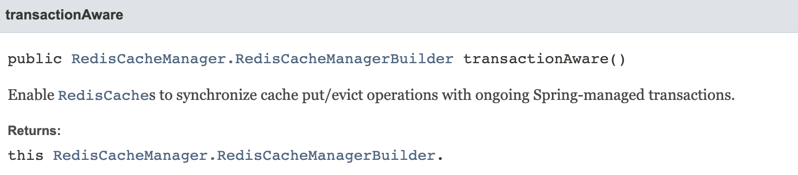

# 그냥 이것 저것 ...

실무에서 마주쳤던 이슈인데, 또 대단한 내용은 아닌 애매한 것들의 정리

### Transaction 예외 Retry 적용 관련 문제

#### 이슈
`ObjectOptimisticLockingFailureException`  예외 발생 시, 재시도 처리를 위한 `@Retryable`이 동작하지 않는 현상을 파악

#### 원인
코드를 살펴보면 외부 트랜잭션 메서드 A가 다른 트랜잭션 메서드 B를 호출하는 구조였다. B는 `@Retryable`이 적용되어 있었으며 전파레벨로 `REQUIRED`를 사용 중이었다.
`ObjectOptimisticLockingFailureException` 은 트랜잭션의 커시 시점 (메서드 A 완료 시점)에 발생하는 예외이기 때문에 B에 적용한 `@Retryable`에서 캐치되지 않았던 것이다.

#### 해결 방안
1.  외부 트랜잭션에 `@Retryable` 설정 → 커밋 시점에 해당 예외를 잡아서 재시도 처리 가능
2.  내부 트랜잭션을 `REQUIRES_NEW`로 설정 → 독립적으로 커밋하기에 예외 발생 시 즉시 재시도

---

### 테스트 코드에서의 @Transactional 주의사항

#### 이슈
Repository, Service layer 등을 테스트할 때 무의식적으로 @Transactional을 붙이고 테스트하는 경우가 있다. 이는 테스트의 원자성을 보장하기 위해 롤백을 활성화 시키는 일반적인 작업이지만 다음의 이슈를 만든다.

##### 1. 실패해야하는 테스트를 성공시켜 가짜 음성(false negative)을 만들어낸다.
예를 들어 Lazy loading을 테스트 한다고 가정하자. 이 경우 @Transactional이 명시되어있지 않은 컴포넌트에서 영속성 객체에 Lazy loading을 시도하면 Exception이 발생해야 한다.

그러나 같은 서비스를 @Transactional Test로 호출하면 얘기가 달라진다. 이 테스트는 성공하며 아무런 문제를 일으키지 않는다. 이유는 테스트 코드에서 준 @Transactional 때문에 영속성 컨텍스트가 유지되고 있기 때문이다.

##### 2. Auto-Commit으로 인한 DB 반영 문제
@Transactional은 Auto-commit을 활성화시킨다. 이는 트랜잭션 내에서 변경된 데이터가 모두 커밋 후 DB에 저장된다는 의미이다.

**트랜잭션이 아닌** Controller에서 엔티티를 setter등으로 업데이트 한 경우 테스트에서는 변경된 데이터가 DB에 저장되지만 실제 서비스에서는 DB에 반영되지 않는 문제가 생긴다.

#### 결론
위와 같은 문제를 피하며 테스트의 원자성을 보장하기 위해선 @BeforeEach / @AfterEach 등에서 수동으로 DB를 롤백해주는 선택지를 사용해야 한다.

그렇다면 테스트에서 @Transactional은 언제 사용해야 하는가?

> @DataJpaTest의 메타 어노테이션을 확인하면 @Transactional이 포함되어 있는 것을 확인할 수 있다. 즉, JPA Repository를 테스트할 때 기본적으로 해당 어노테이션을 사용하게 된다는 것이다. 이는 단순히 Repository의 기능을 테스트하는 것이기 때문에 다른 컴포넌트에서 Lazy loading의 작동 유무에 대해 신경 쓸 필요가 없다. 즉 단순 DAO 계층 (Repository 계층)을 테스트할 때는 @Transactional을 사용해도 문제가 없다.

---

### HikariPool Connection 고갈 이슈

기본적인 parallelStream을 사용하던 로직 내부에 log 추가가 필요한 상황이 생겼다. Spring sleuth의 traceId가 parallelStream에 전파되지 않았기 때문에 trace 전파가 가능하도록 Custom한 thread pool (이하 `traceableThreadPool`을 정의하고, CompletableFuture에 pool을 적용해 사용하기로 했다.

작업은 다음과 같이 진행했다.
1. thread pool의 크기는 기존 parallelStream을 사용할 때와 동일하게 생성 (=ForkJoinPool.commonPool()의 사이즈)
2. parallelStream를 `traceableThreadPool`이 적용된 CompletableFuture로 변경
3. 잠재적으로 로깅 추가 가능성이 있는 CompletableFuture에 `traceableThreadPool`을 적용
4. 적용된 부분들에 대해 기능 / 로깅 테스트 진행 및 통과 확인 후 배포

#### 이슈
개발망에서도 정상 동작하는 것을 확인한 후, Release 망에 배포되면서 이슈가 발생했다. 간헐적으로 모든 API가 먹통이 되었고, `Connection is not available, request timed out after` 로그가 발생했다.

#### 원인 파악

1. Grafana 지표를 살펴봤을 때, Hikari slave pool이 가득 차서 줄어들지 않았다.
2. slave connection 사용치가 올라가는 시점을 기준으로 호출된 API들을 파악했으나, 모두 다른 API였다.
3. 누수 일어나는 정확한 지점 파악 위해 `leak-detection-threshold` 옵션 추가 후 재배포했다.
4. 로그 트래킹 결과 Connection을 물고 있는 서비스들이 공통적으로 A라는 서비스를 호출하는 것을 확인했다.
5. A는 내부적으로 `traceableThreadPool`이 적용된 CompletableFuture를 사용하고 있었다.

여기에서 원인이 내가 했던 작업 때문이었음을 깨달았다. 문제는 2가지 였는데

1. 기존부터 중첩된 비동기 호출이 있었다. 스레드 안에서 스레드를 호출하는 로직이 있었다.
2. 이는 서로다른 thread pool을 사용하고 있었으나, 내가 작업하며 동일한 thread pool을 적용했다.

이 상태에서는 thread마다 새로운 트랜잭션이 열리면서 Connection을 소모하게 되고, Thread에 deadlock이 걸리면서 Connection을 지속적으로 점유하게 된 것이다.

> 결국 과거의 잘못된 코드 + 현재의 잘못된 작업 = 이슈 발생

#### 해결 방안
해결 방안은 간단했다. 중첩 비동기 호출을 제거하는 것. 물론 필요시 pool size 증량을 검토해야겠지만, live 배포 이후에도 이슈는 없는 것을 확인했다.

---

### @Cacheable의 transactionAware 이슈

스프링의 캐시 추상화를 이용하기 위해서는 CacheManager에 대한 Bean 정의가 필요하다. 팀 내에서는 Redis를 이용해 CacheManager를 다음과 같이 지정하고 있었다.

```java
@Bean 
public CacheManager redisCacheManager() { 
	RedisCacheManager redisCacheManager = RedisCacheManager
		.RedisCacheManagerBuilder
		.transactionAware()
		.fromConnectionFactory(connectionFactory)
		.cacheDefaults(RedisCacheConfiguration.defaultCacheConfig())
		.build(); 
	return redisCacheManager; 
}
```

클라이언트가 호출하는 `veryLong` API는 다음의 조건을 갖고 있다.
- API 내부에서는 비동기 메서드를 트리거하며 이는 10초 이상의 매우 무거운 동작을 수행한다.
- API의 응답값은 없으며 해당 동작은 특정 시간 내에 한 번만 성공하면 된다.
여러 요청이 동시에 들어와도 한 번만 성공하면 된다는 조건을 갖고있다. 따라서 우리는 캐시를 이용해 불필요한 부하를 방지하기로 결정했다.

아래는 간단한 `veryLong` 서비스 코드이다.
```java
public void veryLong(Long accountId) {
	if (cacheRepository.get(accountId)) {
		return;
	}
	async(accountId);
}
```
`async` 메서드는 내부적으로 다음과 같이 이루어져 있다.
```java
@Transactional
public void async(Long accountId) {
	cacheRepository.set(accountId);
	
	// DB 및 NW IO로직 등을 수행한다.
}
```
`cacheRepository`는 다음과 같다.
```java
@Cacheable(value = "HEAVY-API", key = "#id")
public Boolean get(Long id) {
	return false;
}

@CachePut(value = "HEAVY-API", key = "#id")
public Boolean set(Long id) {
	return true;
}
```

#### 이슈
동시 요청이 들어올 경우 한 번의 API만 수행될 것이라 생각했으나, 많은 Row was updated 에러 로그가 쌓이기 시작했다.

#### 원인 파악
이는 `async`로직이 동시에 여러군데에서 수행되면서 발생하는 문제였다. Single thread로 동작하는 Redis의 특성 상 최초 캐시가 정상적으로 들어갔다면 `async`는 한 번 밖에 수행될 수 없는데, 문제는 바로 RedisCacheManager 설정의 `transactionAware()`에 있었다.


기본적으로 @Cacheable / @CachePut 등의 Annotation은 애플리케이션에 설정된 CacheManager를 통해 수행된다. 여기에서 `transactionAware()` 옵션이 켜져있는 경우 이를 기존에 진행되고 있는 Transaction과 자동으로 동기화한다. 단순히 동기화라고 하면 의미가 이해되지 않을 수 있는데, 이는 캐시 put / evict로직이 트랜잭션의 커밋 이후에 수행된다는 것을 의미한다. 

> 캐시 매니저를 정의하면서 옵션을 제대로 파악하지 않은게 원인이었다. (반성하자)

#### 해결
그렇다면 이에 대한 해결 방법은 무엇일까?

다음은 먼저 검토했던 수정 방식들이다.
1. redisTemplate / redissonClient 등을 이용, 캐시 추상화를 사용하지 않는다.
	- String 캐시의 경우 모두 추상화를 사용하고 있는데, 일부만 이렇게 사용하는 경우 일관성이 없다.
1. `transactionAware()` 옵션을 사용하지 않는다.
	- 데이터 일관성 측면에서 이 옵션을 제거하는 것은 좋은 선택지가 아니라고 생각했다.
2. 비동기 호출
	- 단순한 방법이지만, 캐시 추상화와 비동기를 함께 사용할 경우 return에 Future 타입 등을 사용해야 한다.
	- 특수한 케이스로 인해 캐시의 Repository interface를 변경하는 것은 좋은 선택지가 아니라 생각했다.

마지막으로 선택한 방식은 ApplicationEventPublisher의 @EventListener와 @Async를 결합해 사용하는 방식이었다.
```java
@EventListener
@Async
public String handleCache(CacheEvent event) {
	cache.set(event.getAccountId());
}
```
이는 위의 3가지 문제를 모두 해결할 수 있는 방법이었다.
- 캐시 추상화를 그대로 사용 가능
- 다른 캐시 로직들에 영향을 끼치지 않음
- 인터페이스 수정 또한 불필요