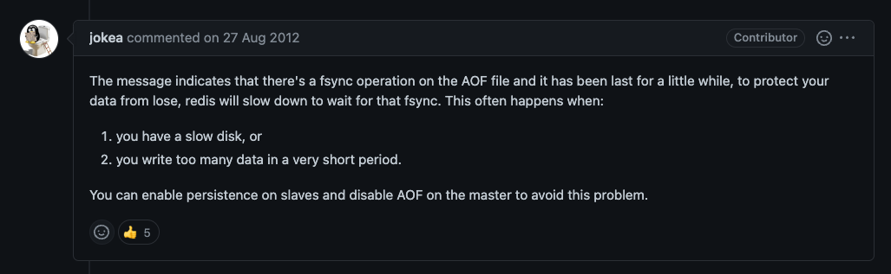

# from Hazelcast to Redis

회사에서 사용 중인 캐시 시스템을 변경하게 됐다. Redis로 넘어가게 된 이유는 여러가지였다.

## Hazelcast에서의 문제점

#### 1. 캐시 클러스터 용량
3대의 노드로 운용중이던 Hazelcast 캐시의 메모리 용량이 한계에 다달았다. 단순히 scale-out을 하면 되는거 아닌가? 라고 생각할 수 있지만, 문제가 간단하지 않았다. 기존에 사용하던 Hazelcast mancenter의 경우 완전 오픈소스가 아니라, 일정 갯수의 노드까지만 무료로 사용할 수 있는 툴이었다. 노드가 늘어나면 이를 유료로 사용해야 한다는 문제가 있었다.

#### 2. 부족한 생태계
다른 오픈소스 웹 콘솔은 없었나? 내가 못 찾은건지는 모르겠지만 적어도 내가 찾은 것 중에는 쓸만한 오픈소스가 없었다. 기존에 개발하면서도 느낀점이지만 hazelcast는 사용자 커뮤니티가 비교적 활성화되지 않은 편이었다. 단순히 stackoverflow에 올라오는 이슈들도 오래된 구 버전의 이슈를 다루고 있었고, 뭔가 찾아보려 하면 실 사용자의 이야기보다는 docs만 올라오는 것도 아쉬운 점이었다.

#### 3. 마지막으로...
hazelcast여야만 하는 이유가 없었다. 초기에 hazelcast를 선택했던 기준은 모르겠으나, 현재 팀 내에는 hazelcast라는 시스템을 잘 아는 사람이 없었다. (관성에 의해 사용되는?) 시스템이었기에 조금이라도 장점이 있고 편리한 대체제가 있다면 모두가 변경에 찬성하는 상태였다.

## Redis 도입
Reids를 선택한 이유는 다음과 같다.

#### 1. 성숙도


압도적인 커뮤니티의 활성도와 그에 따른 다양한 경험들이 이미 축적되어 있었다. 시스템 어드민 용도로 사용할 수 있는 다양한 웹 콘솔, Java Client, 벤치마크 자료와 트러블 슈팅 자료까지 이미 캐시 시스템의 트렌드가 되면서 구축된 탄탄한 생태계가 있다.

#### 2. 영속화(백업) 지원
기본적으로 제공하는 RDB / AOF 기능은 데이터 영속화에 대한 걱정을 덜어준다. 새로운 기능 개발을 준비하면서 Look Aside용도가 아닌, Persistence 용도로의 캐시 사용을 검토하던 중에 Redis가 가진 이런 백업 지원이 적절하다고 생각했다.

#### 3. 개발 편의성
Redis하면 가장 먼저 특징으로 거론되는게 다양한 자료구조와 Single Thread 패턴이다. 개발에 있어서 이런 부분은 많은 수고를 덜어준다. 특히 원자성 보장은 기존 race condition 관리를 위한 수고를 눈에 띄게 덜어줬다.


## How to?

### Redis Cluster 구축
먼저 Redis 운영 방식을 결정해야 했다. Redis하면 많이 거론되는 Sentinel 방식은 scale-up만 가능했기에 단점이 명확했다. 프로덕션 환경에서는 구축이나 운영이 복잡하더라도 scale-out을 위해 Cluster 방식으로 사용하는게 유리했다. 물론 자동 Fail over는 둘 다 제공된다.

### Redis 설정

#### 백업 전략
Redis에서 지원하는 백업 전략은 RDB와 AOF가 있다. 각각의 특징은 다음과 같다.

##### RDB
특정 시점에 메모리에 있는 데이터 스냅샷을 생성하는 기능이다.
-  로딩 속도가 AOF 보다 빠르다.
-  그러나 스냅샷 추출이 오래걸린다. → 이 시간 동안 다른 요청이 block 된다.
-  스냅샷 간격이 길기 때문에 그 사이 요청은 유실된다.

##### AOF
명령 단위의 데이터를 파일에 기록한다.
-  데이터 손실이 거의 없고, 쓰기 속도가 빠르다.
-  데이터 양이 크고, 복구 시 명령어를 처음부터 수행하기 때문에 재시작 속도가 느리다.
-  fsync everysec 정도로 사용 / no의 경우 OS에 맡긴다.
-  특정 시점에 데이터 전체를 다시 쓴다. 커맨드를 압축한다고 보면 된다. (rewrite)

RDB의 대량 디스크 쓰기작업 이슈로 인해 최근 AOF 활성화, RDB 비활성화를 권장한다. 팀에서도 해당 권장사항을 따르기로 했다. (appendfsync는 everysec 적용)

#### Max-Clients
Redis 전용 서버였기 때문에 소켓을 50,000 정도로 크게 잡아도 상관은 없었다. 그러나 Redis를 사용하는 Spring Server와 Connection Pool에 대한 최대 수치가 명확했기 때문에 다음과 같이 계산해서 약 10,000 으로 설정했다.

	((Max Connection + Subscribable Channel Connection) * 서버의 기본 Pod 수) * 2 


### Client 설정
현재 Java 기반 서버에서 Redis에 대한 클라이언트 선택지는 3개였다.
- Jedis: 사용하기 쉽지만, 클러스터에서의 동기 처리로 인한 성능 이슈가 있다.
- Lettuce: Spring이 기본 채택하는 클라이언트, 다양한 처리 지원 복잡하지만 높은 성능을 낼 수 있다.
- Redisson: 가장 다양한 자료구조 제공, near cache 기능을 지원한다.

우리는 Redisson을 이용했는데, 기존 시스템에 쓰이던 분산 락을 pub-sub 방식으로 제공하고 있었고, Hazelcast에서 사용하던 near cache 기능을 사용 가능했기 때문이다.

### Api Server
작업은 다음과 같이 진행됐다.
1. Redis Cache 설정 추가, Connection pool size 등은 우선 Hazelcast와 동일하게 설정
2. Hazelcast에 대치되는 Redis 서비스 로직 작성
3. 캐시 제거 시, 부하가 한 번에 몰릴 것을 대비해 일정 기간 마이그레이션 되도록 로직 수정
	- Hazelcast Hit -> Redis insert 프로세스 추가 
4. Migration 기간 (2주) 후 Hazelcast 로직 제거

### 불필요한 Lock 제거

비록 Redisson을 통해 lock이 pub-sub 기반으로 동작하더라도 불필요하게 분산 lock을 남발할 이유는 없다.

회사의 API 중 초당 호출횟수가 가장 높은 것은 당연 채팅 메시지를 처리하는 API였다. 여기에는 채팅방에서 발생한 메시지의 순서를 sequence라는 변수로 캐싱하고 있었는데, Hazelcast를 사용할 때는 경합을 관리하기 위해 분산 lock을 사용했다.

대략 아래와 같은 코드였다.
```java
// For instance
public void send() {

	// 각종 처리 로직
	try {
		if (lock.tryLock(2, 1, TimeUnit.SECONDS)) {
			int sequence = messageSequenceCache.get("<chatting room ID>") + 1;
			messageSequenceCache.set("<chatting room ID>", sequence);
		}
	} catch (~~~) {
		~~~~
	}
	// 각종 처리 로직
}
```

이는 Redis의 단순 increment 커맨드로 아래와 같이 대체 가능하다.
```java
// For instance
public void send() {

	// 각종 처리 로직
	int offset = 1;
	int sequence = redisTemplate.increment("<chatting room ID>", offset);
	// 각종 처리 로직
}
```
Redis는 자체적으로 single thread로 동작하기 때문에 경합에 대한 처리가 필요치 않다.

## 이슈

완전히 마이그레이션을 끝내고 스테이지망에서 테스트까지 마쳤다. 이제 이상이 없는 줄 알았으나... 라이브에 배포가 나간 뒤 간헐적으로 오류가 발생했다.

#### 증상

아래의 로그들이 다수 발생하며 , 동시간 대에 캐시 통신이 동작하지 않는 이슈가 있었다. 
- `Unable to send PING command over channel`
- `Unable to execute (CLUSTER NODES) org.redisson.client.RedisTimeoutException`

Redis cluster 로그를 살펴보니 동시간 대에 클러스터의 모든 노드에 다음 로그가 있었다.
`asynchronous AOF fsync is taking too long (disk is busy?). Writing the AOF buffer without waiting for fsync to complete, this may slow down Redis. write latency`

또한, 해당 로그 이후로 특정 노드 실패 처리와 Failover 프로세스가 수행된 흔적도 있었다.
`Marking node A as failing (quorum reached).`

#### 조사

- 우선 `asynchronous ...`  로그를 보면 AOF 문제로 보였다. AOF의 fsync 동작으로 인해 Redis가 느려질 수 있다는 로그이다. 
- 아마 이로 인해 Redisson에서 보내는 PING 응답을 처리하지 못했을 것이고, 그로인해 애플리케이션 로그에도 `Unable ...` 로그가 남은 것으로 보인다.
- 또, 클러스터 내 노드 간 Health check에도 실패하여 Failover가 수행된게 아닌가 추측했다.

관련해서 찾아보니 다음과 같은 답변이 있었다.


1. 디스크 자체가 느리거나
2. 짧은 시간에 많은 쓰기가 발생했거나

appendfsync 옵션의 경우 everysec을 사용하고 있었기 때문에 아마 1의 이유가 크지 않았을까 싶다.
> Redis 노드는 전부 SSD가 아닌 HDD를 물리 디스크로 사용 중이었다.

디스크를 당장 변경할 수는 없기 때문에 합리적인 조치 방법은 결국 AOF옵션을 slave 노드에서 비활성화 시키는것인데, 이 방법은 failover에 대한 처리가 문제였다. failover 시 slave, master를 파악해서 옵션을 유동적으로 변경해야 하는데, 이에 대한 처리 방법을 찾지 못했다.

#### 결론

팀에서는 우선 Redis를 캐시 용도로만 사용하고 있었기 때문에 유실에 대한 대안이 당장 필요하지는 않았다. 따라서 appendfsync no를 사용하기로 했다. 길면 30초까지도 유실이 발생할 수 있지만, 백업을 유지하면서 fsync 블락을 없애는 유일항 방법이었다.

향후 있을 작업에서 Redis를 Persistence 용도로도 사용할 가능성이 있었기 때문에 그 전까지 대안을 찾는 것으로 협의했다. (즉 완벽히 해결하지 못했다)

현재 고안 중인 방법은 redis log 중 failover 복구 로그를 감지하면 master / slave에 config를 업데이트해주는 간단한 shell script를 만드는 것이다.

---
부록으로  [redis-tip](/Common/redis-tip)
