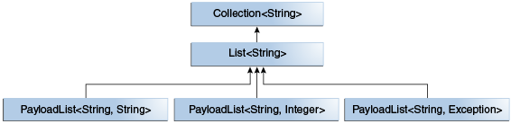

## 왜 Generic이 필요한가

### **Generic을 사용하지 않을 경우**

Generic을 사용하지 않더라도 Java에서는 Object class를 모든 class가 상속받기 때문에 어떤 타입이라도 받을 수 있는 class를 만들 수 있다.

Object를 element로 갖는 SimpleArrayList를 만들어보면,

```java
private int size = 0;
private Object[] list = new Object[5];

public void addElement(Object o) {
    this.list[size++] = o;
}

public Object getElement(int index) {
    return list[index];
}
```

이를 사용해보면,

```java
SimpleArrayList arrayList = new SimpleArrayList();
arrayList.addElement(50);
arrayList.addElement(100);

Integer e1 = (Integer) arrayList.getElement(0);
Integer e2 = (Integer) arrayList.getElement(1);

System.out.println(e1 + e2);
```

위의 코드는 정상적으로 동작하여 150을 출력한다.

만약, 위의 코드가 다음과 같이 변경된다면 어떻게 될까?

```java
private static void genericExample() {
    SimpleArrayList arrayList = new SimpleArrayList();
    arrayList.addElement(50);
    arrayList.addElement("100");

    **//이 부분에서 Compile Error가 발생하지 않는다.**
    Integer e1 = (Integer) arrayList.getElement(0);
    Integer e2 = (Integer) arrayList.getElement(1);

    System.out.println(e1 + e2);
}
```

**하지만 코드를 실행해보면 런타임 시간에 오류를 뱉어낸다.**

```java
Exception in thread "main" java.lang.ClassCastException:
java.lang.String cannot be cast to java.lang.Integer
```

**즉, 컴파일 시간에 에러가 발생하지 않기 떄문에 복잡한 코드가 된다면 수정이 어려워진다.**

만약 위의 문제를 해결하기 위해서 String Element를 저장하는 SimpleArrayList를 만들게 되면 코드의 중복이 늘어날 것이다.

### Generic 사용

SimpleArrayList를 GenericArrayList로 변경해보자.

```java
public class GenericArrayList<T> {
    private int size = 0;
    private Object[] list = new Object[5];

    public void addElement(Object o) {
        this.list[size++] = o;
    }

    public T getElement(int index) {
        return (T)(this.list[index]);
    }
}
```

사용코드는 다음과 같다.

```java
private static void usingGeneric() {
    GenericArrayList<Integer> genericArrayList = new GenericArrayList<>();
    genericArrayList.addElement(10);
    genericArrayList.addElement(100);

    int e1 = genericArrayList.getElement(0);
    //Compiler Error 발생
    String w2 = genericArrayList.getElement(1);
}
```

**T의 타입을 Integer로 선언하였기 때문에, 만약 String으로 element를 받으려 한다면 컴파일 에러가 발생한다.**

### Generic 사용할 수 없는 경우

- new를 통해 동적할당을 하는 경우 (제네릭으로 배열을 생성 X)
  new라는 keyword는 힙에 충분한 메모리가 있는지 확인하고 메모리를 할당하는 역할을 하는데, Generic을 사용할 경우 컴파일 타임에 타입을 알 수 없기 때문에 메모리 공간 확인을 할 수 없다.
- Static 변수에 사용하는 경우
  static 변수는 한 번만 선언되어 모든 객체에서 공유하여 사용하기 때문에, type에 따라 바뀌는 제네릭을 사용할 수 없다.

## 다양한 Generic 사용방법

### Parameterized Type

```java
List<String> list = new ArrayList<>();

//After Compile -> .javac file
ArrayList list = new ArrayList();
```

위와 같이 사용하면 compiler는 compile time에 List에 String만 저장되어야 한다는 것을 알게 되고, ArrayList로 변경해도 런타임에 동일한 동작을 보장한다. 이러한 타입을 **비 구체화 타입**이라고 한다.

> 비 구체화 타입 : 컴파일 타임에 타입 정보 사라짐 → 런타임에도 동일한 동작 보장
> 구체화 타입 : 타입 정보가 런타임 시에 구체화

### Unbounded Wildcard Type

타입 파라미터에 의존적이지 않은 일반 클래스의 메소드를 사용하는 경우, 즉 어떤 타입이 오든 관계가 없을 떄 사용한다. ex) Object의 메소드, `List.clear()`, `List.size()` 등

⇒ 컴파일 타임에 \<?\>가 지워지지 않는다.

```java
//타입 파라미터에 상관없이 동작할 수 있다.
private static void printListSize(List<?> list) {
    System.out.println(list.size());
}
```

### Bounded Type Parameter

Generic으로 사용할 파라미터 타입을 제한할 수 있다.

- **extends**

`public class GenericArrayList<T extends Number>`

T의 타입으로 Number를 상속받은 클래스만을 작성할 수 있다.

- **super**

`public class GenericArrayList<T super Number>`

T의 타입으로 Number의 상위 클래스만을 작성할 수 있다.

### Subtyping in generics

```java
public static void subtyping() {
    List<Number> list = new ArrayList<Number>();
    list.add(new Integer(10));
    list.add(new Double(10L));

    for (Number element : list) {
        System.out.println(element);
    }
}
```

위의 코드는 Integer, Double은 Number의 하위 클래스이기 때문에, 오류 없이 정상적으로 동작한다.

하지만, 다음의 코드는 어떨까?

```java
List<Box<Number>> list = new ArrayList<Box<Number>>();

boxTest(new Box<Integer> ());
boxTest(new Box<Double> ());
```

Box\<Double\>, Box\<Integer\>는 Box\<Number\>의 하위 클래스가 아니기 때문에 컴파일 에러가 발생한다.

제네릭 클래스나 인터페이스를 상속관계로 정의하고 싶다면 다음과 같이 클래스 or 인터페이스로 정의해야한다.



```java
public interface CustomList<E,P>  extends List<E> {
    void setCustomList(int index, P type);
}
```

### Bounded wildcard type

```java
List<Integer> list = new ArrayList<>();
// compiler error
addAll(list);

public void addAll(List<Number> list) {/*....*/}
```

위의 코드는 컴파일 에러를 발생시킨다. 이를 해결하기 위해 Bound Wildcard Type을 사용할 수 있다.

```java
public static void boundWildcard() {
    List<Integer> list = new ArrayList<>();
    addAll(list);
}
public static void addAll(List<? extends Number> list) {
}
```

extends-bound : 자기자신과 하위 클래스를 타입으로 받을 수 있다.

super-bound : 자기자신과 상위 클래스를 타입으로 받을 수 있다.

### 제네릭 메소드

메소드에도 제네릭을 적용할 수 있다. 주로 static 메소드에 사용하지만, 일반 메서드에도 사용 가능하다. 이 때 타입 매개변수가 접근지시자와 반환형 사이에 와야 한다는 것만 주의하면 된다.

```java
public class Util {
    public static <K, V> boolean compare(Pair<K, V> p1, Pair<K, V> p2) {
        return p1.getKey().equals(p2.getKey()) && p1.getValue().equals(p2.getValue());
    }
}

public static void main(String... args) {
    Pair<Integer, String> p1 = new Pair<>(1, "apple");
    Pair<Integer, String> p2 = new Pair<>(2, "pear");
    boolean result = Util.<Integer, String>compare(p1, p2);
    boolean result2 = Util.compare(p1, p2); // type inference
}
```

result2를 보면 타입 추론을 사용 가능하다는 것도 알 수 있다. p1과 p2가 동일한 타입 매개변수를 사용하기 때문에 추론이 가능하다.

**참고자료**

[자바 제네릭 이해하기 Part 1](https://yaboong.github.io/java/2019/01/19/java-generics-1/)

[[ Java] Java의 Generics](https://medium.com/@joongwon/java-java%EC%9D%98-generics-604b562530b3)
