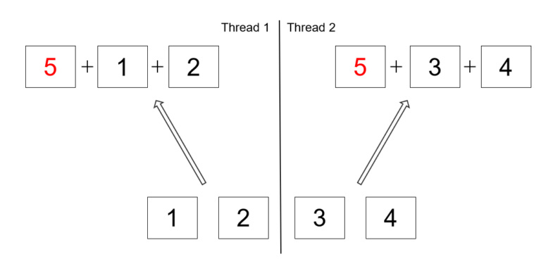

# ParallelStream

## ParallelStream 유의점

### 잘못된 병렬 처리

```java
List<Integer> listOfNumbers = Arrays.asList(1, 2, 3, 4);
int sum1 = listOfNumbers.parallelStream().reduce(5, Integer::sum);
int sum2 = listOfNumbers.stream().reduce(5, Integer::sum);
assertThat(sum1).isNotEqualTo(sum2);
```

두 작업의 결과는 다르다. parallelStream의 reduce 작업 과정은 다음과 같다.



stream의 경우 초기 5 값을 이후로 reduce를 통해 값을 더해가지만, parallelStream은 분할된 작업마다 5를 더하고, 최종적으로 이를 합산한다.

즉 parallelStream()은 stream() 작업을 완전히 대체하지 않는다는 것을 유의해야 한다.

### 병렬 처리 성능

1. 적은 양의 작업에는 스레드, 소스 및 결과 관리에 대한 오버헤드가 커져서 이점이 없을 수 있다.
2. 데이터 소스에 따라 성능 차이가 있을 수 있다. ArrayList는 LinkedList보다 작업 분할이 쉽고, 이로인해 parallelStream의 이점을 더 많이 보게된다.
3. 최종 연산이 병합 작업인 경우, 연산 종류에 따른 성능 차이가 있다.

   ```java
   arrayListOfNumbers.stream().reduce(0, Integer::sum);
   arrayListOfNumbers.stream().parallel().reduce(0, Integer::sum);
   arrayListOfNumbers.stream().collect(Collectors.toSet());
   arrayListOfNumbers.stream().parallel().collect(Collectors.toSet());
   ```

   - 병합 작업은 reduction, addition 등 작업의 경우 정말 저렴하지만 **집합 또는 맵으로 그룹화하는 것과 같은 병합 작업은 상당히 비쌀 수 있다.**

4. 자주 사용하는 데이터가 프로세서 가까이(캐시에) 위치한다. 병렬 처리 시 사용하는 데이터 구조에 포인터가 많을 수록 캐시 미스 확률이 높으며 참조 객체를 가져오기 위한 메모리 부하가 증가한다. 여러 코어가 동시에 메모리에서 데이터를 패치해오기에 병렬화에 부정적인 영향을 미칠 수 있다.

### NQ 모델

병렬 처리 성능 향상을 위한 공식

N: 데이터 수

Q: 연산량

연산량이 클수록 성능 증가를 위해 요구되는 데이터 수는 적어진다.

## ParallelStream vs CompletableFuture

### Thread Pool

- ParallelStream은 기본적으로 CPU core 기반의 전역 forkJoinPool을 사용한다. 물론 사용자가 별도의 Pool을 지정할 수 있지만, ForkJoinPool만 사용 가능하다는 제한이 있다.
- CompletableFuture는 사용자 지정 Executor (Pool)을 사용 가능하다. 작업의 특성이나 용도에 맞는 Executor 지정이 가능하다.

### 작업 방식의 차이

위의 Pool 사용 특성에서 이어지는 내용이다. ForkJoinPool은 분할 정복 방식을 채택하기 때문에 작업량이 균등하게 나눠질 수 있는 경우 유리하다. 또한, Cpu intensive한 작업인 경우 core 수 이상의 스레드는 무의마하다. 이런 특성은 ParallelStream에도 동일하게 적용된다.

반면 CompletableFuture는 I/O wait가 긴 작업을 수행 등, 스레드 풀의 조절에 다양한 유연성이 필요할 때 유리하다.
