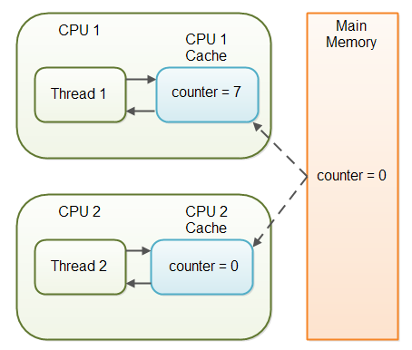
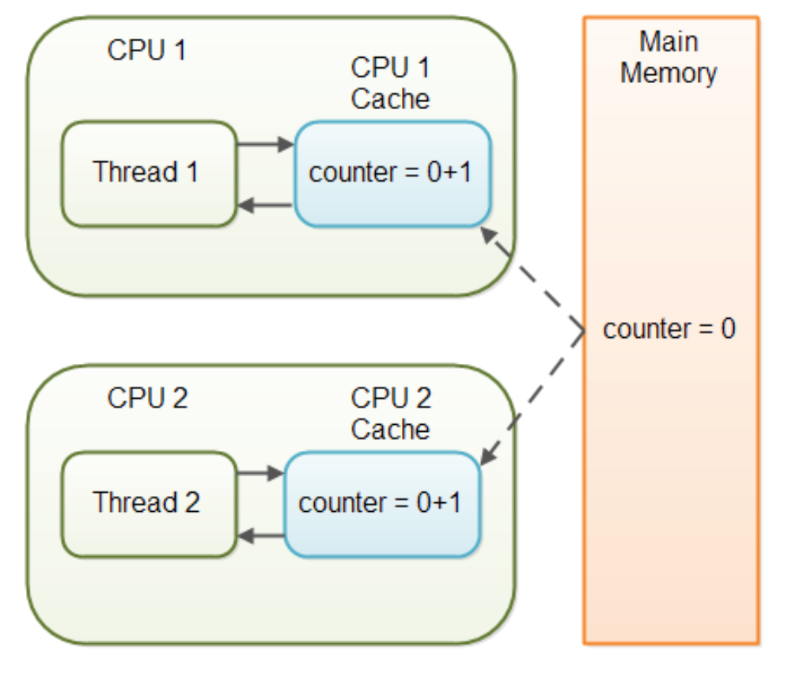
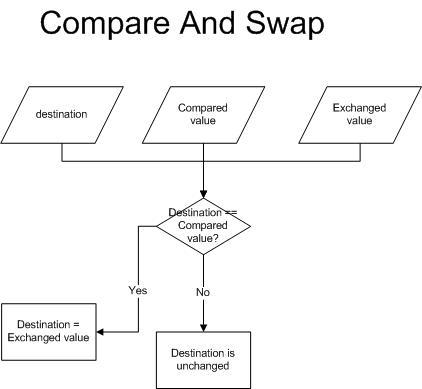
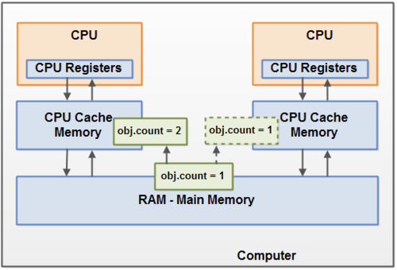

# 동기화 키워드

## Volatile

### 개요

멀티스레드 환경에서 어플리케이션은 변수 값을 CPU 캐시에 저장한다. 이 때 스레드가 변수를 CPU 캐시로부터 읽어오면 변수 값 불일치 문제가 발생한다. `volatile` 키워드는 Java 변수를 메인메모리에 저장한다고 명시하는 것이다. 이에 따라 Read/Write 시 메인 메로리에서 작업을 진행한다.

### 문제 사례



SharedObject를 공유하는 두 개의 스레드가 있을 때

- Thread-1은 counter 값을 더하고 읽는 연산을 (read and write)
- Thread-2는 counter 값을 읽기만 한다. (read only)

```java
public class SharedObject {
    public int counter = 0;
}
```

이 경우 Thread-1이 수행하는 값 증가는 CPU 캐시에만 반영되며 메인 메모리는 반영되지 않았다. 따라서 Thread-2가 값을 읽어올 때 계속 0을 가져오는 문제가 발생한다.

이를 volotile 키워드를 추가함으로써 해결할 수 있다.

```java
public class SharedObject {
    public volatile int counter = 0;
}
```

→ 값이 메인메모리에 저장되며 값을 참조할 때도 캐시가 아닌 메모리로부터 정확한 값을 가져온다.

### 한계점



- Thread-1이 값을 읽어 1을 추가하는 연산을 진행
  - 추가하는 연산을 했지만 아직 Main Memory에 반영되지 않았다.
- Thread-2이 값을 읽어 1을 추가하는 연산을 진행
  - 추가하는 연산을 했지만 아직 Main Memory에 반영되지 않았다.

두 개의 Thread가 1을 추가하는 연산을 하여 최종결과가 2가 되어야 하는 상황

⇒ But, 각각 결과를 Main Memory에 반영하게 된다면 1만 남는 상황이 발생

따라서 `volatile`은 Multi Thread 환경에서 하나의 Thread만 read & write하고 나머지 Thread가 read하는 상황에 적합하다. 여러 Thread가 write하기 위해서는 `synchronized` 등을 통한 변수 읽기/쓰기의 원자성 보장이 필요하다.

## Atomic

### 개요

Atomic 변수는 원자성을 보장하는 변수이다. 멀티스레드 환경에서 동기화 문제를 synchronized 키워드를 사용해 락을 걸곤 하는데, 이런 키워드 없이 동기화를 해결하기 위해 고안된 방법이다.

synchronized는 특정 Thread가 해당 block 전체를 lock 한다. 따라서 다른 Thread는 아무런 작업을 하지 못하게 되어 낭비가 심하다. Nonblocing하며 동기화 문제를 해결하기 위한 방법이 Atomic이다.

### CAS





Atomic을 알기 위해서 먼저 알아야 할 지식이 있다. 멀티스레드, 멀티코어 환경에서 각 CPU는 메인 메모리가 아닌 CPU 캐시 영역의 메모리를 참조한다. 이 때, 메인메모리에 저장된 값과 CPU 캐시에 저장된 값이 다른 경우가 있는데, 이 때 사용되는 것이 CAS 알고리즘이다.

먼저 다음 요소들이 파라미터로 필요하다.

- 작업할 대상 메모리 V
- 예상하는 기존 값 A
- 새로 설정할 값 B

이제 알고리즘을 알아보자.

1. 현재 스레드에 저장된 대상 객체의 예상 값 A와 V에 저장된 실제 값 비교
2. 일치하는 경우 새로운 값 B로 교체
3. 일치하지 않는 경우 실패 후 재시도

### Atomic 예시

```java
public class AtomicInteger extends Number implements java.io.Serializable {

    private volatile int value;

    public final int incrementAndGet() {
        int current;
        int next;
        do {
            current = get();
            next = current + 1;
        } while (!compareAndSet(current, next));
        return next;
    }

    public final boolean compareAndSet(int expect, int update) {
        return unsafe.compareAndSwapInt(this, valueOffset, expect, update);
    }
}
```

이는 AtomicInteger의 내부이다. incrementAndGet 내부에서 CAS로직 `compareAndSet()`을 사용하고 있다.
