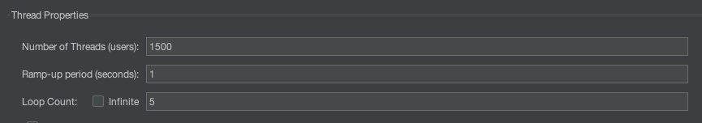
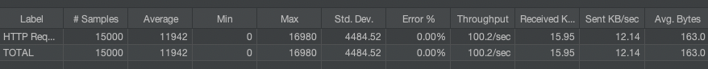
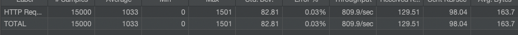
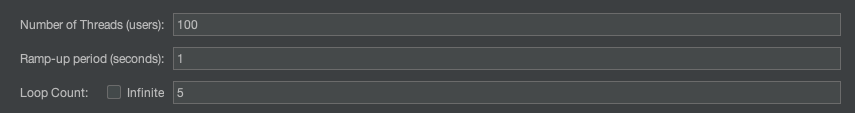
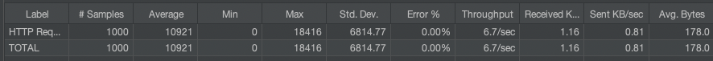
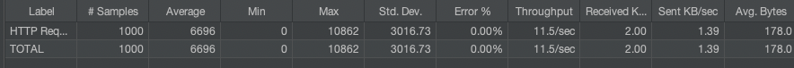

23년 9월 21일 Java 21의 GA버전이 공개되었다. 다양한 기능들이 새로 추가되었지만 그 중 가장 이슈가 된 것이 Project Loom을 통해 등장한 VirtualThread 기능이 아닐까 한다. 사실 기능적인 부분이나 어떻게 동작하는지는 한국어로 [잘 정리해놓은 글](https://findstar.pe.kr/2023/04/17/java-virtual-threads-1/)이 있어 따로 정리하지 않으려 한다.

대신 VirtualThread를 직접 사용해보고 어떤 성능 개선이 이루어졌는지와 대다수 (그리고 나도) 사용하고 있는 Spring 환경에 적용해서 성능을 확인해 볼 예정이다.

### 일반적인 스레드 구현

```java
void normal() throws Exception {  
    Instant beforeTime = Instant.now();  
    ExecutorService executorService = new ThreadPoolExecutor(10, 10, 0, TimeUnit.HOURS, new LinkedBlockingQueue<>());  
    IntStream  
            .range(0, 100)  
            .forEach(index -> {  
                executorService.submit(() -> {  
                    try {  
                        Thread.sleep(1000);  
                    } catch (Exception e) {  
                    }  
                });  
            });  
  
    executorService.shutdown();  
    while(!executorService.awaitTermination(Long.MAX_VALUE, TimeUnit.MILLISECONDS)) {  
    }  
    Instant afterTime = Instant.now();  
    System.out.println(Duration.between(beforeTime, afterTime).toMillis());  
}
```

시간 측정 등의 부수 코드를 제외하고, 가장 간단한 사용 예제이다. 0 ~ 100 범위의 인덱스에 대해 스레드를 만들고 sleep을 수행한다. pool 내의 core / max가 10으로 잡혀있기에 동시 수행하는 스레드는 10개이다. 1초씩 block을 걸었기 때문에 100개의 sleep은 약 10,000 ms내외에 수행된다.

### VirtualThread 사용

```java
void loom() throws InterruptedException {  
    Instant beforeTime = Instant.now();  
    List<Thread> threadList = new ArrayList<>();  
    IntStream  
            .range(0, 100)  
            .forEach(index ->  
            {  
                threadList.add(Thread.ofVirtual()  
                        .start(() -> {  
                            try {  
                                Thread.sleep(1000);  
                            } catch (Exception e) {  
                            }  
                        }));  
            });  
  
    for (var thread : threadList)  
        thread.join();  
  
    Instant afterTime = Instant.now();  
    System.out.println(Duration.between(beforeTime, afterTime).toMillis());  
}
```

다음은 VirtualThread의 예시이다. 풀을 만들지 않고, 곧바로 `Thread.ofVirtual()`를 통해 가상 스레드를 호출한다는 점을 제외하면 별반 다르지 않다. `join`을 통해 모든 스레드를 대기하고 결과를 확인하면 대략 1000ms 내외의 결과를 얻게 된다.

실제로 100,000개 이상의 IntStream을 이용해도 1500ms 내외의 속도로 처리되는 것을 확인할 수 있다. 단순 처리 속도의 문제를 떠나서 actual thread를 10만개 만들었다면 OOM으로 애플리케이션이 중단되었을 것이다. 가상 스레드는 비용, 성능적인 측면에서 굉장한 발전이라고 할 수 있겠다.

## In Spring?

단순한 Java application에서 Thread.sleep()을 통한 확인만 하는 것은 뭔가 아쉽다. 실제 Spring 환경에 적용하여 어떤 성능 차이가 나는지 알아보자. Jmeter를 이용해 부하를 발생시켜 봤다.
코드는 [여기](../example/virtual-thread/README.md)

### Thread block Jmeter Test


위 환경에서 가상 스레드와 플랫폼 스레드 사용 시 성능을 비교해본다.

#### Platform Thread


- 총 2회 테스트, 로컬 환경에서 Throughput은 100/s 내외

#### Virtual Thread


- 총 2회 테스트, 로컬 환경에서 평균 800/s 내외

### DB Test

long 쿼리 상황을 가정해서 테스트해본다.


- MySQL max connection 151
- Hikari
	- minimum-idle: 100  
	- maximum-pool-size: 100

#### Platform Thread


- 평균 6~7/s

#### Virtual Thread


- 평균 11~12/s

DB를 사용할 때는 2배 가량의 차이가 난다. DB connection pool이라는 외부 제약 사항이 존재하기 때문에 드라마틱한 변화는 없는 것으로 보인다. (물론 2배 가까이 차이나는 것도 큰 차이긴 하다)

가상 스레드는 훌륭한 도구지만 만능 열쇠는 아니다. DB와 함께 사용할 경우 DB, Application 양쪽의 CP 수치를 튜닝하면서 적절한 지점을 찾아야 할 것으로 보인다. 