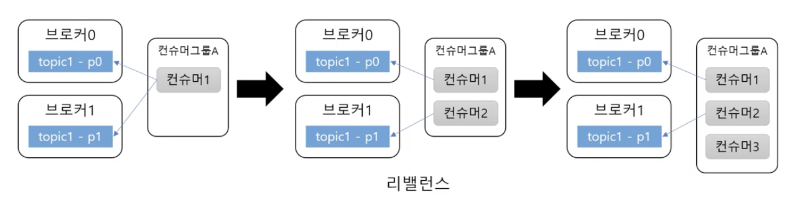

## 컨슈머

특정 토픽의 파티션에서 레코드를 조회하는 역할을 한다. 주요 설정은 그룹 ID, 역직렬화 객체 등이다.

```java
Properties prop = new Properties();
prop.put("bootstrap.servers", "localhost:9092");
prop.put("group.id", "group1");
prop.put("key.deserializer", "commom.foo");
prop.put("value.deserializer", "common.bar");

KafkaConsumer<String, String> consumer = new KafkaConsumer<String, String>(prop);
consumer.subscribe(Collections.singleton("simple")); // 토픽 구독
while(조건) {
	ConsumerRecords<String, String> records = consumer.poll(Duration.ofMills(100));
	for (ConsumerRecord<String, String> record : records) {
		log.info(record.value() + ":" + record.topic() ":" + record.partition() ":" + record.offset());
	}
}

consumer.close();
```

-   토픽을 구독하고 레코드 목록을 읽어온 뒤, 목록에서 레코드 별 처리 진행하는 예시

### 토픽 파티션

토픽의 파티션은 컨슈머의 그룹 단위로 할당된다. 위에서 설정한 `group.id` 설정이 그룹

파티션보다 컨슈머가 많아지는 경우, 특정 컨슈머는 유휴상태에 있게 된다.



따라서 처리량이 떨어져서 컨슈머를 늘렸다면, 파티션도 늘려줘야 한다.

### 커밋과 오프셋

-   poll 메서드는 이전 커밋의 오프셋 이후 레코드를 읽음
-   이후 읽어온 래코드의 마지막 오프셋을 커밋
-   반복

### 커밋된 오프셋이 없는 경우

-   첫 접근이거나 커밋한 오프셋이 없는 경우
-   `auto.offset.reset` 설정 사용
    -   earliest: 맨 처음 오프셋 사용
    -   latest: 가장 마지막 오프셋 사용 (기본값)
    -   none: 컨슈머 그룹에 대한 이전 커밋이 없으면 예외 발생

### 컨슈머 설정

조회에 영향을 주는 주요 설정

-   `fetch.min.bytes`: 조회 시 브로커가 전송할 최대 크기
    -   기본 값은 1이며 이 값이 클 수록 대기 시간은 늘지만 처리량이 증가한다.
-   `fetch.max.wait.ms`: 데이터가 최소 크기가 될 때까지 기다릴 시간
    -   기본 값은 500
    -   브로커가 리턴할 때까지 대기하는 시간으로 `poll()`의 대기 시간과 다르다.
-   `max.partition.fetch.bytes`: 파티션 당 서버가 리턴할 수 있는 최대 크기
    -   기본 값은 1048576 (1MB)
    -   이 크기가 넘어가면 바로 반환한다.

### 자동 커밋

-   `enable.auto.commit`: 커밋 설정
    -   true: 일정 주기로 컨슈머가 읽은 오프셋을 커밋 (기본값)
        -   poll 또는 close 호출 시 동작
    -   false: 수동으로 커밋 실행
-   `auto.commit.interval.ms`: 자동 커밋 주기
    -   기본 5000ms (5초)
        -   ex) poll 을 수행할 때 인터벌 (5초)가 지난 경우 commit 수행

기본 auto commit 옵션을 발생한다면, 중복 or 유실이 발생할 수 있다.

1. `poll()`을 통해 데이터 획득하며 commit, consumer 장애로 record 처리 실패
2. 리밸런싱으로 인한 중복

따라서 auto commit 옵션은 중복과 유실이 허용되는 곳에서 사용한다.

### 추가: Postion과 Commited Position

<aside>
💡 개인적으로 궁금해서 찾아봤는데, interval 시간에 도달하기 전 poll()이 여러번 호출되면 position 값을 통해 다음 레코드를 consume 한다. 커밋만 하지 않을 뿐이다.

</aside>

[1] [https://stackoverflow.com/questions/47543771/kafkaconsumer-position-vs-committed](https://stackoverflow.com/questions/47543771/kafkaconsumer-position-vs-committed)

[2] [https://gunju-ko.github.io/kafka/2018/04/02/Kafka-Offsets.html](https://gunju-ko.github.io/kafka/2018/04/02/Kafka-Offsets.html)

포지션과 커밋티드 포지션 둘 다 레코드에서 읽어올 위치를 나타낸다.

> 포지션
>
> -   다음 fetch 시작 위치 → `poll()`, `seek()` 호출 시 자동 갱신
> -   컨슈머가 수신한 최신 메세지 오프셋에 대응된다.
>
> 커미티드 포지션
>
> -   클라이언트가 실제 커밋한 포지션 (자동 or 수동)
> -   실패 회복에 사용

### 수동 커밋

-   `consumer.commitSync()` - 동기 커밋, 커밋 실패 시 예외 발생
-   `consumer.commitAsync()` - 비동기 커밋, 성공/실패 알려면 콜백 사용

### 재처리와 순서

컨슈머는 커밋 실패, 리밸런싱 등으로 인해 동일한 메세지를 수신할 가능성이 있다.

따라서 컨슈머는 멱등성을 보장할 수 있어야 한다. 즉 데이터 특성에 따라 타임스탬프, 일련 번호 등을 활용해 데이터를 중복으로 처리해도 문제가 없도록 고려해야 한다.

### 세션 타임아웃, 하트비트

-   컨슈머는 브로커로 heartbeat를 전송해서 연결을 유지한다.
    -   일정 시간 컨슈머로부터 heartbeat가 없으면 컨슈머를 그룹에서 빼고 리밸런싱을 진행한다.
    -   `session.timeout.ms`: 지정된 시간동안 heartbeat가 없으면 컨슈머 제외
    -   `hartbeat.interval.ms`: heartbeat 주기 (세션 타임아웃 1/3 추천)
-   `max.poll.interval.ms`: 이 시간이 지나도록 `poll()`하지 않으면 컨슈머를 그룹 제외 후 리밸런싱한다.

### 종료 처리

컨슈머를 다 사용하고 난 뒤에는 `close()` 처리가 필요하다.

일반적으로 무한루프를 돌며 `poll()`을 진행하기 때문에 무한루프를 break하는 처리가 필요한데, 이 때 `wakeup()` 메서드를 사용한다.

다른 스레드에서 `wakeup()` 메서드를 호출하면 `poll()`은 `WakeUpException`을 발생시킨다. 이를 try-catch를 통해 잡아서 `close()` 처리한다.

**카프카 컨슈머는 Thread-safe 하지 않기 때문에 wakeup을 제외하고는 여러 스레드에서 사용하지 말아야 한다.**
