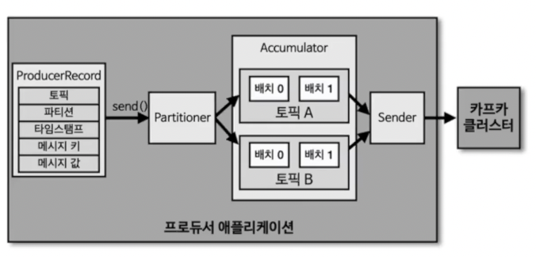

## 프로듀서
내용은 Java라이브러리를 기준으로 한다.

### 프로듀서 내부 구조 

- ProducerRecord: 프로듀서에서 생성하는 레코드, 오프셋은 미포함
- send(): 레코드 전송 요청
- Partitioner: 어느 파티션으로 전송할지 지정
- Accumulator: 배치로 묶어 전송할 데이터를 모으는 버퍼

### 프로듀서 기본 파티셔너
1. `UniformStickyPartitioner`
2. `RoundRobinPartitioner`

2.5.0 버전에서 파티셔너를 지정하지 않은 경우 `UniformStickyPartitioner`가 기본 파티셔너로 설정된다.
동작은 다음과 같다.

#### 메시지 키가 있는 경우
- 키의 해시값과 파티션을 매칭해서 레코드 전송
- 동일한 키를 갖는 레코드는 항상 동일한 파티션에 전달
파티션 개수가 변경될 경우 키와 파티션 번호 매칭은 깨진다. 따라서 메시지 키를 활용할 때는 파티션 개수를 처음부터 여유있게 할당하는게 좋다.

#### 메시지 키가 없는 경우
키가 없을 때는 최대한 동일하게 분배하는 로직을 수행한다.
`RoundRobinPartitioner` 의 배치 성능을 개선한 것이 `UniformStickyPartitioner` 이다.

### 커스텀 파티셔너
개발자가 직접 정의도 가능, ex) 특정 key는 지정된 파티션에 할당 or 레코드의 값을 활용한 분배 등

### 프로듀서 주요 옵션 (필수 옵션)
- bootstrap.servers: 데이터를 전송할 카프카 클러스터에 속한 브로커 호스트 + 포트를 1개 이상 작성
- key.serializer: 레코드 메시지 키를 직렬화하는 클래스
- value.serializer: 레코드 메시지 값을 직렬화하는 클래스

StringSerializer를 사용하면 용량의 낭비가 있을 수 있지만, console 등을 이용해 데이터를 확인할 수 있어서 운영 상 유리한 점이 있다.

### 프로듀서 주요 옵션 (선택 옵션)

##### ack
프로듀서가 전송한 데이터가 브로커에 정상 저장되었는지 여부 확인, default: 1

##### linger.ms
배치를 전송하기 전까지 기다리는 최소 시간, default: 0

##### retries
브로커 에러를 받고 난 뒤 재전송 시도하는 횟수를 지정한다. default: INT_MAX

##### max.in.flight.requests.per.connection
한 번에 동시 전달 가능한 최대 개수 (최대 커넥션, 스레드), default: 5

##### partitioner.class
전송 시 사용할 파티셔너 클래스 지정, default: DefaultPartitioner

##### enable.idempotence
멱등성 프로듀서 동작 여부, default: false (3.0++ 부터는 true)

##### trasactional.id
- 프로듀서가 레코드 전송 시, 레코드를 트랜잭션 단위로 묶을지 설정 (원자성 보장)
- 해당 옵션 설정 시 enable.idempotence는 true가 된다.
- default: null

### Acks 옵션 상세
acks 옵션에 따라 신뢰성과 성능이 달라질 수 있다. 복제 개수가 2 이상일 때 acks 옵션에 따른 동작을 알아본다.

#### acks=0
- 리더 파티션으로 전송한 이후, 적재 여부 확인하지 않고 성공 처리
- 일부 유실이 발생하더라도 속도가 중요한 경우 유리

#### acks=1
- 보낸 데이터가 리더 파티션에만 정상 적재되었는지 확인
- 리더에 적재되지 않은 경우 적재될때까지 재시도
- 리더 파티션이 있는 브로커 장애 발생 시, 동기화되지 못한 데이터 유실 가능
- 대부분의 환경에서 사용하며 이는 기본 옵션

#### acks=-1(all)
- 리더와 팔로워 파티션 모두에 정상 적재되었는지 확인
- acks를 all로 설정할 경우 `min.insync.replicas` 옵션에 따라 확인할 파티션 수 결정

### 프로듀서 개발

kafka 클라이언트를 이용해 프로듀서를 개발한다. (예제 생략)
1. 단순히 값을 토픽에 전송
2. 키-값을 토픽에 전송
3. 특정 파티션 번호를 지정해 메시지 전송
4. 커스텀 파티셔너를 이용해 메시지 전송
5. Callback을 이용한 레코드 전송 결과 확인
등이 가능하다.

#### callback
callback은 기본적으로 메시지가 저장된 토픽, 파티션, 오프셋 정보를 보여준다. 만약 설정 단계에서 acks를 0으로 했다면 (적재 확인 X) 보여줄 데이터가 없기 때문에 오프셋 번호가 -1로 나타난다.

#### producer.flush()
어큐뮬레이터에 저장되어 있는 데이터를 카프카 클러스터에 모두 전송한다.

#### producer.close()
종료 전 처리 + 어큐뮬레이터에 저장되어 있는 데이터를 카프카 클러스터에 모두 전송한다.

---