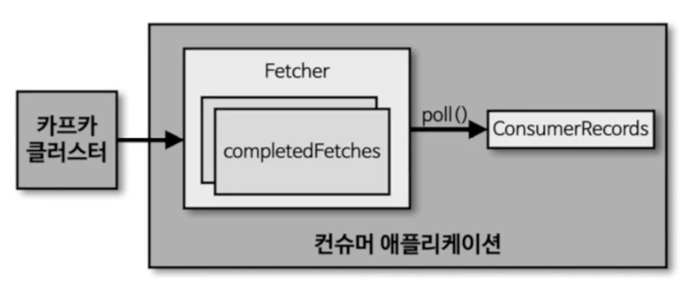

## 컨슈머

### 컨슈머 내부 구조



- Fetcher: 리더 파티션으로부터 레코드들을 미리 가져와서 대기
- ConsumerRecords: 처리할 레코드 모음, 오프셋이 포함됨 -> 처리 완료후 오프셋 커밋

### 컨슈머 그룹
격리된 환경에서 끊임없이 메시지를 처리할 수 있도록 컨슈머들을 그룹으로 만든다.
- 일반적으로 동일한 컨슈머 그룹은 동일한 로직을 수행한다.
- 일반적으로 컨슈머 그룹은 토픽 내 모든 파티션을 구독한다.
- 컨슈머는 여러 파티션에 할당될 수 있기 때문에 토픽의 파티션 갯수보다 작거나 같아야 한다.

#### 리밸런싱
컨슈머 그룹에 속한 특정 컨슈머가 제외되거나 장애가 발생하는 경우, 해당 컨슈머에 할당된 파티션은 다른 컨슈머에 재할당된다.
- 파티션이 100개 이상으로 많은 경우 리밸런싱 시간이 오래걸릴 수 있다.
- 리밸런싱은 데이터 처리 과정에서 언제든 발생할 수 있기 때문에 이에 대응하는 코드를 작성해야 한다.

#### 커밋
중복 처리를 방지하기 위해 컨슈머 애플리케이션이 오프셋 커밋을 정상적으로 처리했는지 검증해야 한다.

#### Assignor
컨슈머와 파티션 할당 정책은 어사이너에 의해 결정된다. 카프카 2.5.0은 RangeAssignor가 기본값으로 설정된다. 일반적으로 컨슈머와 파티션은 1:1로 구성하기 때문에 어떤 Assignor를 사용해도 비슷하다.

### 컨슈머 주요 옵션(필수 옵션)
- bootstrap.servers: 데이터를 가져올 대상 클러스터
- key.deserializer: 레코드의 메시지 키를 역직렬화하는 클래스 지정
- value.deserializer: 레코드의 메시지 값을 역직렬화하는 클래스 지정

### 컨슈머 주요 옵션(선택 옵션)
##### group.id
컨슈머 그룹 아이디를 지정한다. subscribe() 메서드로 토픽 구독 시에는 필수 옵션이다. default: null
##### auto.offset.reset
컨슈머 그룹이 특정 파티션을 읽을 때 저장된 컨슈머 오프셋이 없는 경우, 어떤 오프셋부터 읽을지 선택하는 옵션이다. default: latest
##### enable.auto.commit
자동 커밋 사용 여부 설정, default: true
##### auto.commit.interval.ms
자동 커밋 사용 중일 경우 오프셋 간격을 지정한다. default: 5000
##### max.poll.records
poll() 메서드를 통해 반환되는 레코드 개수를 지정한다. default: 500
##### session.timeout.ms
컨슈머의 heartbeat가 전송되지 않을 때 브로커가 연결을 끊는 시간이다. default: 10000
##### heartbeat.interval.ms
- 하트비트 전송 시간 간격이다. default: 3000
- 마지막 하트비트 전송 후 session.timeout.ms 시간이 지나면 해당 컨슈머 할당을 끊고 리밸런싱한다.
##### max.poll.interval.ms
poll 메서드를 호출하는 간격의 최대 시간, default: 300000
##### isolation.level
트랜잭션 프로듀서가 레코드를 트랜잭션 단위로 보낼 경우 사용한다.

#### auto.offset.reset(상세)
컨슈머 그룹이 특정 파티션을 읽을 때, 어느 오프셋부터 읽을지 선택하는 옵션이다. 일반적으로 새로운 컨슈머 그룹 운용 시에만 사용되는 옵션이다.
- latest: 가장 최근 오프셋부터
- earliest: 가장 과거 오프셋부터
- none: 그룹의 커밋 기록을 확인, 기록이 없으면 오류를 반환하고, 기록이 있다면 커밋 기록 이후부터 읽기 시작

#### 동기 오프셋 커밋 컨슈머
```java
while (true) {  
    ConsumerRecords<String, String> records = consumer.poll(Duration.ofSeconds(1));  
    for (ConsumerRecord<String, String> record : records) {  
        logger.info("record:{}", record);  
    }  
    consumer.commitSync();
}
```

poll() 호출 이후 commitSync() 호출로 명시적 커밋 수행이 가능하다.

#### 동기 오프셋 레코드 단위 커밋 컨슈머
브로커와 통신이 늘어나기 때문에 일반적인 환경에서는 사용되지 않는다.

#### 비동기 오프셋 커밋 컨슈머
동기 오프셋 커밋은 commitSync() 호출 이후 브로커로부터 커밋 완료에 대한 응답을 기다려야 한다. 이 과정에서 데이터 처리가 일시 중단된다. 이런 성능 문제를 극복하기 위해 비동기 커밋을 사용할 수 있다.

```java
while (true) {  
    ConsumerRecords<String, String> records = consumer.poll(Duration.ofSeconds(1));  
    for (ConsumerRecord<String, String> record : records) {  
        logger.info("record:{}", record);  
    }  
	consumer.commitAsync(new OffsetCommitCallback() {  
    public void onComplete(Map<TopicPartition, OffsetAndMetadata> offsets, Exception e) {  
        if (e != null)  
            System.err.println("Commit failed");  
        else  
            System.out.println("Commit succeeded");  
        if (e != null)  
            logger.error("Commit failed for offsets {}", offsets, e);  
	    }  
	});
}
```
- 콜백을 통해 커밋 완료 여부를 알 수 있다.
- 리밸런싱 이슈 등을 어떻게 대응할지 고민이 필요하다.

#### 리밸런스 리스너를 가진 컨슈머
카프카는 리밸런스 발생을 감지하기 위해 ConsumerRebalanceListener 인터페이스를 지원한다.
인터페이스는 다음 메서드를 갖는다.
- onPartitionassigned(): 리밸런스 완료 후 파티션 할당 완료 후 호출되는 메서드
- onPartitionRevoked(): 리밸런스 시작 전 호출되는 메서드
마지막으로 처리한 레코드를 기준으로 커밋하기 위해서는 리밸런스 시작 직전 커밋하면 된다.
```sh
[main] WARN com.example.RebalanceListener - Partitions are revoked : [test-1, test-0, test-3, test-2, test-5, test-4, test-7, test-6, test-9, test-8]
...
[main] WARN com.example.RebalanceListener - Partitions are assigned : [test-5, test-7, test-6, test-9, test-8]
```

### 컨슈머의 안전한 종료
정상 종료되지 않은 컨슈머는 세션 타임아웃이 발생할 때까지 컨슈머 그룹에 남게 된다. 카프카는 안전한 종료를 위한 wakeup() 메서드를 지원한다. 해당 메서드 호출 이후 poll()이 수행되면 WakeupException이 발생한다. 다음과 같이 응용 가능하다.
```java
try {  
    while (true) {  
        ConsumerRecords<String, String> records = consumer.poll(Duration.ofSeconds(1));  
        for (ConsumerRecord<String, String> record : records) {  
            logger.info("{}", record);  
        }  
        consumer.commitSync();  
    }  
} catch (WakeupException e) {  
    logger.warn("Wakeup consumer");  
} finally {  
    logger.warn("Consumer close");  
    consumer.close();  
}
```

#### 멀티스레드 컨슈머
1 thread는 곧 1 컨슈머가 된다. 여러 컨슈머를 구성할 때는 한 개의 스레드를 갖는 프로세스를 여러개 띄우는 방식도 가능하지만, 하나의 프로세스가 여러 스레드를 갖게 구성할 수도 있다.
- 물리장비, 배포 자동화 인프라 부족 -> 단일 프로세스 병렬 스레드 사용
- cloud 환경, 배포 자동화 인프라 소유 -> 병렬 프로세스 단일 스레드 사용

### 컨슈머 랙
컨슈머 랙은 파티션 최신 오프셋과 컨슈머 오프셋 간의 차이다. 이는 해당 컨슈머의 정상 동작 여부를 확인하는 지표가 된다. 컨슈머 랙은 (컨슈머 그룹 - 토픽 - 파티션) 별로 생성된다.
컨슈머 랙을 모니터링함으로써 컨슈머의 장애를 확인할 수 있고 파티션 개수를 정하는 데, 참고할 수 있다. 이는 카프카 모니터링의 핵심이다. 카프카 운영 전 반드시 랙을 모니터링하는 환경을 구축해야 한다.

#### 컨슈머 랙 모니터링 - 파티션 이슈
컨슈머 랙 모니터링을 통해 파티션 자체에 이슈가 있음을 알 수도 있다.

#### 컨슈머 랙 확인 방법

##### 1. 카프카 명령어 kafka-consumer-groups.sh
파티션 별 랙 정보를 알 수 있다. 일회성으로는 사용 가능하지만 모니터링 용도로는 부족하다.

##### 2. 클라이언트 측, metrics() 메서드 사용
컨슈머 애플리케이션에서 KafkaConsumer 인스턴스의 metrics() 메서드를 활용해 랙 지표 확인이 가능하다. 
그러나 다음의 문제가 있다.
- 컨슈머가 정상 동작할 때만 확인 가능하다.
- 모든 컨슈머 애플리케이션에 컨슈머 랙 모니터링 코드가 들어가야 한다.
- 서드파티 애플리케이션에 대해 컨슈머 랙 모니터링이 불가능하거나 힘들다.

##### 3. 외부 모니터링 툴 사용
가장 최적의 방법이다.

### 멱등성 프로듀서
멱등성 프로듀서는 동일한 데이터를 여러 번 전송하더라도 카프카 프로듀서에 단 한 저장되는 것을 보장한다. 데이터의 중복 적재를 막기 위한 옵션이다. 멱등성 프로듀서는 데이터를 브로커로 전달할 때 producder unique ID와 Sequnce ID를 함께 전달해서 중복 적재를 방지한다.

#### 멱등성 프로듀서 옵션
- 멱등성 프로듀서는 `enable.idempotence`를 통해 사용할 수 있다.
- 위 옵션을 사용하는 경우 `retires=Integer.MAX_VALUE` 가 되며 `acks=all`가 된다.
- 다회의 메시지 전송, 전송 데이터 확인, 메시지 정상 적재 확인 및 acks 응답 등으로 부하가 발생할 수 있다.

#### 멱등성 프로듀서 사용시 오류 확인
브로커에서 멱등성 프로듀서가 전송한 데이터의 PID와 SID를 확인하는 과정에서 SID가 순차적이지 않은 경우에 OutOfOrderSequenceException이 발생할 수 있다. 순서가 중요한 데이터의 경우 해당 Exception에 대한 대응 방안을 고려해야 한다.

### 트랜잭션
다수의 데이터를 동일 트랜잭션으로 묶음으로써 전체 데이터를 처리하거나 처리하지 않도록 한다.

#### 트랜잭션 프로듀서의 동작
다수의 파티션에 데이터를 저장할 경우 모든 데이터에 대해 동일한 원자성을 만족시키기 위해 사용한다. 
트랜잭션 프로듀서는 사용자가 보낸 레코드로 파티션에 저장할 뿐 아니라 트랜잭션의 시작과 끝을 표현하기 위해 **트랜잭션 commit 레코드**를 한 개 더 보낸다.

#### 트랜잭션 컨슈머의 동작
트랜잭션 컨슈머는 `isolation.level` 옵션을 `read_committed`로 설정함으로써 사용한다. 컨슈머는`read_committed`옵션을 통해 파티션에 저장된 **트랜잭션 commit 레코드**를 확인한 후 원자성 데이터를 한 번에 처리하게 된다.

---