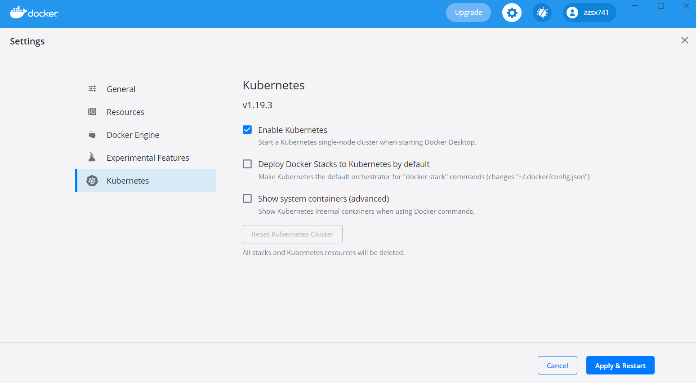

## 실습 환경 구축

쿠버네티스의 설치 환경은 앞서 봤듯이 매우 다양하다. 이번에는 Docker for Windows의 쿠버네티스로 간단하게 k8s를 설치한다.

### 개발용 k8s 설치

설치 완료 후 `kubectl version --short`로 쿠버네티스 버전을 확인한다.

(kubectl은 쿠버네티스에 접근해 API를 사용하기 위한 명령어이다.)

쿠버네티스는 YAML을 사용해 거의 모든 리소스 오브젝트들을 다룬다. 컨테이너를 예로 들자면, 컨테이너의 설정값과 비밀값 등도 모두 YAML 파일로 정의해 사용한다. 실제 서비스를 배포할 때도 kubectl 명령어가 아닌 YAML파일 여러개를 통해 쿠버네티스에 적용시킨다.

### 개념 정리

[1. 소개](concept/01-intro.md)

[2. 개념 이해](concept/02-concept1.md)

[3. 개념 이해](concept/03-concept2.md)

[4. k8s 아키텍쳐](concept/04-architecture.md)

[5. 디스크 (볼륨)](concept/05-volume.md)

### 실습

[6.2 포드(Pod)](practice/6-2.md)

[6.3 레플리카셋](practice/6-3.md)

[6.4 디플로이먼트](practice/6-4.md)

[6.5 서비스](practice/6-5.md)

---
참조 
블로그: [조대협의 블로그](https://bcho.tistory.com/1255?category=731548)  
책: 시작하세요! 도커/쿠버네티스  
