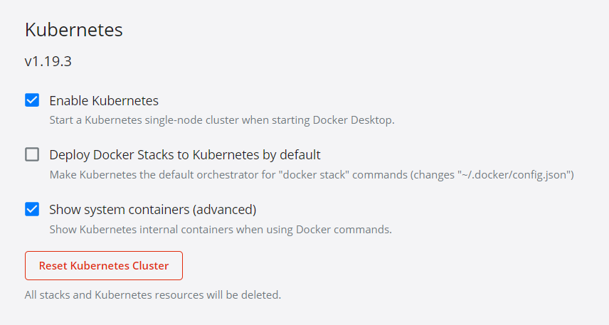
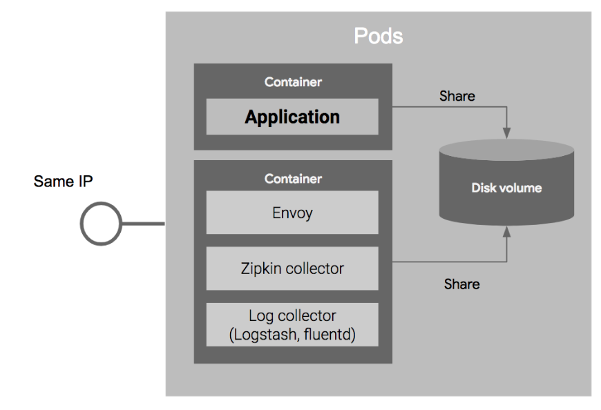
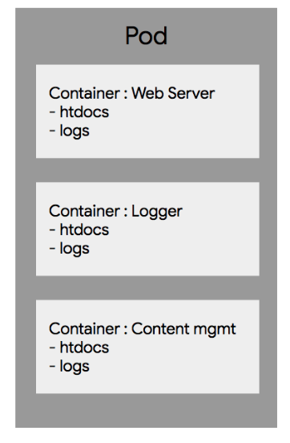
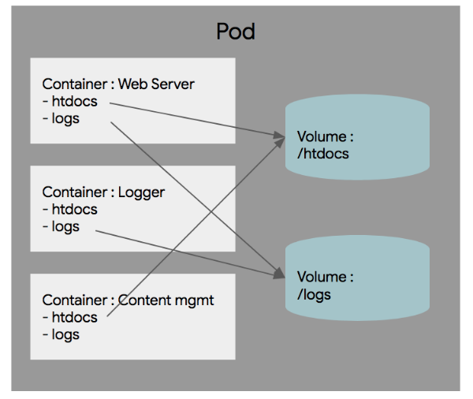
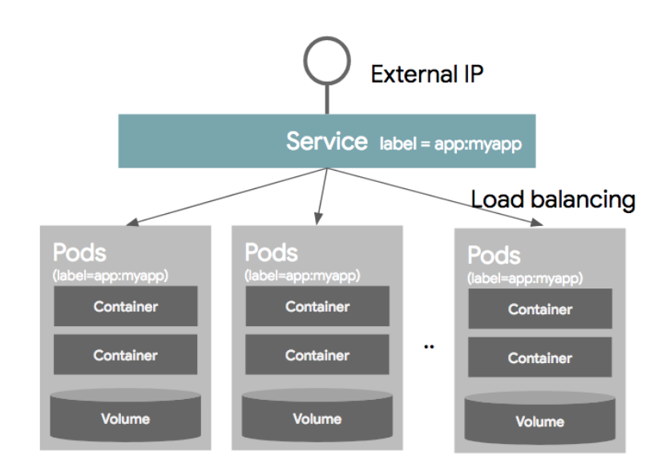
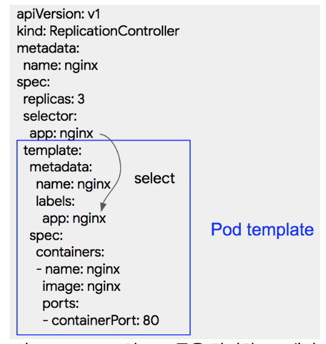
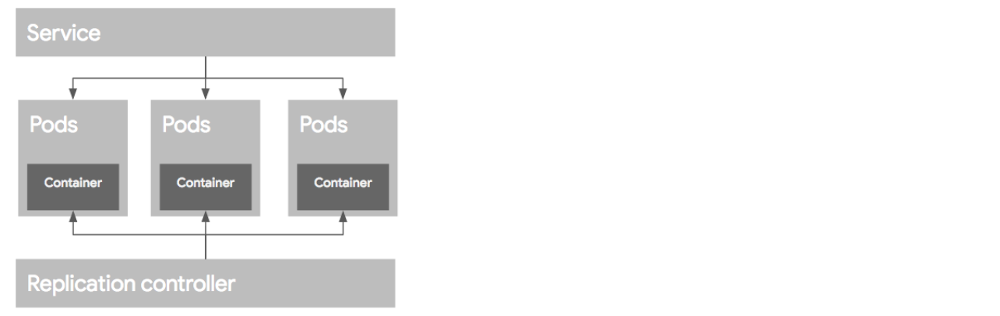
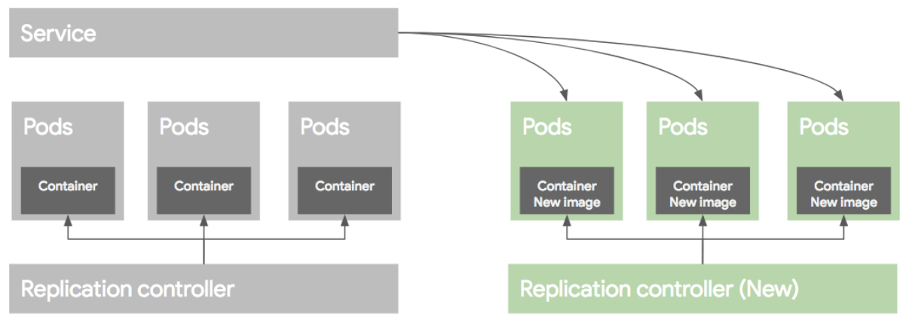
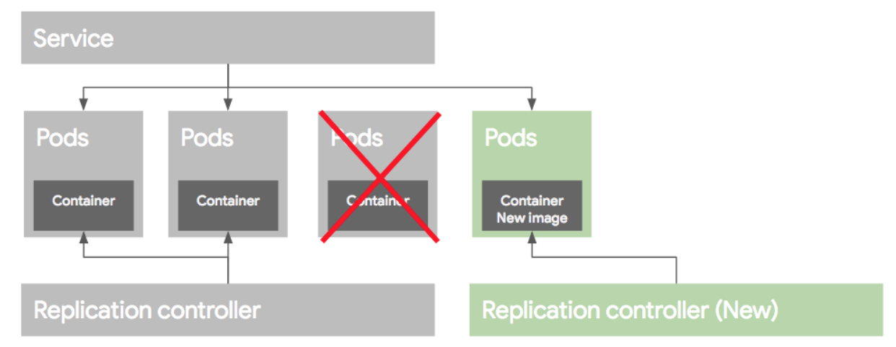

## 마스터와 워커

k8s 이해를 위해 먼저 클러스터 구조를 이해할 필요가 있다.

### **마스터**

클러스터 전체를 관리하는 컨트롤러로 API 서버 등이 컨테이너로 실행된다. 다음 설정을 통해 쿠버네티스 내부 컴포넌트 컨테이너를 볼 수 있다.



### 워커

애플리케이션 컨테이너가 배포되는 (가상 or 물리)머신 노드이다.

### Kubelet

클러스터 내 모든 노드에는 kubelet이라는 에이전트가 실행된다. 이는 컨테이너의 생성, 삭제 뿐만 아니라 마스터와 워커 노드 간 통신을 담당하는 중요한 에이전트이다.

## 오브젝트

쿠버네티스 개념에서 가장 중요한 부분은 오브젝트이다. 

1. 가장 기본 구성단위가 되는 **기본 오브젝트**
2. 기본 오브젝트를 생성하고 관리하는 추가적 기능을 가진 컨트롤러
3. 그리고 이러한 오브젝트의 스펙 외에 추가 정보인 메타 정보

### **오브젝트 스펙**

오브젝트들은 모두 오브젝트 특성을 기술한 오브젝트 스펙으로 정의된다. 정의 방법은 다음과 같다.

- 커맨드라인을 통해 오브젝트 생성시 인자로 전달
- yaml이나 json으로 스펙 정의

### **기본 오브젝트**

k8s에 의해서 배포 및 관리되는 가장 기본적 오브젝트는 컨테이너화되어 배포되는 애플리케이션 워크로드를 기술하는 오브젝트이다. 이는 Pod, Service, Volume, Namespace 4가지가 있다.

**Pod**

가장 기본적인 배포 단위로, 컨테이너를 포함하는 단위이다. k8s는 컨테이너를 Pod 단위로 배포하는데, 이는 하나 이상의 컨테이너를 포함한다.

아래는 Pod을 정의한 오브젝트 스펙이다.

```yaml
apiVersion: v1 # 스크립트 실행위한 k8s 버전, 보통v1
kind: Pod # 리소스의 종류
metadata: # 리소스의 각종 메타데이터, 라벨이나 이름 등
  name: nginx
spec: # 상세 스펙 정의
  containers: # 컨테이너를 갖기 때문에 container를 정의한다.
  - name: nginx # 이름
    image: nginx:1.7.9 # 사용하는 도커 이미지
    ports:
    - containerPort: 8090 # 오픈하는 포트
```

왜 개별적으로 컨테이너를 배포하지 않고 여러개의 컨테이너를 Pod 단위로 묶어서 배포할까?

이는 다음과 같은 특성 때문이다.

- Pod내의 컨테이너는 IP와 Port를 공유한다.

    따라서 두 개의 컨테이너가 하나의 Pod으로 배포된 경우, localhost를 통해 통신이 가능하다.

- Pod 내에 배포된 컨테이너 간에는 디스크 볼륨을 공유할 수 있다.

    최근에는 애플리케이션 뿐만 아니라 Reverse proxy나 로그 수집기 등 다양한 주변 솔루션이 같이 배포된다. 이 때 로그 수집기를 다른 컨테이너로 배포하는 경우 컨테이너에 의해 파일 시스템이 분리되어 로그 수집기가 애플리케이션 로그 파일을 읽을 수 없다. k8s는 하나의 Pod 내에서 컨테이너간 볼륨을 공유할 수 있기에 다른 컨테이너의 파일을 읽어올 수 있다.

    

**Volume**

Pod이 가동할때 컨테이너마다 로컬 디스크를 생성해서 가동된다. 이는 컨테이너가 리스타트 되거나 새로 배포될때 마다 새롭게 정의되서 배포되기에 영구적이지 못하다. (유실 가능성)

DB와 같이 파일을 영속적으로 저장해야 한다. 이런 스토리지를 볼륨이라 한다. 볼륨은 Pod 가동 시 컨테이너에 마운트해서 사용한다.

다음과 같은 웹 서버를 배포하는 Pod이 있다.

- WebServer 컨테이너는 htdocs 디렉토리의 컨테이너를 서비스하고, /logs 디렉토리에 웹 억세스 기록을 기록한다.
- Content 컨테이너는 htdocs 디렉토리의 컨텐트를 업데이트하고 관리한다.
- Logger 컨테이너는 logs 디렉토리의 로그를 수집한다.





각 컨테이너에서 접근해야하는 디렉토리를 우측과 같이 볼륨을 나눠 관리할 수 있다. k8s 는 다양한 디스크를 추상화된 형태로 제공한다. 일반적 외장 스토리지는 물론 클라우드 외장 스토리지인 AWS EBS, github 등 오픈소스 기반 외장 스토리지 및 스토리지 서비스를 지원한다.

**Service**

Pod과 볼륨을 이용해 컨테이너들을정의한 후, Pod을 서비스로 제공할 때, 일반적인 분산환경에서는 여러개의 Pod을 로드밸런서를 이용해 하나의 IP와 포트로 묶어 서비스를 제공한다.

Pod은 동적으로 생성되며 장애시 재시작을 통해 IP가 바뀌기에 로드밸런서에서 Pod 목록 지정에 IP주소를 이용하긴 어렵다. 또한 오토 스캐일링으로 인해 Pod이 동적으로 추가, 삭제되기에 이런 Pod 목록을 로드밸런서가 유연하게 선택해 줘야 한다. 이때 사용하는 것이 라벨과 라벨 셀렉터이다.

서비스 정의 시, 어떤 Pod을 서비스로 묶을 것인지 정의하는데, 이를 라벨 셀렉터라고 한다. 각 Pod 생성 시 메타데이터 정보 부분에 라벨을 정의할 수 있다. 서비스는 라벨 셀렉터에서 특정 라벨을 가진 Pod만 선택해 서비스에 묶게 된다.



myapp인 서비스만 골라내 서비스에 넣고, 이 Pod들 간에만 로드밸런싱을 통해 외부로 서비스를 제공하는 형태이다.

이 서비스를 스펙으로 정의하면 다음과 같다.

```yaml
kind: Service # 리소스 종류는 서비스이다.
apiVersion: v1 # api 버전 지정
metadata:
  name: my-service
spec: 
  selector: # Pod 선택할 라벨
    app: myapp
  ports: # TCP 80포트 사용, 해당 요청은 9376 포트로 연결
  - protocol: TCP
    port: 80
    targetPort: 9376
```

**Name space**

네임스페이스는 한 쿠버네티스 클러스터내의 논리적 분리단위이다.

Pod, Service 등은 네임스페이스 별로 **생성**이나 **관리, 사용자 권한 부여**가 가능하다. → 하나의 클러스터를 개발/운영/테스트로 나눠 운영 가능하다.

이를 통해 할 수 있는 것은

- 사용자별로 네임스페이스별 접근 권한을 다르게 운영
- 네임스페이스별로 리소스 할당량 지정
- 네임스페이스별 리소스 관리 (Pod, Service 등)

네임스페이스는 물리적 or 장치를 통한 환경 분리가 아니기에 다른 네임스페이스간 Pod이라도 통신이 가능하다. **높은 수준의 분리 정책을 원하는 경우 쿠버네티스 클럴스터 자체를 분리하는 것을 권장**

### 라벨

라벨은 쿠버네티스 리소스 선택에 사용이 가능하다. 각 리소스는 라벨을 가질 수 있으며 검색 조건에 따라 특정 라벨을 갖는 리소스만 선택 가능하다. 이를 통해 다음이 가능하다.

- 라벨로 선택된 리소스만 Service에 연결
- 특정 라벨로 선택된 리소스에만 네트워크 접근 권한을 부여

라벨은 metadata 섹션에 키/값 쌍으로 정의가 가능하다. 하나의 리소스에는 여러 라벨을 동시에 적용할 수 있다.

```yaml
metadata:
  label: 
		key1: value1
		key2: value2
```

셀렉터를 사용하는 방법은 오브젝트 스펙에서 selector라 정의하고 라벨 조건을 적으면 된다. 셀렉터 종류는 두 가지로 다음과 같다.

1. Equality based selector
    - 같냐 다르냐로 조건을 선택하는 방법이다.
    - environment = dev
    - tier != frontend
2. Set based selector
    - 집합의 개념을 사용한 셀렉터이다.
    - environment in (production,qa)
    - tier notin (frontend, backend)

## 컨트롤러

앞에서 소개한 4개의 기본 오브젝트로 애플리케이션을 설정하고 배포하는 것이 가능하다. k8s는 이를 조금 더 편리하게 관리하기 위해 컨트롤러라는 개념을 사용한다.

컨트롤러는 기본 오브젝트들을 생성하고 이를 관리한다. 종류는 다음과 같다.

- Replication Controller
- Replication Set
- DaemonSet Job
- StatefulSet
- Deployment

### Replication Controller

이는 Pod을 관리하는 역할을 한다. 지정된 숫자로 Pod을 가동시키고 관리한다. RC는 크게 3 파트로 구성된다.

1. Replica의 수

    RC에 의해 관리되는 Pod의 수, 숫자만큼 유지하도록 한다. 

2. Pod Selector

    라벨을 기반으로해 RC가 관리할 Pod을 가지고 오는데 사용한다.

3. Pod Template

    Replica 유지를 위해 새로 Pod을 생성해야할 때 어떻게 Pod을 만들지에 대한 정보를 이곳에 정의한다.

이미 돌고 있는 Pod이 있는 상태에서 RC리소스 생성 시, 해당 Pod의 **라벨이 일치할 경우** 새롭게 생성된 RC의 컨트롤을 받게 된다. 해당 Pod들이 RC에서 정의한 replica 수 보다 많으면, replica 수에 맞게 추가분 pod을 삭제하고, 모자르면 새롭게 생성한다.

이 과정에서 기존에 생성된 Pod이 template에 정의된 스펙과 다를지라도 그 Pod은 삭제하지 않는다.



### ReplicaSet

Replication Controller의 새버전이다. Replication Controller는 Equality 기반 Selector를 이용하지만 ReplicaSet은 Set 기반의 Selector를 이용한다.

### Deployment

Replication Controller와 Replica Set의 상위 추상화 개념이다. 실제 운영시엔 이를 사용한다.

이를 이해하기 위해 먼저 Deployment 없이 어떻게 배포하는지에 대해 살펴본다.

다음과 같은 Pod과 RC가 있다고 하자 



애플리케이션이 업데이트되어 새로운 버전으로 컨테이너를 만들고 이를 배포하는 시나리오에 대해 알아본다.

1. 블루/그린 배포

    

    예전(블루) 버전 서비스하던 시스템 신규(그린) 버전을 배포한 후, 트래픽을 블루 → 그린으로 한번에 돌리는 방식이다. 가장 손쉬운 방법으로는 **새로운 RC를 만들어 새로운 템플릿으로 Pod을 생성한 뒤, 생성이 끝나면 서비스를 새로운 Pod으로 옮기는** 방식이다.

    배포 이후 문제가 없으면 예전 버전의 RC와 Pod을 지운다. 

2. 롤링 업그레이드

    Pod을 하나씩 업그레이드 해가는 방식이다. 먼저 새로운 RC를 만든 후에, 기존 RC에서 Replica 수를 하나 줄이고 새로운 RC에는 Replica 수를 하나만 준다.

    

    **라벨을 같은 이름**으로 해주면 **서비스에는 자연히 새로운 RC에 의해 생성된 Pod이 포함**된다. 이런 작업을 반복하면 다음과 같이 된다.

    

    만약 배포가 잘못된 경우에는 기존 RC의 replica 수를 원래대로 올리고, 새버전의 replica 수를 0으로 만들어서 예전 버전의 Pod으로 롤백이 가능하다.

    이 과정은 명령어를 통해 RC 단위 컨트롤이 가능하지만, 여전히 작업이 필요하며 배포 과정을 모니터링 해야한다. 그리고 가장 문제는 클라이언트에서 실행하는 명령이기에 클라이언트 연결이 끊어질 경우 문제가 생길 수 있다. 그리고 롤백과정 역시 수동 컨트롤이 필요할 수 있다.

    이 과정을 자동화-추상화한 개념이 Deployment이다. 이는 Pod 배포를 위해 RC를 생성 및 관리하는 역할을 하며 롤백을 위한 기존 RC 관리 등 여러 기능을 포함한다.