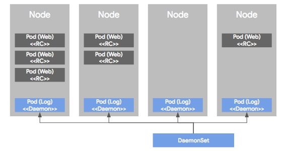
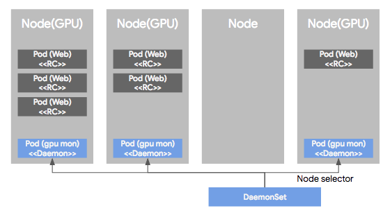
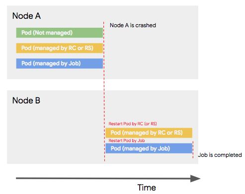
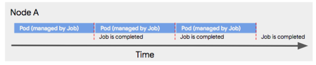
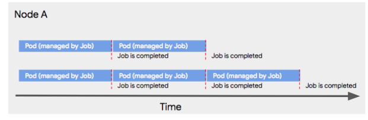

RC, RS, Deployment는 웹서버와 같은 일반적 워크로드에 대해 Pod을 관리하기 위한 컨트롤러다. 그러나 실제 운영환경에서는 DB, 배치 작업, 데몬 서버와 같이 다양한 형태의 워크로드 모델이 존재하며 k8s는 다양한 컨트롤러를 제공함으로써, Pod의 운영을 다양한 시나리오에 맞게 지원한다.

### DaemonSet

DaemonSet은 Pod이 각각 노드에서 하나씩만 돌게 하는 형태로 Pod을 관리하는 컨트롤러다.



DS에 의해 관리되는 Pod는 모든 노드에 균등하게 하나씩만 배포되며 이는 서버 모니터링이나 로그 수집 용도로 많이 사용된다.



또한, 특정 노드들에만 선택적으로 Pod이 하나씩 배포되도록 할 수도 있다. 이는 Pod의 **node selector**를 이용한다. 특정 장비에만 로그 수집이 필요한 경우가 사용예시이다.

### Job

워크로드에는 배치나 한번 실행되고 끝나는 형태의 작업 또한 있을 수 있다.

- 한 번만 발생하는 파일 변환 작업
- ETL 배치 작업

등등은 웹서버 처럼 계속 Pod이 떠있을 필요가 없다. 이러한 워크로드 모델을 지원하는 컨트롤러가 **Job**이다.

Job에 의해 관리되는 Pod은 Job이 종료될 때 같이 종료된다. Job을 정의할 때는 일반적으로 아래와 같이 컨테이너 스펙 부분에 image 뿐만 아니라 컨테이너에서 Job을 수행하기 위한 커맨드를 같이 입력한다.

```yaml
apiVersion: batch/v1
kind: Job
metadata:
  name: pi
spec:
  template:
    spec:
      containers:
      - name: pi
        image: perl
        command: ["perl",  "-Mbignum=bpi", "-wle", "print bpi(2000)"]
      restartPolicy: Never
  backoffLimit: 4
```

Job 컨트롤러에 의해 실행된 Pod은 이 command 실행 결과에 따른 (프로세스 exit 코드로) Job의 실패와 성공을 판단한다. 결과가 실패라면, Job을 재실행할지 그냥 끝낼지를 설정에 따라 결정한다.

**Job이 끝나기 전 비정상적인 종료가 발생한다면?**

k8s 클러스터에서 특정 노드에 장애가 발생했다 가정한다. RC/RS에 의해 관리되느 Pod은 자동으로 다른 노드에서 자동으로 생성되 시작될 것이다. 컨트롤러에 의해 관리되지 않는 Pod은 사라진다.



장애 시 재시작은 선택이 가능하다. 만약 재시작을 하도록 한다면 작업의 상태가 보장되지 않기에 데이터가 겹치거나 문제가 없는 형태여야 한다.

배치 작업의 경우 같은 작업을 연속해서 여러번 수행하는 경우가 있다. 이런 경우를 위해 Job 컨트롤러는 Pod을 순차적, 여러번 실행할 수 있도록 설정이 가능하다. Job 설정 시 completion에 횟수를 주면 같은 작업을 그만큼 순차적 반복한다.



순차성이 필요없고 병렬로 처리하고 싶다면, Job 설정에서 parallelism에 동시 실행할 수 있는 Pod 수를 주면, 지정된 수 만큼 Pod를 실행해 completion 횟수를 병렬로 처리한다.



### Cron jobs

Job 컨트롤러에 의해서 실행되는 배치성 작업들에 대해서 고려할 점중 하나는 바로 자동화 실행이다. 주기적으로 정해진 스케쥴에 따라 Job 컨트롤러에 의해 작업을 실행시키는 컨트롤러엔 cron jobs 컨트롤러가 있다.

cron jobs 컨트롤러는 Unix cron 명령어와 유사하다. 시간에 따른 실행 조건을 정의할 수 있으며 이에 따라 Job 컨트롤러를 실행하여 정의된 Pod을 실행할 수 있게 한다.

```yaml
apiVersion: batch/v1beta1
kind: CronJob
metadata:
  name: hello
spec:
  schedule: "*/1 * * * *"
  jobTemplate:
    spec:
      template:
        spec:
          containers:
          - name: hello
            image: busybox
            args:
            - /bin/sh
            - -c
            - date; echo Hello from the Kubernetes cluster
          restartPolicy: OnFailure
```

Job 컨트롤러와 유사하며 다른 점은 schedule이라는 항목이다.

### StatefulSet

RS/RC나 다른 컨트롤러로는 DB와 같이 상태를 가지는 애플리케이션 관리가 어렵다. 이에 상태를 가진 Pod을 지원하기 위해 StatefulSet이라는 것이 새로 소개되었다.