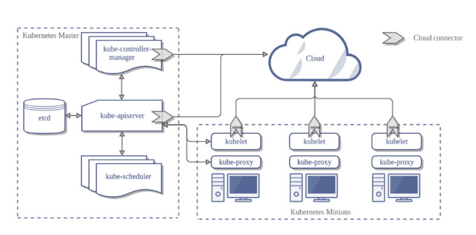

이제 k8s가 실제 어떤 구조로 구현되었는지 아키텍쳐를 살펴본다.

## 마스터와 노드

k8s는 크게 마스터와 노드 두 개의 컴포넌트로 분리된다. 마스터는 k8s 설정 환경을 저장하고 전체 클러스터를 관리하며 노드는 Pod나 컨테이너처럼 k8s 위에서 동작하는 워크로드를 호스팅한다.

### 마스터

k8s 클러스터 전체를 컨트롤한다. 크게 API 서버, 스케쥴러, 컨트롤러 매니져, etcd로 구성되어 있다.

**API 서버**

모든 명령과 통신을 API를 통해서 하는데, 그 중심이 되는 서버가 API 서버이다. k8s 모든 기능들을 REST API로 제공하고 이에 대한 명령을 처리한다.

**Etcd**

API 서버가 명령을 주고 받는 서버라면 k8s 클러스터의 DB 역할이 되는 서버이다. etcd라는 K-V 스토어 오픈소스로 설정값이나 클러스터 상태를 저장한다.

**스케쥴러**

Pod, 서비스 등 각 리소스들을 적절 노드에 할당한다.

**컨트롤러 매니져**

컨트롤러를 생성하고 이를 각 노드에 배포하며 이를 관리한다.

**추가) DNS**

그림에는 없지만, k8s는 리소스의 엔드포인트를 DNS로 맵핑하고 관리한다. Pod나 서비스등은 IP를 배정받는데, 동적 생성되는 리소스이기에 IP주소가 그대마다 변경이 된다. 따라서 리소스에 대한 위치 정보가 필요했고, k8s는 이를 내부 DNS를 두는 방식으로 해결했다.

### 노드

노드는 마스터에 의해 명령을 받고 실제 워크로드를 생성해 서비스하는 컴포넌트이다. Kubelet, Kube-proxy, cAdvisor 그리고 컨테이너 런타임이 배포된다.

**Kubelet**

노드에 배포되는 에이전트, 마스터의 API 서버와 통신하며 노드가 수행해야 할 명령을 받아 수행하고, 노드의 상태를 마스터로 전달

**Kube-proxy**

- 노드로 들어오는 네트워크 트래픽을 적절한 컨테이너로 라우팅
- 로드밸런싱 등 노드로 들어오고 나가는 네트워크 트래픽 프록
- 노드와 마스터간 네트워크 통신을 관리

**컨테이너 런타임**

Pod를 통해 배포된 컨테이너를 실행하는 런타임, 도커 외에도 rkt 등..

**cAdvisor**

각 노드에서 가동되는 모니터링 에이전트, 노드에서 가동되는 컨테이너들의 상태 및 성능 정보를 수집해, 마스터 서버 API로 전달한다.

전체적으로 모듈화가 되어있으며 기능확장을 위한 플러그인을 설치할 수 있는 구조로 되어있다.