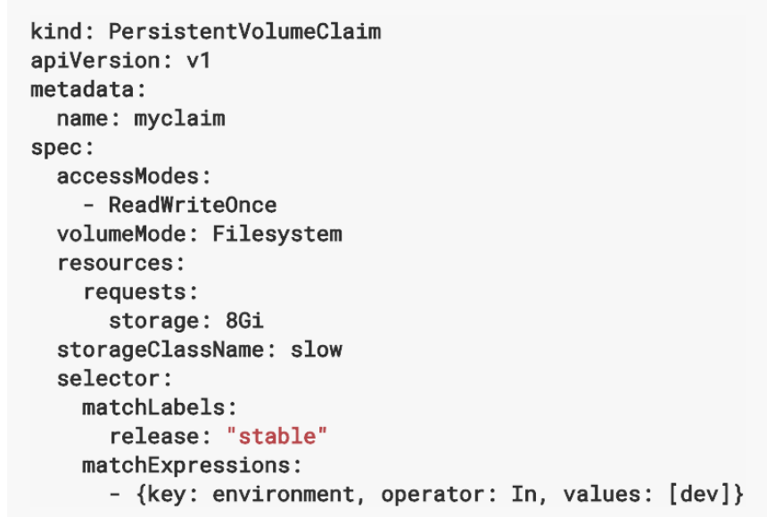

k8s에서 볼륨이란 Pod에 종속되는 디스크이다. Pod 단위이기에 Pod에 속해 있는 여러개의 컨테이너가 공유해서 사용될 수 있다.

## 볼륨 종류

로컬 디스크, NFS 등 일반적인 외장 디스크 인터페이스, Ceph 등의 오픈소스 파일 시스템, 퍼블릭 클라우드, 프라이빗 클라우드 등 다양한 볼륨을 지원한다. 크게 **임시, 로컬, 네트워크** 디스크로 나뉨

### emptyDir

Pod가 생성될때 생성되고, Pod가 삭제될 때 같이 삭제되는 임시 볼륨.

Pod 내의 컨테이너가 크래쉬되어 삭제 및 재시작되어도 emptyDir의 생명주기는 Pod 단위이기에 삭제되지 않는다.

emptyDir의 내용은 물리적 디스크(로컬, 네트워크 등)에 저장이 된다. emptyDir.medium 필드에 "Memory"라고 지정 시, emptyDir 내용은 물리 디스크 대신 메모리에 저장이 된다.

다음은 하나의 Pod에 nginx와 redis 컨테이너를 가동 시키고, emptyDir 볼륨을 생성하여 이를 공유하는 설정이다.

```yaml
apiVersion: v1
kind: Pod
metadata:
  name: shared-volumes 
spec:
  containers:
  - name: redis
    image: redis
    volumeMounts:
    - name: shared-storage
      mountPath: /data/shared # 여기에 마운트한다.
  - name: nginx
    image: nginx
    volumeMounts:
    - name: shared-storage
      mountPath: /data/shared # 여기에 마운트한다.
  volumes: # emptyDir 기반 볼륨 생성
  - name : shared-storage
    emptyDir: {}
```

이제 컨테이너에 접속해서 디렉토리에 /data/shared 디렉토리에 접속해본다.

```bash
# 컨테이너 shell 접속
$ kubectl exec -it shared-volumes --container redis -- bash

# 디렉터리 확인
root@shared-volumes:/data/shared# ls -al
total 8
drwxrwxrwx 2 redis root  4096 Feb  1 08:27 .
drwxr-xr-x 3 redis redis 4096 Feb  1 08:27 ..
```

이제 파일을 생성해본다.

```bash
root@shared-volumes:/data/shared# echo hello > file.txt
root@shared-volumes:/data/shared# ls -al
total 12
drwxrwxrwx 2 redis root  4096 Feb  1 08:32 .
drwxr-xr-x 3 redis redis 4096 Feb  1 08:27 ..
-rw-r--r-- 1 root  root     6 Feb  1 08:32 file.txt
```

다음으로 nginx 컨테이너에 접속해서 shared volume을 확인해본다.

```bash
root@shared-volumes:/# cd data/shared/
root@shared-volumes:/data/shared# ls -al
total 12
drwxrwxrwx 2  999 root 4096 Feb  1 08:32 .
drwxr-xr-x 3 root root 4096 Feb  1 08:27 ..
-rw-r--r-- 1 root root    6 Feb  1 08:32 file.txt
```

### hostPath

hostPath 볼륨 타입은 노드의 로컬 디스크 경로를 Pod에서 마운트해서 사용한다.

- 같은 hostPath에 있는 볼륨은 여러 Pod 사이에서 공유되어 사용됨
- Pod가 삭제 되더라도 hostPath에 있는 파일들은 삭제되지 않음
- 다른 Pod가 같은 hostPath를 마운트하면 남아있는 파일에 엑세스가 가능

**주의할 점) 하나의 팟이 재시작되어 다른 노드에서 가동될 경우, 그 노드의 hostPath를 사용하기에 이전에 다른 노드에서 사용한 hostPath의 파일 내용에 엑세스가 불가능하다.**

hostPath는 노드의 파일 시스템 접근에 유용하다. 로그 파일을 읽어서 수집하는 로그 에이전트를 팟으로 배포하는 경우, 노드의 파일시스템에 접근해야하기에 유용하게 사용할 수 있다.

노드의 /tmp 디렉토리를 hostPath를 이용해 /data/shared 디렉토리에 마운트해 사용하는 예제이다.

```yaml
apiVersion: v1
kind: Pod
metadata:
  name: hostpath
spec:
  containers:
  - name: redis
    image: redis
    volumeMounts:
    - name: terrypath
      mountPath: /data/shared
  volumes:
  - name : terrypath
    hostPath:
      path: /tmp
      type: Directory
```

해당 팟을 배포한 뒤, 노드(k8s on docker 기준으로는 로컬 머신)의 /tmp에 파일을 생성해본다.

```bash
reason96@□□ä-5994 MSYS /tmp
$ echo "hello hostPath" > hello.txt
```

다음으로 팟의 컨테이너에 접속해 /data/shared 디렉토리를 확인하면 정상적으로 연결된다.

### gitRepo

이 볼륨은 생성시 지정된 git 레퍼지토리의 특정 리비전 내용을 clone으로 내려받은 후에 디스크 볼륨을 생성하는 방식이다. 물리적으로 emptyDir이 생성되고, 레포지터리 내용을 clone으로 다운받는다. 정적 파일 및 스크립트 언어 기반 코드들은 gitRepo 볼륨을 이용해 손쉽게 배포 가능하다.


```yaml
apiVersion: v1
kind: Pod
metadata:
  name: gitrepo-volume-pod
spec:
  containers:
  - image: nginx:alpine
    name: web-server
    volumeMounts:
    - name: html
      mountPath: /usr/share/nginx/html
      readOnly: true
    ports:
    - containerPort: 80
      protocol: TCP
volumes:
  - name: html
    gitRepo:
      repository: https://github.com/luksa/kubia-website-example.git
      revision: master
      directory: .
```

위 설정은 연결된 repository의 master 리비전을 클론해 마운트 시키는 설정이다.

## PersistentVolume(PV) and PersistentVolumeClaim(PVC)

디스크 볼륨을 설정하려면 물리적 디스크를 생성해야 하고, 이런 물리적 디스크에 대한 설정을 자세히 이해할 필요가 있다. k8s는 인프라에 대한 복잡성을 추상화를 통해 간단히 하고, 개발자들이 손쉽게 필요한 인프라를 설정하도록 하는 개념을 갖고 있다. PVC와 PV 개념은 시스템 관리자가 인프라 종속적 부분을 관리하게 하며 개발자가 이에 대한 이해 없이 간단히 사용할 수 있도록 한다.

1. 시스템 관리자가 물리 디스크 생성
2. PV라는 이름으로 쿠버네티스에 등록
3. Pod 생성 시 볼륨 정의 → 물리적 디스크 특성 정의 X, PVC를 지정해 관리자가 생성한 PV에 연결


이 때 주의할 점은 볼륨은 생성 이후 직접 삭제하지 않으면 삭제되지 않는다. PV의 생명주기는 클러스터에 의해 관리되어 Pod 생성과 삭제에 관계없이 별도 관리 된다.

### PeersistentVolume

다음은 NFS 파일 시스템 5G를 pv0003으로 정의하는 PV 정의 예제이다.


- Capacity: 볼륨 용량
- VolumeMode: Filesystem (default) 또는 raw 설정 가능, 일반 파일시스템인지 raw볼륨인지 정의
- Reclaim Policy
    - PV는 연결된 PVC 삭제 후 다른 PVC에 의해서 재사용이 가능하다. 재사용 시 디스크 내용을 지울지 유지할지에 대한 정책을 Reclaim Policy를 이용해 설정 가능하다.
        - Retain: 삭제X, PV내용 유지
        - Recycle: 재사용 가능, 재사용 시 데이터 내용을 자동으로 rm -rf로 삭제 후 재사용
        - Delete: 볼륨 사용이 끝나면, 해당 볼륨 삭제
    - Reclaim Policy는 디스크 특성에 따라 적용 여부가 나뉜다.
- AccessMode
    - Pod에서 동시에 PV에 접근할 수 있는 정책이다.
        - ReadWriteOnce(RWO): PV는 하나의 Pod에만 마운트되며 읽고 쓸 수 있다.
        - ReadOnlyMany(ROX): 여러개의 Pod에 마운트되며 읽을 수 있다. 쓰기는 불가능
        - ReadWriteMany(RWX): 여러개의 Pod에 마운트되며 읽고 쓸 수 있다.
    - 이 또한 모든 디스크의 특성에 따라 선택적 지원된다.

### PersistentVolumeClaim

PVC는 Pod의 볼륨과 PVC를 연결하는 관계 선언이다.



- accessMode, VolumeMode는 PV와 동일하다.
- resources는 PV와 같이, 필요한 볼륨 사이즈를 정의한다.
- selector를 통해서도 볼륨 선택이 가능하다. 이미 생성된 PV 중 라벨이 매치되는 볼륨을 찾아서 연결한다.

### Dynamic Provisioning

앞서 봤듯이 PV를 수동 생성한 후 PVC에 바인딩 한 후에, Pod에서 사용할 수 있지만, kubernetes는 동적 생성 기능 또한 지원하고 있다. 동적 생성은 시스템 관리자가 디스크를 생성하고 PV를 생성할 필요 없이 PVC만 정의하면 이에 맞는 물리디스크 생성 및 PV 생성을 자동화하는 기능이다.


PVC를 정의하면 PVC 내용에 따라 k8s 클러스터가 물리 디스크를 생성하고, 이에 연결된 PV를 생성한다. 실 환경에서는 성능에 따라 다양한 디스크를 사용할 수 있다. 따라서 디스크를 생성할 때 필요한 디스크 타입을 정의할 수 있는데, 이를 storageClass라 하며 PVC에서 이를 지정하면 이에 맞는 디스크를 생성한다.

```yaml
apiVersion: v1
kind: PersistentVolumeClaim
metadata:
  name: mydisk
spec:
  accessModes:
  - ReadWriteOnce
  resources:
    requests:
      storage: 30Gi
```

```yaml
apiVersion: v1
kind: Pod
metadata:
  name: redis
spec:
  containers:
  - name: redis
    image: redis
    volumeMounts:
    - name: terrypath
      mountPath: /data/shared
  volumes:
  - name : terrypath
    persistentVolumeClaim:
      claimName: mydisk
```

PVC와 Pod을 생성한 후에 kubectl get pvc 명령어를 이용해 생성된 PVC 및 PV를 확인 가능하다.