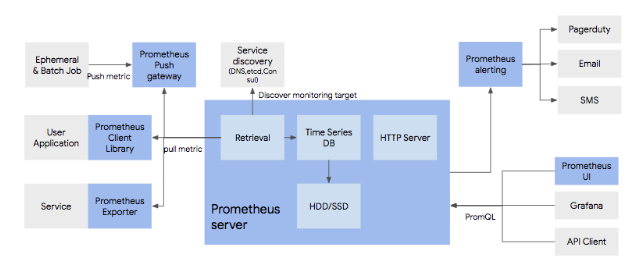
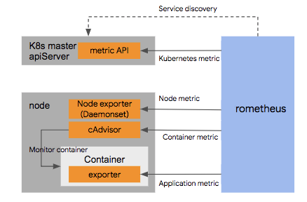

## Prometheus

그렇다면 이런 시스템을 어떻게 구축할까?

주요 모니터링 솔루션으로 언급되는 것은 프로메테우스이다. 이는 k8s 모니터링뿐만 아니라 애플리케이션, 서버, OS 등 다양한 대상으로부터 지표를 수집하여 모니터링할 수 있는 범용 솔루션이다. 구조는 아래와 같다.

### 데이터 수집

프로메테우스는 데이터 수집에 Pulling 모델을 사용한다. 따라서 프로메테우스가 주기적으로 모니터링 대상에서 지표를 읽어온다.

대상이 프로메테우스 데이터 포맷을 지원하지 않는다면 별도의 에이전트를 설치해서 지표를 읽어온다. 이를 exporter라 한다. mysql, nginx, redis와 같은 패키지는 미리 개발된 export가 있어서 다양한 서비스의 지표까지 쉽게 읽어올 수 있다.

java나 node.js와 같은 사용자 애플리케이션의 경우, Exporter를 사용하는 방법 말고도 프로메테우스 클라이언트 라이브러리를 사용하게 되면 바로 지표를 프로메테우스 서버로 보낼 수 있다.

마지막으로 Push gateway를 사용한다. 배치나 스케쥴 작업의 경우 일시적으로 작업을 진행하고 서비스가 사라지는 경우가 있다. 이런 서비스는 Pulling으로 지표를 얻어오기 어려울 수 있는데, 이를 보완하기 위해 이런 서비스들이 Push gateway에 지표를 쏴준다. Push gateway는 지표를 보관하다가 프로메테우스가 Pulling을 요청할 때, 이 지표를 리턴해준다.

### 서비스 디스커버리

프로메테우스는 모니터링 대상 목록을 유지하고 있는다. 대상에 대한 IP나 기타 접속 정보를 설정 파일로 주면 이를 기반으로 프로메테우스 서버가 모니터링 정보를 읽어온다.

그러나 컨테이너 환경에서는 IP가 동적으로 변경되는 경우가 많다. 때문에 프로메테우스는 서비스 디스커버리를 사용해서 모니터링 대상이 등록된 저장소에서 목록을 받고, 그 대상을 모니터링 한다.

프로메테우스는 다양한 서비스 디스커버리 서비스와 연동해 자동으로 모니터링 대상 목록을 가져올 수 있다.

### 저장 및 시각화

수집된 지표는 프로메테우스 내부의 시계열 DB에 저장되며 프로메테우스 웹 콘솔을 이용해 시각회되거나 Grafana와 같은 시각화 툴을 통해 지표를 시각화할 수 있다.

### 알림 서비스

alerting 컴포넌트는 지표에 대한 규칙을 걸어놓고 이를 위반할 때 알림을 보낼 수 있는 기능을 가지고 있다. 알림 대상은 이메일 pagerduty와 같은 notification 서비스 등이 연동 가능하다.

### 쿠버네티스 연동 아키텍처

쿠버네티스와 프로메테우스의 연동에 정해진 아키텍쳐는 존재하지 않는다. 범용솔루션이기 때문에 연동에 대한 자유도가 높기 때문이다. 다만, 레퍼런스 할 수 있는 구조는 다음과 같다.

- 프로메테우스 서버가 모니터링할 리소스를 찾기 위해서는 서비스 디스커버리 메커니즘이 필요하다. 이를 위해 쿠버네티스 API를 호출해, 자원들 목록에서 자원을 라벨셀렉터를 이용해 수집한다. 
그 다음 수집된 모니터링 대상에 대해서 모니터링을 수행한다. 쿠버네티스는 apiServer에서 /metric 이라는 URL을 통해 기본적인 지표를 리턴하기에, 쿠버네티스 자원들에 대한 모니터링은 이 API를 통해 수집하게 된다.
- 노드 Level에 대한 정보는 API를 통해 수집하기 어렵기때문에 node에 node exporter를 설치해서 하드웨어와 OS에 대한 정보를 수집한다.
- 컨테이너에 대한 정보는 node 별로 배포되어 있는 cAdvisor가 이를 수집하여 프로메테우스에 제공한다.
- 컨테이너 내에서 가동되는 애플리케이션에 대한 정보는 필요한 경우 클라이언트 SDK나 솔루션에 맞는 exporter를 이용해 수집한다.