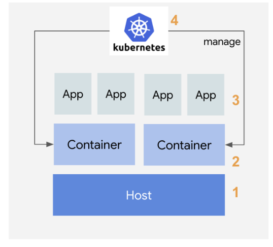
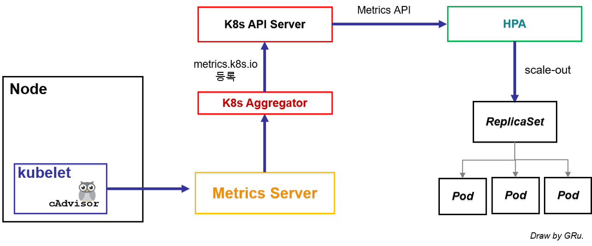
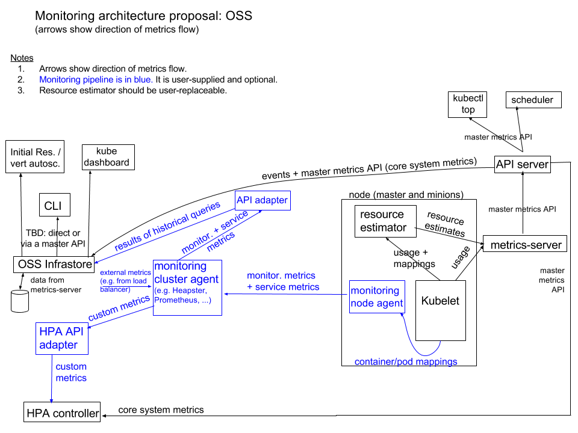

시스템 운영에 있어 가장 중요한 기능중의 하나는 시스템에 대한 모니터링이다. 시스템 자원의 사용량이나 에러등에 대한 모니터링을 통해서, 시스템을 안정적으로 운영하고 문제 발생시 원인 파악과 대응을 할 수 있다.

## Metrics 4계층

쿠버네티스 기반 시스템을 모니터링하기 위해서는 아래와 같은 4계층을 모니터링해야 한다.

### 1. 호스트(노드)

먼저 컨테이너를 실행하는 HW 호스트에 대한 지표 모니터링이 필요하다. 노드의 모든 리소스 및 노드의 OS와 커널에 대한 모니터링이 이에 해당한다.

### 2. 컨테이너

노드에서 가동되는 각각의 컨테이너에 대한 정보이다. 컨테이너의 리소스 사용량들을 모니터링한다.

### 3. 애플리케이션

컨테이너 안에서 구동되는 애플리케이션 지표를 모니터링한다. 

→ ex)컨테이너에서 가동되는 node.js 기반 애플리케이션 응답시간, HTTP 에러 빈도

### 4. 쿠버네티스

컨테이너를 컨트롤하는 k8s 자체를 모니터링한다. k8s 자원인 서비스나 포드, 계정 정보등이 이에 해당한다. **여기서 다루는 모니터링은 자원 사용량에 대한 지표 모니터링이다. 포괄적 의미의 모니터링(로그 수집 등) 과 다르다.**

## Metric 분류

### System Metric

호스트와 컨테이너 계층에 해당하는 메트릭이다. Node나 컨테이너의 CPU, 메모리 사용량 등 일반적인 시스템 관련 Metric이다. 이를 더 세분화하면 두 가지로 나뉜다.

1. Core Metrics

    쿠버네티스 내부 컴포넌트들이 사용하는 Metrics, kubectl top에서 사용하는 Metrics 값

2. Non-core Metrics

    쿠버네티스가 직접 사용하지 않는 다른 시스템 Metric을 의미한다.

### Service Metric

4계층 중 나머지 두 계층에 해당한다. Application을 모니터링 하는데 필요한 Metric 이다.

## Metric 수집 방법

메트릭을 수집하는 방법을 Pipeline이라 한다. Pipeline은 Core metric pipeline, Monitoring pipeline 2가지가 있다.

### Core Metric Pipeline (Resource Metric Pipeline)

k8s의 마스터 노드, 워커 노드로부터 수집되는 System Metric에 대한 모니터링을 담당한다. kubectl top 명령으로 나오는 결과와 관련있는 메트릭을 수집한다.

- 시스템 메트릭만 수집가능
- 주로 k8s를 구성하는 모듈(kube-apiserver, kube-scheduler, etc) 들이 사용한다.
- 별도의 서드파티 모니터링 시스템과 연계되지 않음
- Scheduler와 HPA등에서 기초자료 수집 용도로 사용된다.

**CAdvisor**

- k8s에서 사용하는 기본적인 모니터링 Agent
- 모든 워커노드의 Kubelet은 CAdvisor를 자체적으로 내장
- 이를 통해 노드, 팟, 팟 내부의 컨테이너에 대한 시스템 메트릭 정보 수집
- 수집한 정보는 kubelet전달, 해당 정보는 이후 **메트릭 서버, 프로메테우스**에서 수집

**Metric Server**

- k8s Addon 종류 중 하나로 공식적으로 k8s에서 개발, 관리되는 Addon이다.
- CAdvisor가 kubelet에 전달한 시스템 메트릭 정보를 가져와 메모리에 저장한다.
- 메모리에 저장되기에 영구적이지 않으며 짧은 기간 데이터만 보관

메트릭서버는 k8s 클러스터 구성 시 default로 있는 서버가 아니기에 별도로 구축이 필요하다.

**k8s Aggregator**

기본적으로 k8s에서 제공되는 core API이외에 더 많은 기능을 사용하기 위해 커스텀 API를 추가할 수 있도록 해준다.

**Metric API**

위에서 설명한 k8s Aggregator를 통해서 Metric Server에서 사용할 Custom API인 Metric API를 kube-apiserver에 등록한다. 일반적으로 Metric Server addon을 설치하면 Metric API까지 한번에 설치된다.

### Core Metric Pipeline 프로세스

1. 모든 Worker Node의 cAdvisor에서 System Metric 정보를 수집.
2. cAdvisor는 수집한 정보를 kubelet으로 전송.
3. kubelet에 있는 System Metric 정보를 Metric Server가 받아와서 메모리에 저장함.
4. Metrics-Server에서는 System metric 정보를 사용하기 위해 Custom API를 k8s Aggregator를 통해 미리 API server에 등록해놓았음.
5. 등록된 Metrics API를 통해 수집된 System Metric 정보가 HPA로 전송됨.
6. 설정한 값에 따라 HPA에서는 kube-controller manager에 명령을 내림
7. 명령을 받은 kube-controller manager에서 pod을 scale-out 시킴

### Monitoring Pipeline (Full Metric Pipeline)

k8s를 구성하는 노드 이외에 별도의 Addon을 사용해서 모니터링 데이터를 수집한다.

- 시스템 메트릭, 서비스 메트릭 등 모두 수집 가능
- 주로 k8s 클러스터 사용자들이 필요한 자원을 모니터링 하는데 사용
- 별도의 서드파티 모니터링 시스템과 연계 가능, ex) Prometheus

1. 서비스 메트릭의 경우 기본 제공 메트릭이 아니기때문에 별도의 Agent를 배치해야함
2. 수집한 시스템, 서비스 메트릭을 모니터링 클러스터 에이전트(힙스터, 프로메테우스)로 전송
3. 모니터링 클러스터 에이전트는 해당 메트릭을 대시보드로 확인하거나 HPA로 전송한다.

## 쿠버네티스 로깅

지표 모니터링과 함께 중요한 기능 중 하나는 로그 수집 및 모니터링이다. 로그 수집 및 모니터링 방법은 여러가지가 있지만, 오픈소스 로그 수집 및 모니터링 조합인 EFK 스택을 이용하는 경우가 대부분이다.

1. Fluentd 에이전트를 이용해 각종 로그 수집
2. Elastic search에 저장
3. 저장된 지표를 Kibana 대쉬보드를 이용해 시각화

참조

[https://ikcoo.tistory.com/104](https://ikcoo.tistory.com/104)