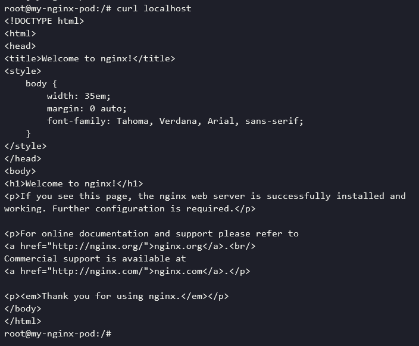

### 6.2.1 Pod 사용하기

컨테이너 애플리케이션 배포를 위한 기본 단위이다. 1개의 포드에는 1개의 컨테이너가 존재할 수도 있고, 여러 개의 컨테이너가 존재할 수도 있다.

개념 이해를 위해 Nginx 컨테이너로 구성된 포드를 직접 생성해본다.

```yaml
apiVersion: v1
kind: Pod
metadata:
  name: my-nginx-pod
spec:
  containers: # 리스트가 와야함
  - name: my-nginx-container
    image: nginx:latest
    ports: # 리스트가 와야함
    - containerPort: 80
      protocol: TCP
```

작성한 yaml을 이용해 쿠버네티스에 Pod를 생성한다.

```bash
$ kubectl apply -f nginx-pod.yaml
```

오브젝트 목록을 확인하는 방법은 다음과 같다. ex) Pod 목록

```bash
$ kubectl get pods
```

Nginx 포드 생성 시점에 사용할 포트를 지정하긴 했지만 아직 외부에서 접근할 수 있도록 노출된 상태는 아니다. 따라서 포드의 Nginx 서버로 요청을 보내기 위해서는 컨테이너 내부 IP로 접근해야 한다.

다음 명령을 통해 생성된 리소스의 자세한 정보를 얻어올 수 있다.

```bash
$ kubectl describe pods my-nginx-pod
Name:         my-nginx-pod
Namespace:    default
Priority:     0
Node:         docker-desktop/192.168.65.3
Start Time:   Thu, 21 Jan 2021 15:56:56 +0900
Labels:       <none>
Annotations:  <none>
Status:       Running
IP:           10.1.0.6
IPs:
  IP:  10.1.0.6
Containers:
  my-nginx-container:
    Container ID:   docker://e4f002db51472c640555e06839cdc95be8dec6ee9b7807bfbcb77fbfa6cddf53
    Image:          nginx:latest
    Image ID:       docker-pullable://nginx@sha256:10b8cc432d56da8b61b070f4c7d2543a9ed17c2b23010b43af434fd40e2ca4aa
    Port:           80/TCP
    Host Port:      0/TCP
    State:          Running
...
```

출력 결과에서 알 수 있듯이 IP는 10.1.0.6이다. 그러나 이는 외부에서 접근할 수 있는 IP가 아니기에 클러스터 내부에서만 접근 가능하다. docker run 명령어에서 -p 옵션 없이 컨테이너를 실행한 것과 비슷하다.

쿠버네티스 외부/내부에서 포드에 접근하려면 서비스라 하는 쿠버네티스 오브젝트를 따로 생성해야 하지만, 지금은 이 오브젝트 없이 IP만으로 Nginx 포드에 접근해본다. 클러스터의 노드 중 하나에 접속한 뒤 Nginx 포드의 IP로 HTTP 요청을 전송한다.

**로컬 환경이기 때문에 노드는 하나 뿐이다. 임시로 테스트용 포드를 생성해 접속하여 Nginx 포드로 curl 테스트를 진행했다.**

```bash
$ kubectl run -i --tty --rm debug \
	--image=alicek106/ubuntu:curl --restart=Never bash
```

```bash
:/# curl 10.1.0.6 
<!DOCTYPE html>
<html>
<head>
<title>Welcome to nginx!</title>
<style>
    body {
        width: 35em;
        margin: 0 auto;
        font-family: Tahoma, Verdana, Arial, sans-serif;
    }
</style>
</head>
<body>
<h1>Welcome to nginx!</h1>
<p>If you see this page, the nginx web server is successfully installed and
working. Further configuration is required.</p>

<p>For online documentation and support please refer to
<a href="http://nginx.org/">nginx.org</a>.<br/>
Commercial support is available at
<a href="http://nginx.com/">nginx.com</a>.</p>

<p><em>Thank you for using nginx.</em></p>
</body>
</html>녿
```

이번엔 포드의 컨테이너 내부로 직접 들어가본다. docker exec 명령어와 유사하게 쿠버네티스에서도 kubectl exec 명령으로 포드의 컨테이너에 명령어를 전달할 수 있다.

**포드 내에 컴포넌트는 Nginx 하나이기에 이렇게 접속하면 해당 컨테이너에 접속하게 된다.**

```bash
$ kubectl exec -it my-nginx-pod -- bash
```

마찬가지로 docker와 유사하게 다음과 같이 포드 로그를 확인할 수 있다.

```bash
$ kubectl logs my-nginx-pod
```

포드를 삭제할 때는 다음 명령어를 사용한다.

```bash
$ kubectl delete -f nginx-pod.yaml # 해당 yaml에 정의된 포드삭제
$ kubectl delete pod my-nginx-pod # 이름 기반 포드 삭제
```

### 6.2.2 포드 vs 도커 컨테이너

위를 살펴보면 포드로 생성한 Nginx는 docker run을 통한 단일 컨테이너와 크게 다르지 않다. 왜 포드라는 개념을 사용할까?

```bash
$ kubectl get pods
NAME           READY   STATUS    RESTARTS   AGE
my-nginx-pod   1/1     Running   0          92m
```

READY 1/1이란 my-nginx-pod에 하나의 컨테이너가 있으며 이는 정상적으로 준비됐다는 뜻이다. 포드는 1개의 컨테이너만으로 구성해야 하는 것이 아니다. 따라서 이 항목은 2/2, 3/3도 될 수 있다.

Nginx 포드에 새로운 우분투 컨테이너를 추가한다. 이전에 사용한 Yaml 파일을 수정한다.

```yaml
apiVersion: v1
kind: Pod
metadata:
  name: my-nginx-pod
spec:
  containers:
  - name: my-nginx-container
    image: nginx:latest
    ports:
    - containerPort: 80
      protocol: TCP
  
  - name: ubuntu-sidecar-container
    image: alicek106/rr-test:curl # curl이 설치된 우분투
    command: ["tail"]
    args: ["-f", "/dev/null"] # 컨테이너가 종료되지 않도록 함
```

참고로, 포드의 YAML 파일에서 사용되는 command와 args는 컨테이너 내부에서 가장 먼저 실행될 프로세스를 지정한다. YAML 파일에서 **command를 설정하면 도커 컨테이너의 ENTRYPOINT로, 포드에서 args를 설정하면 도커 컨테이너의 CMD로 치환된다고 이해하면 쉽다.**

```bash
$ kubectl exec -it my-nginx-pod -c \
	ubuntu-sidecar-container bash
```

ubuntu-sidecar-container 컨테이너 내부에서 로컬호스트로 HTTP 요청(`curl localhost`)을 전송하면 Nginx 서버의 요청이 도착하는 것을 확인할 수 있다.



여기서 눈여겨 봐야할 점은 ubuntu 컨테이너가 Nginx서버를 실행하고 있지 않음에도 로컬호스트에서 Nginx 서버로 접근이 가능하다는 점이다. 이는 포드 내의 컨테이너들이 네트워크 네임스페이스 등과 같은 리눅스 네임스페이스를 공유해 사용하기 때문이다.

**포드 내부 컨테이너들은 네트워크와 같은 리눅스 네임스페이스를 공유한다.**

### 6.2.3 완전한 애플리케이션으로서의 포드

일반적으로 하나의 포드는 하나의 컨테이너로 구성된다. 또한, 하나의 포드는 완전한 애플리케이션이다. Nginx 컨테이너의 경우 그 자체로 완전한 애플리케이션이기에 한 포드에 두 개를 정의하는 것은 바람직하지 않다.

그러나 Nginx가 설정 파일 변경사항을 갱신하는 설정 리로더나 로그를 수집해주는 프로세스 기능이 필요하다면 어떨까?

이런 경우 주 컨테이너를 Nginx로 하되 기능 확장을 위한 컨테이너를 포드에 포함시킬 수 있어야 한다. → 이를 **Side car container**라 한다.

사이드카 컨테이너는 포드 내의 다른 컨테이너와 네트워크 환경 등을 공유하게 된다. 따라서 포드에 포함된 컨테이너들은 모두 같은 워커 노드에서 함께 실행된다.

따라서 포드에 정의된 여러 컨테이너는 하나의 완전한 애플리케이션으로 동작한다. 이것이 도커 컨테이너와 k8s 포드의 차이점이다.