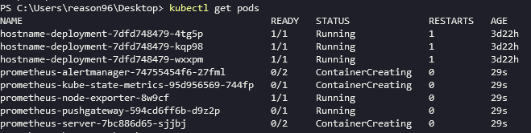
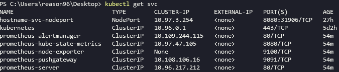
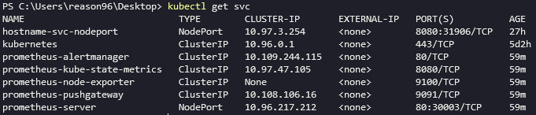
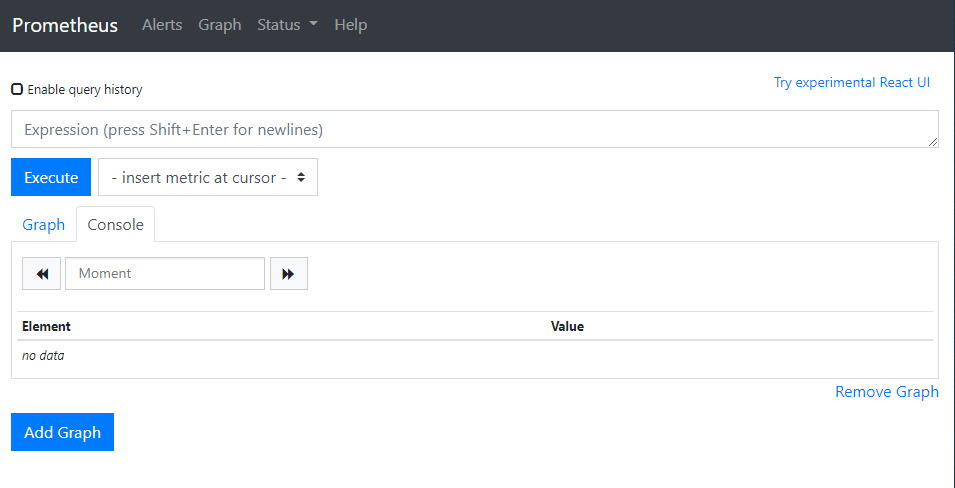
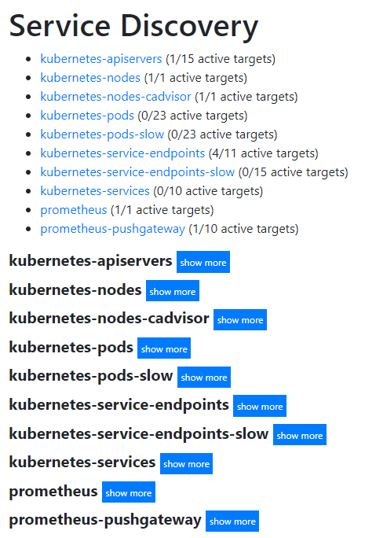
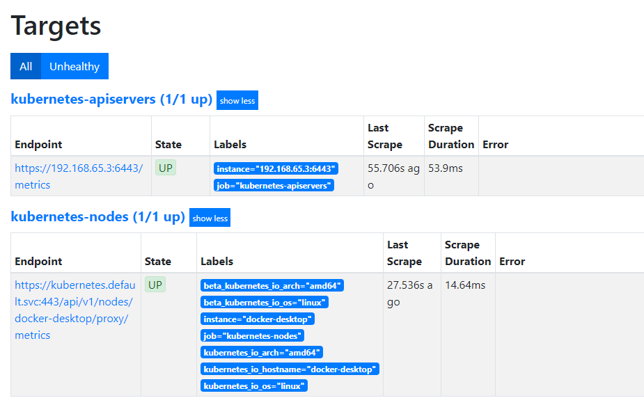

## Helm 설치

- window 환경
- chocolately 설치 가정
- heml v3

Helm 클라이언트 설치 (Powershell)

```bash
$ choco install kubernetes-helm
```

Tiller 설치

- V3으로 넘어오며 필요없어졌음

Chart repository 추가

```bash
$ helm repo add stable https://charts.helm.sh/stable
```

Chart list 출력

```bash
$ helm search repo stable
```

repository update

```bash
$ helm repo update
```

## Prometheus 배포

Prometheus 차트를 클러스터에 배포해본다.

```bash
$ helm install prometheus stable/prometheus
```

그 뒤, pod의 상태를 확인해보면



몇 개의 pod이 Running 중이지 않음을 확인할 수 있다.

이는 k8s 클러스터에 StorageClass가 정의되어있지 않기 때문이다. 따라서 PV(persistent vloume) 옵션을 false로 변경해 EmptyDir을 사용하게 해야한다.

### Helm 차트를 변경하는 방법

**using yaml**

1. 차트 확인

    ```bash
    $ helm inspect values stable/prometheus
    ```

2. persistentVolume.enabled 부분을 변경

    ```bash
    $ vim volumeF.yaml

    다음과 같은 파일 생성
    alertmanager:
        persistentVolume:
            enabled: false
    server:  
        persistentVolume:
            enabled: false
    pushgateway: 
        persistentVolume:
            enabled: false

    $ helm upgrade -f volumeF.yaml prometheus stable/prometheus
    ```

이제 pods를 확인하면 정상 동작중임을 확인 가능하다.

```bash
PS C:\Users\reason96\Desktop> kubectl get pods
NAME                                            READY   STATUS    RESTARTS   AGE
hostname-deployment-7dfd748479-4tg5p            1/1     Running   1          3d23h
hostname-deployment-7dfd748479-kqp98            1/1     Running   1          3d23h
hostname-deployment-7dfd748479-wxxpm            1/1     Running   1          3d23h
prometheus-alertmanager-5bffbcfdbc-5tbpg        1/2     Running   0          6s
prometheus-alertmanager-74755454f6-27fml        2/2     Running   0          16m
prometheus-kube-state-metrics-95d956569-744fp   1/1     Running   0          16m
prometheus-node-exporter-8w9cf                  1/1     Running   0          16m
prometheus-pushgateway-594cd6ff6b-d9z2p         1/1     Running   0          16m
prometheus-server-6dc75cbb56-xqf6j              1/2     Running   0          6s
prometheus-server-7bc886d65-sjjbj               2/2     Running   0          16m
```

추가) 다른 방법으로는 커맨드라인으로 설정을 추가하는 방법이 있다.

```bash
$ helm install prometheus stable/prometheus 
--set alertmanager.persistentVolume.enabled=false 
--set server.persistentVolume.enabled=false 
--set pushgateway.persistentVolume.enabled=false
```

### 접속

이제 웹으로 접속하는 작업을 진행한다. 먼저 서비스 상태를 확인한다.



`prometheus-server`를 `ClusterIP`에서 `NodePort`로 바꾼다. 

```bash
$ kubectl edit svc prometheus-server
```

이제 다시확인해보면 상태는 다음과 같다.



포트포워딩된 포트가 확인된다. localhost로 30003포트에 접근하면 웹 콘솔 확인이 가능하다.



status → service discovery를 눌러보면 다음과 같은 정보를 모니터링 할 수 있음을 확인할 수 있다.



status → target을 눌러보면 어디로부터 지표들을 수집해오는지 apiserver, node metric 정보 수집 URL등을 확인 가능하다.



삭제는 생성할 때 지정한 이름(prometheus)을 사용한다.

```bash
$ helm uninstall prometheus
```