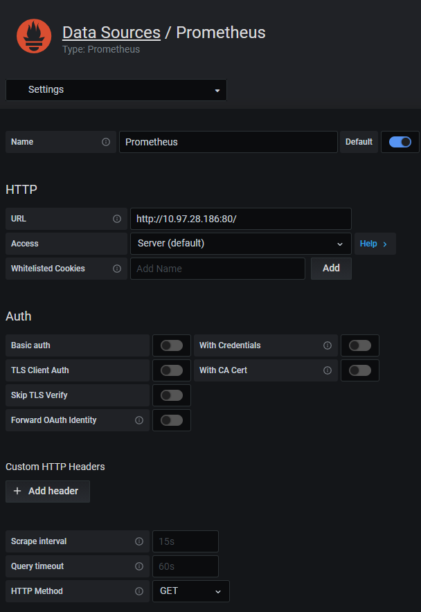

사전작업

```bash
# 먼저 grafana를 helm repo에 등록한다.
$ helm repo add grafana https://grafana.github.io/helm-charts

# 설치
$ helm install grafana grafana/grafana

# k8s에서 서비스 타입 변경 -> NodePort
$ kubectl edit svc grafana

# 인코딩된 로그인 암호 얻기 (base64)
$ kubectl get secret --namespace default grafana -o jsonpath="{.data.admin-password}" | echo
```

위에서 얻은 암호를 디코딩한 뒤 (원래 터미널에서 되지만... 윈도우니까 온라인 디코더 이용)


로그인을 한다.


다음으로 Data source 설정을 진행한다.



URL에는 Grafana 서버에서 접근이 가능한 Prometheus 서버 서비스의 **cluster ip와 내부 포트** 번호를 설정한다. 이제 프로메테우스를 Grafana의 데이터 소스로 사용할 수 있다.

대시보드 구성은 수동으로 일일이 할 수도 있지만 Grafana 커뮤니티에는 미리 구성되어 있는 템플릿이 많다. 이를 import 해서 사용하도록 한다. 템플릿 ID인 1621번을 입력하고 불러오도록 한다. 노드 모니터링 등 다양한 대시보드 템플릿이 있기 때문에 용도에 맞게 선택해서 사용하면 된다.


이제 프로메테우스 부분에 앞에서 만든 데이터 소스(Prometheus)를 선택한다.


이제 모니터링 데이터를 확인할 수 있다.