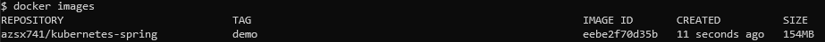
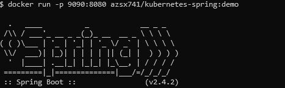
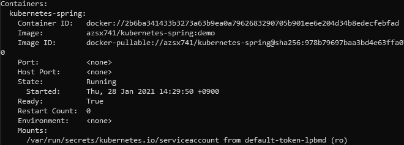
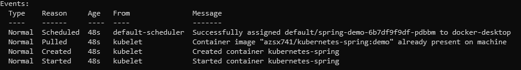

### 간단한 Spring Boot Application 제작

- java8 및 maven 기반으로 spring boot application 생성
- **Actuator** 의존성 추가 및 exposure properties 설정
    - actuator 모듈은 애플리케이션 상태를 모니터링할 수 있으며 이를 위한 다양한 endpoint제공
- 테스트용 컨트롤러(API) 추가

어플리케이션 빌드 및 테스트

```bash
$ $ ./mvnw install
$ java -jar target/*.jar
$ curl localhost:8080/actuator
{"_links":{"self":{"href":"http://localhost:8080/actuator","templated":false},"beans":{"href":"http://localhost:8080/actuator/beans","templated":false},"caches-cache":{"href":"http://localhost:8080/actuator/caches/{cache}","templated":true},"caches":{"href":"http://localhost:8080/actuator/caches","templated":false},"health-path":{"href":"http://localhost:8080/actuator/health/{*path}","templated":true},"health":{"href":"http://localhost:8080/actuator/health","templated":false},"info":{"href":"http://localhost:8080/actuator/info","templated":false},"conditions":{"href":"http://localhost:8080/actuator/conditions","templated":false},"configprops":{"href":"http://localhost:8080/actuator/configprops","templated":false},"env":{"href":"http://localhost:8080/actuator/env","templated":false},"env-toMatch":{"href":"http://localhost:8080/actuator/env/{toMatch}","templated":true},"loggers":{"href":"http://localhost:8080/actuator/loggers","templated":false},"loggers-name":{"href":"http://localhost:8080/actuator/loggers/{name}","templated":true},"heapdump":{"href":"http://localhost:8080/actuator/heapdump","templated":false},"threaddump":{"href":"http://localhost:8080/actuator/threaddump","templated":false},"metrics-requiredMetricName":{"href":"http://localhost:8080/actuator/metrics/{requiredMetricName}","templated":true},"metrics":{"href":"http://localhost:8080/actuator/metrics","templated":false},"scheduledtasks":{"href":"http://localhost:8080/actuator/scheduledtasks","templated":false},"mappings":{"href":"http://localhost:8080/actuator/mappings","templated":false}}}
```

### Containerize

프로젝트 루트 경로에 다음과 같은 도커파일을 만든다.

```bash
FROM openjdk:8-jdk-alpine
ARG JAR_FILE=target/*.jar
COPY ${JAR_FILE} app.jar
ENTRYPOINT ["java","-Djava.security.egd-file:/dev/ ./urandom","-jar","/app.jar"]
```

도커 이미지를 빌드한다.

```bash
$ docker build -t azsx741/kubernetes-spring:demo ./
```



컨테이너를 실행시키고 테스트해본다.



마지막으로 이미지를 registry로 push하면 k8s에서 사용할 컨테이너에 대한 준비는 끝났다.

```bash
$ docker push azsx741/kubernetes-spring:demo
```

### Deploy Spring-Boot application to K8s

컨테이너화한 애플리케이션을 배포한다. Deployment 및 Service 설정을 정의한 spring-demo.yaml을 생성한다.

```yaml
apiVersion: apps/v1
kind: Deployment
metadata:
  labels:
    app: demo
  name: demo
spec:
  replicas: 1
  selector:
    matchLabels:
      app: demo
  strategy: {}
  template:
    metadata:
      labels:
        app: demo
    spec:
      containers:
      - image: azsx741/kubernetes-spring:demo
        name: kubernetes-spring
---
apiVersion: v1
kind: Service
metadata:
  labels:
    app: demo
  name: demo
spec:
  ports:
  - name: demo-svc-8080
    port: 8080
    protocol: TCP
    nodePort: 31111
    targetPort: 8080
  selector:
    app: demo
  type: NodePort
```

서비스는 NodePort를 사용해 외부에 공개한다.

```powershell
$ kubectl apply -f spring-demo.yaml
deployment.apps/spring-demo created
service/spring-demo created
```

이제 파드에 대한 정보를 조회해본다.



Containers 항목에서는 컨테이너의 정보 확인이 가능하다.



Events 항목에서는 pod가 노드에 할당되고 이미지 pull 및 컨테이너 생성이 차례로 실행된 것을 확인 가능하다.