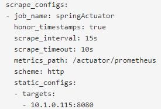
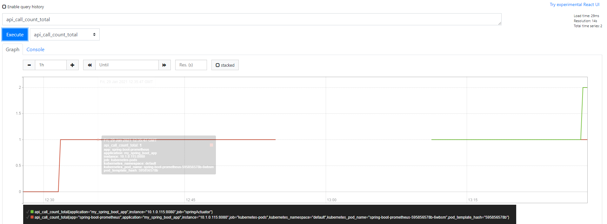
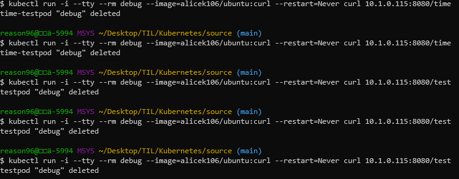
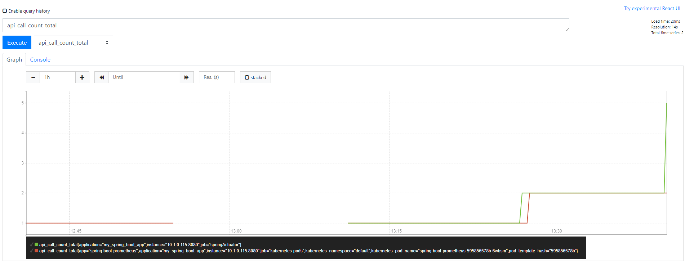

### 간단한 Spring Boot Application 제작

- java8 및 maven 기반으로 spring boot application 생성
- 테스트 컨트롤러 추가

**의존성 추가**

```xml
<dependency>
    <groupId>org.springframework.boot</groupId>
    <artifactId>spring-boot-starter-actuator</artifactId>
</dependency>
<dependency>
    <groupId>io.micrometer</groupId>
    <artifactId>micrometer-registry-prometheus</artifactId>
</dependency>
```

**간단한 metric용 Controller 추가**

```java
@RestController
public class DemoController {

    @Autowired
    private MeterRegistry meterRegistry;
		
    // Counter 메트릭 추가, api_call_count_total 가 메트릭 이름이 됨
    private Counter counter;
		
    @PostConstruct
    public void init() {
        counter= meterRegistry.counter("api.call.count");
    }

    @GetMapping("/")
    public String demo() {
        return "Hello, It's demo";
    }

    // Time 메트릭 추가		
    @Timed(value = "api.call.time")
    @GetMapping("/time")
    public String timeTest() {
        return "time-test";
    }
		
    // counter를 증가시킨다.
    @GetMapping("/test")
    public String test() {
        counter.increment();
        return "test";
    }
}
```

**IDE에서 빌드한 후 actuator/prometheus 엔드포인트로 반환값 확인**

```
api_call_time_seconds_count{application="my_spring_boot_app",exception="None",method="GET",outcome="SUCCESS",status="200",uri="/time",} 5.0
api_call_time_seconds_sum{application="my_spring_boot_app",exception="None",method="GET",outcome="SUCCESS",status="200",uri="/time",} 0.0913208
# HELP api_call_time_seconds_max  
# TYPE api_call_time_seconds_max gauge
api_call_time_seconds_max{application="my_spring_boot_app",exception="None",method="GET",outcome="SUCCESS",status="200",uri="/time",} 0.0037198
# HELP api_call_count_total  
# TYPE api_call_count_total counter
api_call_count_total{application="my_spring_boot_app",} 1.0
```

각 메트릭이 정상적으로 출력된다는 것을 확인할 수 있다.

**어플리케이션 빌드 및 테스트**

```bash
$ ./mvnw install
$ java -jar target/*.jar
$ curl localhost:8080/actuator
{"_links":{"self":{"href":"http://localhost:8080/actuator","templated":false},"beans":{"href":"http://localhost:8080/actuator/beans","templated":false},"caches-cache":{"href":"http://localhost:8080/actuator/caches/{cache}","templated":true},"caches":{"href":"http://localhost:8080/actuator/caches","templated":false},"health-path":{"href":"http://localhost:8080/actuator/health/{*path}","templated":true},"health":{"href":"http://localhost:8080/actuator/health","templated":false},"info":{"href":"http://localhost:8080/actuator/info","templated":false},"conditions":{"href":"http://localhost:8080/actuator/conditions","templated":false},"configprops":{"href":"http://localhost:8080/actuator/configprops","templated":false},"env":{"href":"http://localhost:8080/actuator/env","templated":false},"env-toMatch":{"href":"http://localhost:8080/actuator/env/{toMatch}","templated":true},"loggers":{"href":"http://localhost:8080/actuator/loggers","templated":false},"loggers-name":{"href":"http://localhost:8080/actuator/loggers/{name}","templated":true},"heapdump":{"href":"http://localhost:8080/actuator/heapdump","templated":false},"threaddump":{"href":"http://localhost:8080/actuator/threaddump","templated":false},"metrics-requiredMetricName":{"href":"http://localhost:8080/actuator/metrics/{requiredMetricName}","templated":true},"metrics":{"href":"http://localhost:8080/actuator/metrics","templated":false},"scheduledtasks":{"href":"http://localhost:8080/actuator/scheduledtasks","templated":false},"mappings":{"href":"http://localhost:8080/actuator/mappings","templated":false}}}
```

### Containerize

프로젝트 루트 경로에 다음과 같은 도커파일을 만든다.

```bash
FROM openjdk:8-jdk-alpine
ARG JAR_FILE=target/*.jar
COPY ${JAR_FILE} app.jar
ENTRYPOINT ["java","-Djava.security.egd-file:/dev/ ./urandom","-jar","/app.jar"]
```

도커 이미지를 빌드한 뒤, 저장소에 푸시한다.

```bash
$ docker build -t azsx741/spring-boot-prometheus:demo ./
$ docker run -p 9090:8080 azsx741/spring-boot-prometheus:demo # 테스트해보고 컨테이너 rm
$ docker push azsx741/spring-boot-prometheus:demo
```

### K8s Deployment 생성

```yaml
apiVersion: apps/v1
kind: Deployment
metadata:
  name: spring-boot-prometheus
spec:
  selector:
    matchLabels:
      app: spring-boot-prometheus
  replicas: 1
  template:
    metadata:
      labels:
        app: spring-boot-prometheus
      annotations:
        prometheus.io/scrape: "true"
        prometheus.io/port: "8080"
        prometheus.io/path: "/actuator/prometheus"
    spec:
      containers:
        - name: spring-boot-prometheus
          image: azsx741/spring-boot-prometheus:demo
          imagePullPolicy: Always
          ports:
            - containerPort: 8080
          resources:
            limits:
              memory: 294Mi
```

```bash
# 파일기반으로 디플로이먼트 생성
$ kubectl apply -f spring-boot-prometheus.yaml

# 정상동작하는지 prometheus 엔드포인트로 curl 실행
$ kubectl run -i --tty --rm debug --image=alicek106/ubuntu:curl 
	--restart=Never curl IP:port/actuator/prometheus
```

### Deploy Prometheus using Helm Chart

```bash
# 네임스페이스 생성
$ kubectl create ns monitoring

# 네임스페이스에 prometheus 설치
$ helm install prometheus stable/prometheus --namespace monitoring 

# 팟 확인
$ kubectl get pods --namespace monitoring
NAME                                            READY   STATUS    RESTARTS   AGE
prometheus-alertmanager-74755454f6-khfm4        2/2     Running   0          51s
prometheus-kube-state-metrics-95d956569-rmzw7   1/1     Running   0          51s
prometheus-node-exporter-9pnqm                  1/1     Running   0          51s
prometheus-pushgateway-594cd6ff6b-d96jw         1/1     Running   0          51s
prometheus-server-7bc886d65-p84xv               2/2     Running   0          51s

# 서비스를 노드포트 타입으로 변경
$ kubectl edit svc prometheus-server

# 서비스 목록 확인
$ kubectl get svc -n monitoring
NAME                            TYPE        CLUSTER-IP       EXTERNAL-IP   PORT(S)        AGE
prometheus-alertmanager         ClusterIP   10.101.231.169   <none>        80/TCP         7h12m
prometheus-kube-state-metrics   ClusterIP   10.100.206.237   <none>        8080/TCP       7h12m
prometheus-node-exporter        ClusterIP   None             <none>        9100/TCP       7h12m
prometheus-pushgateway          ClusterIP   10.99.249.131    <none>        9091/TCP       7h12m
prometheus-server               NodePort    10.99.123.2      <none>        80:30417/TCP   7h12m
```

### 프로메테우스 설정값 적용

컨피그맵 조회

```bash
# 컨피그맵 목록 확인
$ kubectl get cm -n monitoring
NAME                      DATA   AGE
prometheus-alertmanager   1      100m
prometheus-server         5      100m

# prometheus-server 컨피그맵의 YAML 파일 조회
$ kubectl get cm prometheus-server -n monitoring -o yaml 
```

이제 YAML파일을 수정해서 spring application의 metric을 수집하도록 한다.

```bash
$ kubectl edit cm prometheus-server -n monitoring
```

다음과 같은 내용을 **prometheus.yml**(yaml)에 추가한다.

```yaml
- job_name: 'springActuator'
  scrape_interval: 15s
  metrics_path: '/actuator/prometheus'
  static_configs:
  - targets:
    - 10.1.0.115:8080
```

타겟에는 다음과 같이 아까 띄워놓은 spring-boot 애플리케이션 pod의 IP를 입력한다. 여기에서는 **10.1.0.115**이다.

```bash
$ kubectl get pod -o wide
NAME                                      READY   STATUS    RESTARTS   AGE    IP           NODE             NOMINATED NODE   READINESS GATES
spring-boot-prometheus-595856578b-6wbsm   1/1     Running   0          164m   10.1.0.115   docker-desktop   <none>           <none>
```

컨피그맵이 정상적으로 수정되었다면 이를 반영하기 위해 `prometheus-server` pod을 삭제한다.

- 프로메테우스 서버의 디플로이먼트가 자동으로 Pod을 복구하며 값들을 갱신한다.

### 콘솔로 확인

이제 아까 NodePort 타입으로 변경한 Prometheus 서비스를 통해 웹 콘솔에 접속하면 Configuration 항목에 방금 추가한 spring actuator 관련 엔드포인트 설정이 포함되어 있음을 확인할 수 있다.



이제 Prometheus는 actuator endpoint에 접근이 가능하다.



```bash
$ kubectl run -i --tty --rm debug --image=alicek106/ubuntu:curl 
--restart=Never curl 10.1.0.115:8080/test

$ kubectl run -i --tty --rm debug --image=alicek106/ubuntu:curl 
--restart=Never curl 10.1.0.115:8080/time
```

위의 두 명령을 통해 spring application의 metric 값들에 변화를 줘본다.





그래프에 매우 잘 반영되고 있다. 다음으로는 더 다양한 상태를 효과적으로 시각화하기 위해 Grafana를 연동한다.

### Deploy Grafana using Helm Chart