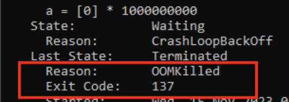

현재 팀 내 애플리케이션 대다수는 배포, 운영 환경에 k8s를 사용하고 있다. 대부분의 api가 전달되는 core
서버의 경우 평시 약 40대의 pod가 구동되고 있다.

이전까지는 k8s를 사용하는 환경임에도 설정을 수정할 일은 거의 없었다. 이미 구축된 서비스였기 때문에 입사를 한 뒤 k8s의 개념에 대해 공부하고, 이미 정의된 템플릿을 보며 ‘아 이 설정은 어떤 설정이구나’ 하는 정도로 지나간 게 끝이었다.

그러던 중 팀 내에서 장비 리소스를 확보하기 위해 전체적인 스펙을 조절하는 작업을 진행했다. core api 서버 또한 평시 사용량을 기준으로 memory request / limit 을 재설정는데, 이후 이슈가 발생하기 시작했다.

## 이슈 상황

40대의 Pod 중 일부 Pod가 불규칙하게 재시작 되며 알림이 오기 시작했다.
발생 상황을 종합해 봤을 때 다음과 같았다.

- OOMKilled로 종료, 137 Exit Code
- 시간대 불규칙
- 요청이 몰리는 상황 없음
- 컨테이너 memory 지표를 봤을 때 limit 도달하지 않음

일단 OOM killed라는 문구를 보고는 당연 메모리 문제를 의심했다. 그러나 JVM OOM에 의한 종료라면 jvm 설정 상 heapdump가 남아있어야 했는데, 어딜 찾아봐도 없었다. 또한, JVM 메모리 지표를 봐도 종료되기 전까지 특이사항이 없었다. 수동으로 진행한 heap dump 분석에서도 특이 사항을 찾을 수 없었다.

### `OOMKilled` / Exit code(137)
단순히 `OOMKilled`라는 문구로는 ‘컨테이너 메모리가 부족한가?' 정도의 생각 밖에 할 수 없었다. 그러나, 위에서 살펴봤 듯 애플리케이션에서는 문제점을 찾을 수 없었다. 일단은 정확히 `OOMKilled`의 의미에 대해 정확히 알아보기로 했다.

### OOM Killed
`OOMKilled`는 OOM Killer로 알려진 (k8s 컨테이너 생명주기를 관리하기 위한) 리눅스 커널의 피쳐이다. **OOM Killer**는 노드 내에 많은 메모리를 사용하는 프로세스를 모니터링하고 종료시킨다. 중요한 점은 **여유 메모리가 있어도 프로세스를 종료**시킬 수 있다는 점이다.

리눅스 커널은 호스트에서 구동되는 각 프로세스에 `oom_score`를 부여해서 관리한다. 이 스코어가 높을 수록 종료될 확률이 높다. 또한, `oom_score_adj`라는 값을 이용해 사용자가 OOM 프로세스를 조정하고, 언제 종료되어야 하는 지를 정의할 수 있다.

### QoS(Quality of Service)

k8s는 POD의 request / limit을 사용해 QoS class를 정의한다. 이는 서비스 품질 및 자원 관리 방법을 결정하며 어떤 클래스를 사용하는 지에 따라 `oom_score_adj`값도 결정된다.

k8s에는 세 종류의 QoS 클래스가 있으며 각 클래스의 `oom_score_adj`는 다음과 같다.

- Guaranteed → -997
- Burstable → 1000
- BestEffort → min(max(2, 1000—(1000 * memoryRequestBytes) / machineMemoryCapacityBytes), 999)

각 스코어를 보면 알 수 있듯이 노드의 메모리가 부족해지면 BestEffort Pod가 가장 먼저 종료된다. 반대로 말해 Guaranteed는 가장 마지막에 죽는 Pod가 된다.

종료된 Pod는 노드에서 반드시 제거되는 것은 아니며 Pod의 재시작 정책에 따라 재시작 된다.

### Over Commit

Pod를 할당할 때 사용되는 자원 할당 기준은 Limits가 아닌 Requests이다. 그러나 유휴 자원이 있다면 Limits 만큼의 자원을 사용할 수 있다. 한정된 자원을 사용하기 위한 방법으로, 사용할 수 있는 자원보다 더 많은 양을 컨테이너에 할당하여 사용률을 높이는 방법을 오버커밋이라 한다.

**최소 메모리 요구량이 이용 가능한 메모리보다 적은 상태**에서도 Pod가 노드에 스케쥴링 하는 것을 허용하기 때문에 오버커밋이 발생할 수 있다.

**예시**

request: 1GB, limits: 1.5GB인 Pod 10대가 10GB 노드에 스케쥴링된 상황에서 일부 Pod가 최소 요구량 이상의 메모리를 사용한다면 노드는 몇 개의 Pod를 죽일 것이다.

총 사용량이 노드 리소스의 100%를 초과하는 경우는 다음과 같이 처리된다.

- CPU: Request 이상 사용 중인 컨테이너의 I/O wait 등을 조절 (쓰로틀링)
- Memory: 우선순위에 따라 Pod를 강제 종료(재시작)

## 결론

문제가 생겼던 Pod는 container의 mem, cpu 각 request / limit이 동일하게 설정되어 있었다. 즉 기존에는 QoS가 Guaranteed로 설정되어 있었다. 그러나 내가 설정을 수정하며 QoS가 Burstable로 수정되었고, 커널에 의한 종료 우선순위가 올라간 것이다.

우리가 사용하던 k8s 클러스터는 전사 클러스터였기 때문에 언제든 다른 Pod들에 의해 자원이 쓰일 수 있었고, 자원이 부족해지면 우리의 Pod가 언제든 제거(재시작)될 수 있던 것이다.

결국 리소스 조정을 통해 QoS를 다시 Guaranteed로 적용했고, 재시작이 발생하던 Pod들은 문제가 해결됐다.

### 정리

- OOMKilled 발생 시, 애플리케이션의 메모리 사용량이 직접적 원인이 아닐 수 있다.
- k8s는 오버커밋을 허용하기 때문에 각각의 POD에 보다 여유로운 자원을 할당할 수 있다. 할당된 자원은 유동적이며 일부 케이스에서 OOM Killer에 종료될 수도 있다.
- 종료 문제를 최대한 방지하기 위해서는 POD의 QoS를 Guaranteed로 변경할 수 있다. 이는 POD 정의 시, 리소스 request / limit 값을 일치시키면 된다.
- (대충 아는 지식으로 수정했다가 낭패를 봤다...)

---
참고

- [https://komodor.com/learn/how-to-fix-oomkilled-exit-code-137/](https://komodor.com/learn/how-to-fix-oomkilled-exit-code-137/)
- [https://no-easy-dev.tistory.com/entry/쿠버네티스-Pod-자원관리-QoS](https://no-easy-dev.tistory.com/entry/%EC%BF%A0%EB%B2%84%EB%84%A4%ED%8B%B0%EC%8A%A4-Pod-%EC%9E%90%EC%9B%90%EA%B4%80%EB%A6%AC-QoS)
- [https://box0830.tistory.com/293](https://box0830.tistory.com/293)