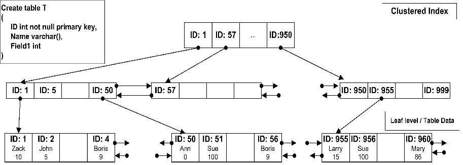

## Index

### 용어

- **Data Page:** DB의 데이터가 저장되는 단위, 각 페이지에는 여러 Row들이 포함되어 있다.
- **Index Page**: 데이터를 색인한 페이지이다. 인덱스 생성 시 지정한 컬럼을 기준으로 만들어진다.
- **RID**: **Index Page**에서 특정 데이터의 위치를 나타내는 값
    - [파일번호: Data Page 번호: Row 번호] 형식이다.

### Clustered Index

기본적으로 DB의 데이터는 모두 **Data Page**라는 단위로 저장된다.

다음의 이미지를 참고하자



인덱스 컬럼을 이용해 데이터를 검색하는 경우, **Index Page**에서 이진탐색을 통해 조회할 **Data Page**를 찾고 이를 차례대로 읽으며 데이터를 찾는다.

- **Clustered Index는 하나의 컬럼을 기준으로 Data Page자체를 정렬하기에 테이블 당 하나밖에 생성하지 못한다.**
- 클러스터 키는 항상 하나가 존재한다. 기본적으로 PK가 되며, PK가 없다면 유니크키, 둘 다 없다면 Hidden Key가 생성된다.

### Non-Clustered Index

Clustered Index에 포함되지 않은 Column을 이용한 검색 성능 향상을 위해서는 Non-Clustered 인덱스를 사용해야 한다. 이는 **Data Page**를 건드리지 않고, **Index Page**만을 별도로 생성해서 저장한다.

Non-Clustered Index를 생성하는 경우

1. **Leaf Index Page**가 생성되고, 지정된 Column을 기준(키)으로 정렬된 키와 해당 키(Column)의 **Data Page**에서의 위치(**RID 또는 PK**) 를 저장한다.
2. **Root Index Page**가 생성되고, 각 **Leaf Index Page의 첫 번째 키와 해당 Page 번호**가 저장된다.

인덱스 컬럼을 이용해 데이터를 검색하는 경우

1. **Root Index Page**에서 이진탐색을 통해 **Leaf Index Page**를 찾는다.
2. **Leaf Index Page**에서 **RID**를 보고, 실제 데이터가 저장된 **Data Page**를 찾아간다.

## Index 자료구조

### B-Tree

인덱스의 기본이되는 자료구조이다.

- 하나의 노드에 많은 key를 배치시켜 데이터 조회 시 I/O 횟수를 줄여준다.
- 노드의 key는 중복되지 않는다.

### B+Tree

B-Tree에서는 항상 Node를 탐색해야 하는 단점이 있다. 범위 조회를 사용하는 경우 탐색 시간이 훨씬 많아진다.

이런 문제를 해결하기 위한 자료구조가 B+Tree이다. (MySQL의 InnoDB 인덱스 생성 시 사용)

- 데이터 조회 위해 항상 Leaf node 탐색 필요
- 중간 node 들에는 데이터가 없으며 key만 존재, B-Tree와 다르게 key가 중복될 수 있음
- Leaf node간 연결리스트 형태로 범위, 정렬 조회 성능이 최적화됨
- 내부 노드에는 key만 저장하기 때문에 더 많은 key를 저장 가능하고, 그만큼 I/O를 줄여준다.

## 커버링 인덱스

MySQL에서는 Non Clustered Key에 Clustered Key (PK)가 항상 포함되어 있다. 그 이유는 Non Clustered Key에 실제 데이터 블록의 위치가 없기 때문이다.

**이 경우 인덱스 조건에 부합한 where 조건이 있더라도 select에 인덱스에 포함된 컬럼 외 다른 값이 필요할 때는 Non Clustered 키에 있는 Clustered Key 값으로 Data Page(Block)을 찾는 과정이 필요하다. (물론 PK를 이용해 처음부터 Clustered Key를 이용하는 경우도 있다.)**

커버링 인덱스는 여기서 **실제 데이터 접근 의 행위 없이** 인덱스에 있는 컬럼 값들로만 쿼리를 완성하는 것을 말한다.

### extra 항목

일반적으로 커버링 인덱스가 사용된 경우 explain 쿼리 시, extra 항목에는 `using index`가 표시된다.

`using where`이 표기된다면 레코드가 스토리지 엔진에서 바로 처리되지 못하고, MySQL 엔진이 스토리지 엔진으로부터 받은 레코드에 별도의 가공을 해서 필터링 작업을 처리하는 경우 표시된다. 일반적으로 인덱스에 포함되지 않은 조건문으로 인해 발생한다. 처리한 row와 결과가 많이 차이나는 경우 불필요하게 많은 데이터에 access 하고 있다는 의미일 수 있다.

`using index condition`이 표기된다면 index condition pushdown이 이용된 것이다. 인덱스 범위 조건에 사용될 수 없어도, **인덱스에 포함된 필드**라면 스토리지 엔진으로 전달하여 **최대한 스토리지 엔진에서 걸러낸 데이터를 MySQL 엔진으로 로딩한다.**

### 인덱스 풀스캔이란?

인덱스의 선두 컬럼이 없는 상황 (사용 가능한 인덱스가 없는 상황)에서 옵티마이저는 Table full scan을 먼저 고려한다. 만약 인덱스 스캔 단계에서 대부분 레코드를 필터링하고, 일부 데이터에 대해서만 테이블 엑세스가 발생한다면 Index full scan 방식이 선택된다.

Index full scan은 경우에 따라 성능을 저하시키기도, 향상시키기도 한다.
다음의 예를 들어보겠다.
```sql
ALTER TABLE TAB1 ADD INDEX tb_index (COL4, COL3)

SELECT COL1, COL2
FROM TAB1
WHERE COL3 = 'AAA'
```
10만 row의 테이블에 'AAA'가 매칭되는 데이터가 9만 개 있는 경우를 가종해보자. (선택도 높음)
이 때 index full scan이 발생하게 된다면 인덱스를 스캔하는 비용을 비롯해 해당 데이터를 찾기 위한 디스크 I/O가 추가적으로 발생한다. 이 경우 오히려 table full scan을 통해 곧바로 데이터에 접근하는 것이 빠를 수 있다.

반대로 선택도가 매우 낮은 경우에는 디스크 I/O를 높은 수준으로 줄일 수 있기 때문에 성능향상을 기대할 수 있다. 추가적으로 다음의 경우에도 index full scan이 효과를 볼 수 있다.
- 정렬 조건 선두에 인덱스 선두 컬럼이 존재하는 경우 -> 별도 정렬 불필요로 성능 향상
- 조회 컬럼 목록에 인덱스 컬럼들만 존재하는 경우 -> 디스크 I/O 없이 조회로 성능 향상 (커버링)

---
참고

- [https://aboutsqlserver.com/2010/09/22/indexes-structure/](https://aboutsqlserver.com/2010/09/22/indexes-structure/)
- [https://velog.io/@ddongh1122/MySQL-실행계획2-EXPLAIN](https://velog.io/@ddongh1122/MySQL-%EC%8B%A4%ED%96%89%EA%B3%84%ED%9A%8D2-EXPLAIN)
- [https://pangtrue.tistory.com/286](https://pangtrue.tistory.com/286)
- [https://jojoldu.tistory.com/476](https://jojoldu.tistory.com/476)
- [https://dev.mysql.com/doc/refman/8.0/en/innodb-index-types.html](https://dev.mysql.com/doc/refman/8.0/en/innodb-index-types.html)
- [http://www.axiominfo.co.kr/base/article/column.php?com_board_basic=read_form&com_board_idx=17&&com_board_search_code=&com_board_search_value1=&com_board_search_value2=&com_board_page=13&](http://www.axiominfo.co.kr/base/article/column.php?com_board_basic=read_form&com_board_idx=17&&com_board_search_code=&com_board_search_value1=&com_board_search_value2=&com_board_page=13&)
- [https://m.blog.naver.com/PostView.naver?isHttpsRedirect=true&blogId=gglee0127&logNo=221336088285](https://m.blog.naver.com/PostView.naver?isHttpsRedirect=true&blogId=gglee0127&logNo=221336088285)