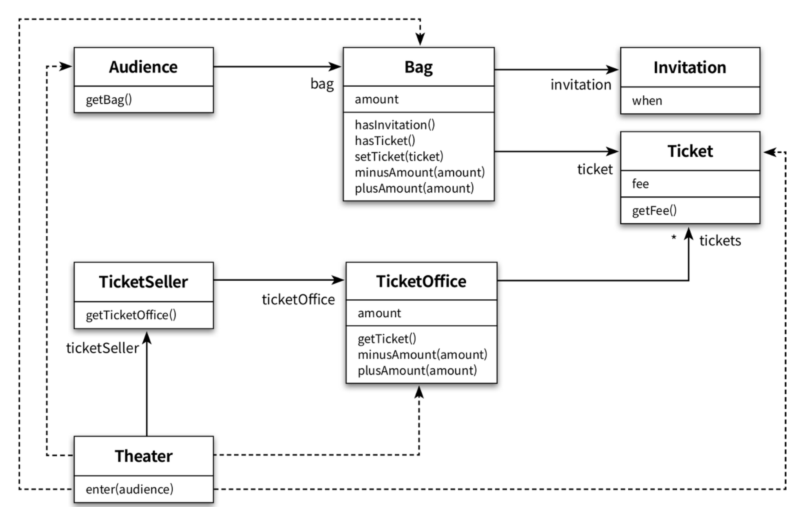
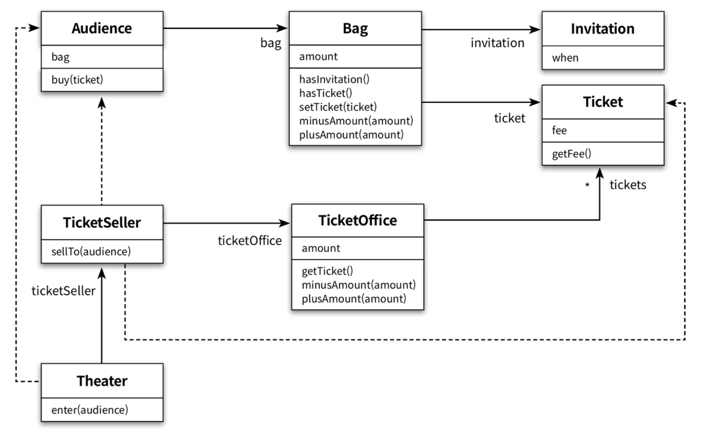

## 1. 티켓 판매 애플리케이션 구현하기



위는 간단한 소극장의 티켓 판매 애플리케이션 구조이다. 그리고 Theater는 enter 메서드를 이용해 관객의 입장을 처리한다.
```java
public class Theater {
	private TicketSeller ticketSeller;

	public Theater(TicketSeller ticketSeller) {
		this.ticketSeller = ticketSeller;
	}

	public void enter(Audience audience) {
		if (audience.getBag().hasInvitation()) {
			Ticket ticket = ticketSeller.getTicketOffice().getTicket();
			audience.getBag().setTicket(ticket);
		} else {
			Ticket ticket = ticketSeller.getTicketOffice().getTicket();
			audience.getBag().minusAmount(ticket.getFee());
			ticketSeller.getTicketOffice().plusAmount(ticket.getFee());
			audience.getBag().setTicket(ticket);
		}
	}
}
```

## 2. 무엇이 문제인가
소프트웨어 모듈이 가져야 하는 세 가지 기능은 다음과 같다.
1. 모듈은 제대로 실행되어야 한다.
2. 변경이 용이해야 한다.
3. 이해하기 쉬워야 한다.
앞의 프로그램은 2와 3의 조건을 만족하지 못한다.

### 예상을 빗나가는 코드
우리의 Theater 클래스와 enter 메서드는 여러 문제가 있다.
1. 소극장이 관람객의 가방을 뒤지고, 판매원 의지와 상관없이 티켓을 마음대로 꺼내간다.
	- 코드의 동작이 상식과 예상을 벗어난다.
2. 여러가지 세부 요소를 한꺼번에 기억해야 한다.
	- 코드를 작성하는 사람, 읽는 사람 모두에게 큰 부담을 준다.
3. 가장 큰 문제는 Audience와 TicketSeller를 변경할 경우 Theater도 함께 변경해야 한다는 점이다.

### 변경에 취약한 코드
지나치게 세부적인 사실에 의존해 동작하는 클래스는 세부 사실의 한 가지만 바뀌어도 함께 변경해야 한다.
- 의존성은 변경에 대한 영향을 암시한다.
우리의 목표는 애플리케이션 기능을 구현하는 데 필요한 최소한의 의존성만 유지하고, 불필요 의존성을 제거하는 것이다.

## 3. 설계 개선하기
설계 개선의 핵심은 관람객과 판매원을 자율적은 존재로 만드는 것이다.

### 자율성을 높이자
1. Theater의 enter 메서드에서 TicketOffice에 접근하는 모든 코드를 TicketSeller 내부로 숨긴다.
	- ticketOffice에 대한 접근은 이제 ticketSeller에서만 존재하게 된다. 이로인해 ticketSeller는 ticketOffice에서 티켓을 꺼내거나 판매 요금을 적립하는 일을 스스로 수행할 수밖에 없다.

2. 동일하게 Bag에 대해서도 캡슐화를 수행한다.
	- audience는 자신의 가방 안에 초대장이 들었는지 스스로 확인한다.
	- ticketSeller는 더 이상 audience의 bag에 대해 알 필요가 없다.



기존에 존재하던 Theater -> TicketOffice, Bag 의존성이 제거되었다. 해당 클래스들 내부의 변경 사항은 외부로 영향을 주지 않게 되었다. 또한, Audience와 TicketSeller는 자신이 행동하고 상태를 관리한다. 이는 분명 의사소통 관점에서 개선되었다. 객체의 자율성을 높임으로써 이해하기 쉽고 유연한 설계를 얻게 된 것이다.

### 캡슐화와 응집도
밀접하게 연관된 작업만을 수행하고 연관성 없는 작업은 다른 객체에 위임하는 객체를 가리켜 응집도가 높다고한다. 객체 응집도를 높이기 위해서는 객체 스스로 자신의 데이터를 책임져야 한다. 외부 간섭을 최대한 배제하고 메시지를 통해서만 협력하는 자율적 객체들의 공동체를 만드는 것이 훌륭한 객체지향 설계의 지름길이다.

### 절차지향과 객체지향
절차적 프로그래밍은 일반적인 사고와 예상을 쉽게 벗어나고, 변경으로 인한 영향을 고립시키기 어렵게 만든다. 결과적으로 변경하기 어려운 코드를 양산하는 경향이 있다.

객체지향 프로그래밍에서는 자신의 데이터를 스스로 처리하도록 데이터와 프로세스를 동일 모듈에 위치시킨다. 이로써 객체지향은 이해하기 쉬운 코드를 만들어내고 내부의 변경이 외부에 파급되지 않도록 제어한다.

### 책임의 이동
객체지향 설계에서는 각 객체에 책임이 적절하게 분배된다. 코드에서 데이터와 데이터를 사용하는 프로세스가 별도의 객체에 위치하고 있다면 절차적 프로그래밍 방식을 따르고 있을 확률이 높다.

객체지향 설계의 핵심은 적절한 객체에 적절한 책임을 할당하는 것이다. 객체가 어떤 데이터를 가지느냐보다는 어떤 책임을 할당할 것이냐에 초점을 맞춰야 한다.

	설계를 어렵게 만드는 것은 의존성이다. 해결 방법은 결합도를 낮추는 것이다.

얼핏 보면 자율성을 높인 것 같은 코드가 오히려 의존성을 높이는 경우도 있다. 결국 설계는 트레이드 오프의 산물이다. 적절한 트레이드오프를 항상 생각해야 한다.

>훌륭한 객체지향 설계란 소프트웨어를 구성하는 모든 객체들이 자율적으로 행동하는 설계를 가리킨다. 대상이 실세계에서는 생명이 없는 수동적 존재라 할지라도 객체지향의 세계로 넘어오는 순간 그들은 생명과 지능을 가진 존재로 다시 태어난다.

## 4. 객체지향 설계

### 설계가 왜 필요한가
설계는 코드 작성의 일부이며 코드를 작성하지 않고서는 검증할 수 없다.  그렇다면 좋은 설계란 무엇일까?
**좋은 설계란 오늘 요구하는 기능을 온전히 수행하면서 내일의 변경을 매끄럽게 수용할 수 있는 설계다.**

요구사항은 필연적으로 변경되며 이는 코드의 수정을 초래한다. 코드의 수정은 버그를 발생시킨다. 그리고 버그의 가장 큰 문제점은 코드 수정의 의지를 꺾는다는 것이다.

### 객체지향 설계
우리가 진정으로 원하는 것은 변경에 유연하게 대응할 수 있는 코드다. 
1. 객체지향은 의존성을 효율적으로 통제할 수 있는 다양한 방법을 제공함으로써 요구사항 변경에 좀 더 수월하게 대응할 수 있는 가능성을 높여준다.
2. 객체지향은 우리가 세상을 바라보는 방식대로 코드를 작성할 수 있게 돕는다. 이를 통해 코드를 좀 더 쉽게 이해할 수 있게 한다.
훌륭한 객체지향 설계란 협력 객체 사이의 의존성을 적절하게 관리하는 설계다.
