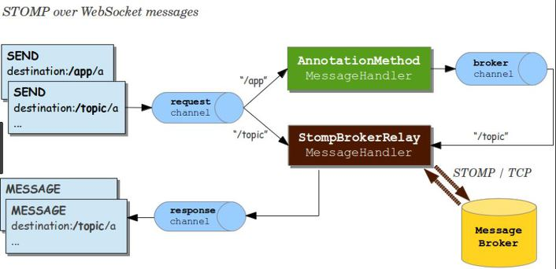

### Websocket

클라이언트-서버 간의 전통적 통신기법은 클라이언트 Request - 서버 Response였다. 그러나 서버가 클라이언트에게 특정 동작을 알릴 필요가 생기기 시작했고, 이를 해결하는 방법으로 Polling 등이 등장했다. 이는 대안이 될 수 있었지만, request-response의 지속적 수행 및 중복 패킷 전달 등 근본적인 문제를 지니고 있었다.

웹 소켓은 이런 문제들을 해결하기 위해 등장한 HTTP환경의 전이중 통신 지원 프로토콜이다. HTTP를 이용해 Handshake를 완료한 후, HTTP를 이용해 동작하지만, HTTP와는 다른 방식으로 동작한다.

- 장점 : 반복적 Handshake의 필요가 없으며, 덕분에 지연이 낮다.
  - 높은 빈도, 대량의 정보 통신에 유리하다.
  - Binary, Text 데이터 송수신 가능
- 단점 : Connection이 유지되는 동안 항상 통신을 하는 것은 아니다(Connection 낭비 유발 가능)

### STOMP

위에서 살펴봤듯이 웹소켓은 Binary, Text 데이터라면 모두 송수신 가능하다. 이런 통신을 더 구체적으로 제어하기 위해 handshake 과정에서 sub-protocol을 지정해 사용할 수 있다.

STOMP는 이 sub-protocol의 일종으로 사용하게 되면 규격을 갖춘(format) message를 보낼 수 있다.

- 텍스트 기반 메세징 프로토콜
- 포맷은 아래와 같이 명령, 헤더, 바디(본문)로 이루어진다.

**클라이언트**

- 메세지를 보내기 위한 SEND, 수신 메세지를 구독하기 위한 SUBSCRIBE 명령 사용 가능
- destination 헤더를 통해 어디에 메세지를 전송하고, 구독할지 알려줄 수 있다. (pub/sub)

```
SUBSCRIBE
id:sub-0
destination:/chat/kBJeODHgyk64hMLOnXXE
```

```
SEND
Trace-Id:cadb8bc2a5a24a7ee55da7f5f5c439b1
API-Version:110
content-type:application/json;charset=utf-8
destination:/app/chat-api
content-length:223

{"tid":"cadb8bc2a5a24a7ee55da7f5f5c439b1","method":"/chat/sendMessage","params":{"Type":"NORMAL","content":"hello","attribute":"TEXT","optional":null}}
```

자주 쓰이는 destination prefix는 "app", "topic", "queue" 등이 있다.

- SUBSCRIBE의 destination에서는 Topic으로 등록되지 않은 주제에 대해 구독하지 않도록 한다.

**서버**

```
MESSAGE
destination:/chat/cPdKAaq7iwTtMRCyJlxl
content-type:application/json;charset=UTF-8
subscription:sub-0
message-id:8eebc828-91e2-2890-1b4a-1eaa13827abb-3
content-length:380

{"tid":"cadb8bc2a5a24a7ee55da7f5f5c439b1","type":"MESSAGE","method":"/chat/sendMessage","jsonData":{~~~}}

MESSAGE
destination:/chat/cPdKAaq7iwTtMRCyJlxl
content-type:application/json;charset=UTF-8
subscription:sub-0
message-id:8eebc828-91e2-2890-1b4a-1eaa13827abb-2
content-length:141

{"tid":"cadb8bc2a5a24a7ee55da7f5f5c439b1","type":"RESPONSE","method":"/chat/sendMessage","jsonData":{~~~}}
```

메세지를 서버로 전송했을 때, 서버가 클라이언트로 보내는 RESPONSE와 구독자에게 보내는 MESSAGE까지 2개의 응답이 MESSAGE형식으로 확인된다. **(클라이언트가 구독자인 경우)**



SEND명령어를 사용할 때를 살펴보면 Prefix로 /app을 준 경우, request는 스프링 컨트롤러로 흘러가며 처리 과정을 통해 broker에게 전달된다. 반면, Prefix로 /topic을 준 경우 브로커에게 직접 접근한다. 위의 예제를 이용해 조금 더 설명하자면

/topic 엔드포인트 == **SUBSCRIBE destination: /chat**

/app 엔드포인트 == **SEND destination: app/chat-api**

라고 할 수 있다. 결국에 /app을 통해 `AnnotationMethod`로 전송된 메세지는 `StompBrokerRelay`를 거쳐 /topic을 구독하는 클라이언트에게 전달된다.

다음은 스프링 프로젝트에서 필요한 STOMP관련 설정 예시이다.

WebsocketConfiguration

```java
@Override
protected void registerStompEndpoints(StompEndpointRegistry registry) {
    registry.addEndpoint("/stomp").setAllowedOrigins("*").setHandshakeHandler(HandshakeHandler).addInterceptors(stompHandshakeInterceptor);
}

@Override
public void configureMessageBroker(MessageBrokerRegistry config) {
    config.enableSimpleBroker("/chat").setTaskScheduler(heartBeatScheduler()).setHeartbeatValue(new long[]{10000, 10000});
    config.setApplicationDestinationPrefixes("/app");
    config.configureBrokerChannel().taskExecutor(brokerChannelTaskExecutor());
    config.setPreservePublishOrder(false);
    config.setUserRegistryOrder(99);
}
```

- `registry.addEndpoint("/stomp")`: 클라이언트에서 웹 소켓에 연결(connect)할 수 있는 엔드포인트 설정, 해당 엔드포인트를 통해 Handshake 및 **CONNECT**가 완료된다.
- `enableSimpleBroker`: 해당 경로로 SimpleBroker를 등록한다. SimpleBroker는 해당하는 경로를 SUBSCRIBE하는 client에게 메시지를 **RESPONSE**하는 간단한 작업을 수행한다. 클라이언트 측에서는 해당 prefix을 갖는 destination을 **SUBSCRIBE**해야한다.
- `setApplicationDestinationPrefixes`: 클라이언트의 **SEND**요청을 처리한다. 메세지를 전송할 때 엔드포인트에 해당 prefix를 포함해야 한다.

클라이언트는 **SEND**나 **SUBSCRIBE** 명령을 통해 메시지의 내용과 수신 대상을 설명하는 “destination” 헤더와 함께 메시지를 전송하고 구독할 수 있다. 이것은 브로커를 통해 연결된 다른 클라이언트로 메시지를 보내거나 서버로 메시지를 보내 일부 작업을 수행하도록 요청할 수 있는 pub/sub 메커니즘을 가능하게 한다.

**STOMP 설정 과정 정리**

1. Receive Client
   - 메세지를 받기 위해 특정 토픽이 사전에 서버에 subscribe 되어야함
2. Send Client
   - 서버와 연결된 클라이언트는 특정 path로 메세지를 전달한다.
3. Broker
   - 메세지 브로커는 kafka, rabbitmq, activemq 등의 오픈소스들 처럼 MQ이며, pub/seb 모델을 따른다. 토픽에 따라 사용자를 구분한다.
   - 연결된 클라이언트 세션 관리
   - 특정 토픽 - 메세지 매핑 통해, 토픽을 구독하는 세션에 존재하는 클라이언트에 메세지 전달
