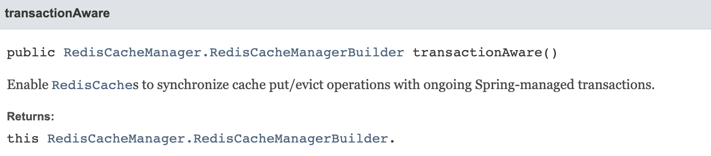

# @Cacheable의 transactionAware 이슈

스프링의 캐시 추상화를 이용하기 위해서는 CacheManager에 대한 Bean 정의가 필요하다. 팀 내에서는 Redis를 이용해 CacheManager를 다음과 같이 지정하고 있었다.

```java
@Bean 
public CacheManager redisCacheManager() { 
	RedisCacheManager redisCacheManager = RedisCacheManager
		.RedisCacheManagerBuilder
		.transactionAware()
		.fromConnectionFactory(connectionFactory)
		.cacheDefaults(RedisCacheConfiguration.defaultCacheConfig())
		.build(); 
	return redisCacheManager; 
}
```

클라이언트가 호출하는 `veryLong` API는 다음의 조건을 갖고 있다.
- API 내부에서는 비동기 메서드를 트리거하며 이는 10초 이상의 매우 무거운 동작을 수행한다.
- API의 응답값은 없으며 해당 동작은 특정 시간 내에 한 번만 성공하면 된다.
여러 요청이 동시에 들어와도 한 번만 성공하면 된다는 조건을 갖고있다. 따라서 우리는 캐시를 이용해 불필요한 부하를 방지하기로 결정했다.

아래는 간단한 `veryLong` 서비스 코드이다.
```java
public void veryLong(Long accountId) {
	if (cacheRepository.get(accountId)) {
		return;
	}
	async(accountId);
}
```
`async` 메서드는 내부적으로 다음과 같이 이루어져 있다.
```java
@Transactional
public void async(Long accountId) {
	cacheRepository.set(accountId);
	
	// DB 및 NW IO로직 등을 수행한다.
}
```
`cacheRepository`는 다음과 같다.
```java
@Cacheable(value = "HEAVY-API", key = "#id")
public Boolean get(Long id) {
	return false;
}

@CachePut(value = "HEAVY-API", key = "#id")
public Boolean set(Long id) {
	return true;
}
```

#### 이슈
동시 요청이 들어올 경우 한 번의 API만 수행될 것이라 생각했으나, 많은 Row was updated 에러 로그가 쌓이기 시작했다.

#### 원인 파악
이는 `async`로직이 동시에 여러군데에서 수행되면서 발생하는 문제였다. Single thread로 동작하는 Redis의 특성 상 최초 캐시가 정상적으로 들어갔다면 `async`는 한 번 밖에 수행될 수 없는데, 문제는 바로 RedisCacheManager 설정의 `transactionAware()`에 있었다.


기본적으로 @Cacheable / @CachePut 등의 Annotation은 애플리케이션에 설정된 CacheManager를 통해 수행된다. 여기에서 `transactionAware()` 옵션이 켜져있는 경우, 캐시 조작은(put / evict 등) @Transactional이 커밋된 이후 수행된다.

> 캐시 매니저를 정의하면서 옵션을 제대로 파악하지 않은게 원인이었다. (반성하자)

#### 해결
그렇다면 이에 대한 해결 방법은 무엇일까?

다음은 먼저 검토했던 수정 방식들이다.
1. redisTemplate / redissonClient 등을 이용, 캐시 추상화를 사용하지 않는다.
	- String 캐시의 경우 모두 추상화를 사용하고 있는데, 일부만 이렇게 사용하는 경우 일관성이 없다.
1. `transactionAware()` 옵션을 사용하지 않는다.
	- DB에 유효한 데이터를 저장한 후 캐시를 갱신하는 것이 안전하다. 옵션을 제거하는 것은 좋은 선택이 아닌 것 같다.
2. @Cacheable + @Async로 결합한다.
	- 단순한 방법이지만, 캐시 추상화와 비동기를 함께 사용할 경우 return에 Future 타입 등을 사용해야 한다.
	- 특수한 케이스로 인해 캐시의 Repository interface를 변경하는 것은 좋은 선택지가 아니다.
	- 캐시 조작때마다 스레드를 사용하는게 맞을까?

결국 명확한 해결 방법을 찾지 못한 채, 고민하던 중 (임시로 3번 방식으로 조치하긴 했다.) [redisTemplate 사용 중 새로운 문제](redisTemplate.md)를 겪으며 해결 방법을 선택하게 되었다.