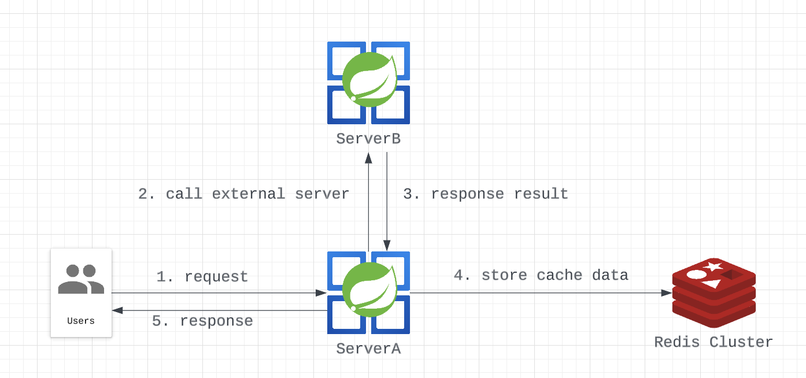
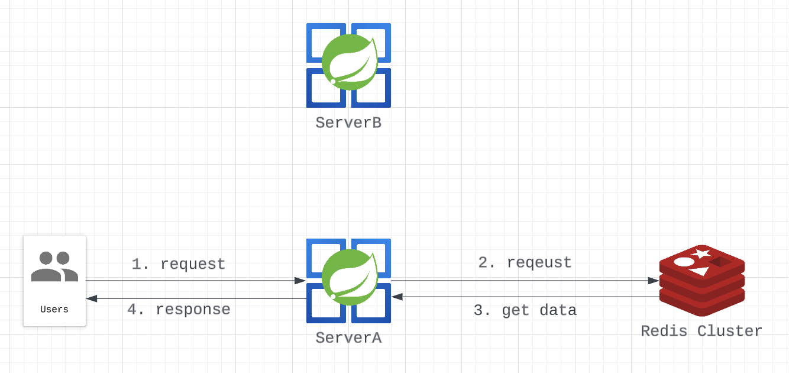
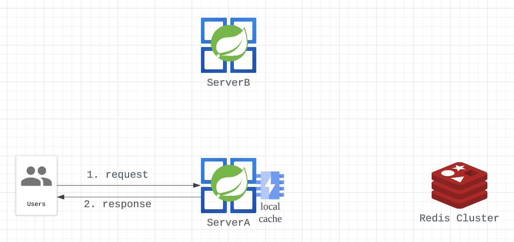
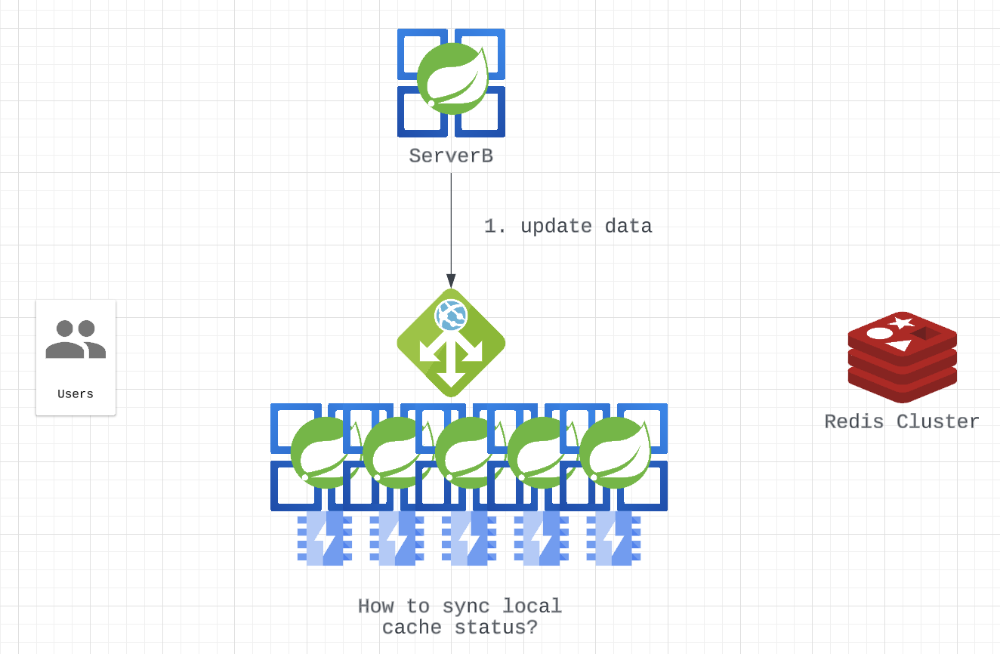
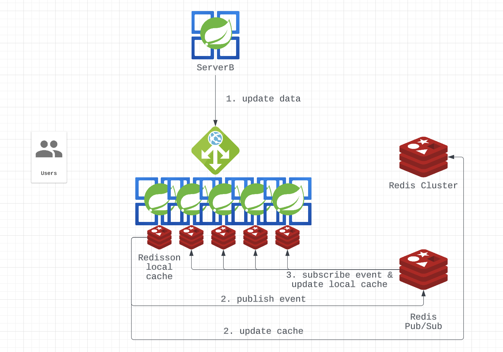

# Redisson의 Local Cache
로컬 캐시란 무엇일까? 쉽게 말하자면 애플리케이션 런타임에 heap을 사용해 데이터를 관리하는 방법이다. 적절한 퇴거 정책과 업데이트 로직만 있다면 단순 변수 선언도 로컬캐시라고 할 수 있다. 물론 대부분의 경우 Caffeine이나 Guava 등 외부 라이브러리를 사용한다.

로컬 캐시는 DB는 물론 외부 캐시시스템을 접근하는 것보다도 훨씬 빠른 속도를 보장한다. 타 시스템에 대한 의존은 물론 **네트워크 트래픽 자체**가 발생하지 않기 때문이다.

그러나 이는 단점도 존재한다. 그건 바로 데이터가 애플리케이션 단위로만 관리된다는 점이다. 프로덕션 환경의 서비스라면 동일한 애플리케이션을 여러 인스턴스로 구동할 것이다. 그리고 여러 인스턴스 간 로컬 캐시의 데이터를 동기화하려 한다면, 이는 매우 복잡한 작업이 될 것이다.

로컬 캐시의 이점을 누리면서 모든 인스턴스 간 실시간으로 데이터를 동기화시킬 방법은 없을까?

### Redisson Local Cache

Redisson이 제공하는 local cache는 이럴 때 좋은 대안이 된다. Redisson의 로컬 캐시는 크게 두 가지 용도로 사용할 수 있는데

1.  기존 캐시 데이터 access가 빈번해서 성능 향상을 누리기 위해
2.  기존 로컬 캐시를 여러 instance간 동기화 하기 위해

앞서 어급한 사례는 2번에 해당할 것이다.

### How to work?

사용법은 간단하다.
`redissonClient.getMapCache("myCache");` 와 같이 호출하고,
`myCache.put(key, value);` 와 같이 데이터를 넣으면 끝이다.
Spring 서버 등에서 사용할 경우 아래와 같이 Bean 초기화 시 로컬 캐시를 초기화해두고 런타임 내에 계속해서 사용한다.
```java

@Service
@RequiredArgsConstructor
public class Test {
	private final RedissonClient redissonClient;
	private RMapCache<String, TestCache> myCache;

	@PostConstruct
	public void init() {
		myCache = redissonClient.getMapCache("myCache");
	}

	public update(String key, TestCache value) {
		myCache.put(key, value);
	}
}

```

자세한 동작 방식은 다음과 같다.

1.  캐시 초기화
	- 인스턴스 A 및 인스턴스 B는 Redisson 구성을 기반으로 로컬 캐시를 시작하고 초기화
2. 인스턴스 A의 캐시 업데이트
	-   인스턴스 A는 로컬 캐시의 특정 항목을 업데이트하라는 요청을 수신
	-   인스턴스 A는 항목을 추가, 수정 또는 제거하여 캐시 업데이트 작업을 수행
3.  캐시 업데이트 전파
	-   Redisson은 인스턴스 A에서 캐시 업데이트 작업을 가로채고, 캐시 업데이트 이벤트 + 영향을 받는 데이터를 나타내는 캐시 업데이트 메시지를 Redis 채널 또는 항목에 게시
3.  인스턴스 B에서 받은 캐시 업데이트
	-   Redis 채널 또는 항목에 가입된 인스턴스 B는 캐시 업데이트 메시지를 수신
4.  인스턴스 B의 캐시 무효화
	-   캐시 업데이트 메시지를 수신하면 인스턴스 B는 로컬 캐시의 해당 항목에 인스턴스 A의 변경 사항을 반영하거나 항목을 무효화 (무효화된 항목은 다시 요청할 때 Redis에서 다시 로드)

## 사용 사례

### 기존 API 호출 구조



우리가 관리하는 Server A의 API는 유저에게 결과를 반환하기 위해 Server B로부터 얻은 데이터를 활용한다. 이 API는 매우 높은 빈도로 호출되기 때문에 매번 Server B를 호출한다면 양 쪽 모두에 높은 부하가 가해지는 상황이다. 따라서 최초 호출에서 외부 데이터를 Redis에 캐싱하고 있다. 


이후 요청에 대해서는 외부 서버를 통하지 않고 캐시를 통해 결과를 반환한다.

#### 문제점
캐시를 조회하는 비용이 API 호출을 통한 데이터 조회하는 비용보다는 저렴할 것이다. 그러나 이 또한 네트워크 트래픽을 발생시키고, 기존에 발생하던 트래픽만큼 Redis cluster의 부하가 증가했다는 문제가 있다. 여기서 더 개선할 수는 없는 것일까?

### 개선1


그럴 때 사용할 수 있는 것이 local cache이다. 데이터의 양이 적다면 guava 등의 캐시를 통해 외부 저장소를 통하지 않고 캐시를 이용할 수 있다. 이렇게 하면 Redis 왕복 비용을 줄일 수 있을 것이다. 

#### 문제점
위의 아키텍쳐는 매우 간단한 경우이지만, 대부분의 production 환경에서 ServerA의 인스턴스는 한 개가 아닐 것이다.

일반적으로는 위와 같이 VM 혹은 K8s 등으로 다중 인스턴스를 구성하고, 서버간 호출은 gateway를 통하는 경우가 많다. 이 때 다음의 케이스가 발생하면 어떻게 대응해야 할까?
1. Server B의 원본 데이터가 업데이트
2. 다중 인스턴스 간 상태를 공유해야함

### 개선2

Redisson이 지원해주는 local cache를 사용한다면, 이런 문제들을 모두 개선할 수 있다. 각 인스턴스는 독립적으로 local cache를 갖는다. 그러나 이에 대한 원본 데이터는 외부 redis 저장소에 기록된다.
특정 인스턴스의 local cache를 갱신하면 이는 redis에 기록되는 동시에 pub/sub 채널을 통해 전파된다. 같은 local cache를 공유하는 인스턴스들은 해당 이벤트를 받아서 자신의 local cache를 자동으로 갱신한다.

결과적으로 다음의 이점을 얻을 수 있게 됐다.
1. 외부에 있는 Redis로부터 매번 데이터를 조회하지 않아 성능 상승
2. 자동적으로 인스턴스간 상태를 공유하여 관리 복잡성 해소
3. Redis에도 데이터를 관리하기 때문에 인스턴스 재시작, 확장 시 즉시 데이터 사용 가능