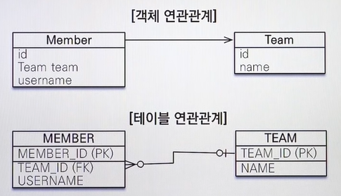
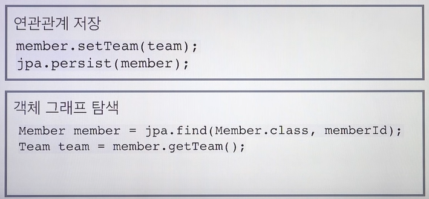

# 개요 - JPA

### 등장 배경: 객체와 RDB의 패러다임 차이

1. 상속
   - 상속관계 ↔ 슈퍼서브타입 관계
   - RDB에는 상속관계가 존재하지않음
     - 슈퍼서브타입으로 사용시 조인연산에 대한 각각의 쿼리 필요
2. 연관관계

   

   - 객체 연관관계는 방향성이 있은 - Team에서 member조회 불가
   - 테이블 연관관계는 무방향성 - 양쪽모두에서 FK 참조가능

3. 겍체 그래프 탐색
   - 객체 간 범위 제한없이 탐색 가능해야함
   - 그러나 처음 실행하는 SQL에 따라 탐색 범위 결정
   - DAO 계층을 보지 않으면 알 수 없음
4. 비교 (식별자의 패러다임 차이)
   - DB SQL에서 조회한 두 객체는 다르다
   - 자바 컬렉션에서 조회한 두 객체는 같다

> 객체 지향적으로 설계할수록 공수가 증가함

### Java Persistence API

- JAVA ORM 표준
- 객체는 객체대로 설계, RDB는 RDB대로 설계
- ORM framework가 매핑 - 패러다임 불일치 해결
- Mybatis와 다르게 쿼리까지 생성

### 문제 해결

1. 상속 - 객체를 분리하여 쿼리를 알아서 날린다
2. 연관관계, 객체 그래프 탐색

   

3. 비교: 동일한 트랜잭션에서 조회한 엔티티는 같음을 보장
