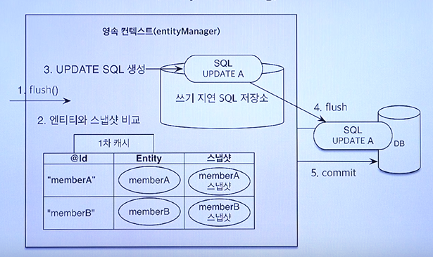

# 영속성 관리

JPA에서 가장 중요한 것 두 가지는 ORM과 영속성 컨텍스트이다. 이번엔 영속성 컨텍스트에 대해서 알아본다.

일반적으로 JPA를 사용하는 절차는 다음과 같다.

EntityManagerFactory 생성 → EntityManager 생성 → 사용자는 EntityManager 사용 (EntityManager는내부적으로 Connection 사용 DB접근)

### EntityManagerFactory와 EntityManager

- EMF는 하나만 생성하여 에플리케이션 전체가 공유해야 한다 ⇒ 성능이슈
- EM은 스레드간 공유하면 안되며 반드시 사용 후 제거해야한다.
  - DB접근을 하기 때문에 DB커넥션에서 문제가 생길 수 있음
- JPA 모든 데이터 변경은 트랜잭션 내에서 실행해야 한다.

### 영속성 컨텍스트

이는 엔티티를 영구 저장하는 논리적인 환경이다. EM을 통해 접근 가능하다.

- EM.persist(entity)는 DB에 저장하는 것이 아닌 엔티티를 영속성 컨텍스트에 저장하는 것이다.

엔티티 생명주기

1. 비영속: Entity 객체를 생성만 한 상태 → `Member entity = new Member("something")`
2. 영속: EM에 Entity를 집어넣은 상태 → `em.persist(entity)`
   - EM의 영속성 컨텍스트를 통해 entity가 관리되는 상태이다.
   - 영속화 된다고 DB에 쿼리가 날아가는게 아니다.
3. 준영속: 영속화된 엔티티를 영속성 컨텍스트에서 분리한 상태 → `em.detach(member)`
4. 삭제: DB 삭제 → `em.remove(member)`

### 영속성 컨텍스트의 이점

1. 영속성 엔티티의 동일성 보장
   - DB 조회 결과를 1차 캐시에 저장 후 트랜잭션 범위 내 재사용
   - Repeatable Read 등급의 트랜잭션 격리 수준 보장
2. 쓰기지연
3. 변경감지
   - flush, commit 시 엔티티와 1차 캐시 내 스냅샷을 비교
   - 변경점이 있는 경우 Update 쿼리 생성해서 DB 반영
4. 지연로딩
   - 연관 엔티티 로딩을 사용 시점 까지 미루고 싶은 경우, `EM.getReference()` 사용 → proxy 반환
   - 프록시 메서드 호출 시, 프록시 target(실제 엔티티)가 없다면 영속성 컨텍스트에 초기화 요청

### flush

영속성 컨텍스트 변경내용을 DB에 동기화하는 작업이다. commit과의 차이를 인지해야 한다.

1. **flush는 1차 캐시(영속성 컨텍스트)를 지우는게 아니다.**
   - 쓰기 지연 SQL 저장소 내용을 그저 DB에 반영할 뿐
2. 영속성 컨텍스트 변경내용을 DB에 동기화한다.
   - 실제 DB에 영속화까지 완료하는 commit과는 다르다.
   - 다른 세션에서 DB를 조회하면 동기화된 데이터가 보이지 않는다.

동작 과정

- 변경 감지 수행
- 수정된 엔티티를 쓰기 지연 SQL 저장소에 등록
- 쓰기 지연 SQL 저장소 쿼리를 DB에 전송 (등록, 수정, 삭제 쿼리)

### 언제 flush가 동작하는가?

- em.flush() - 직접 호출
- 트랜잭션 커밋 시 자동 호출
- JPQL 쿼리 실행 시 자동 호출
  - 미리 flush를 해줘야 DB에서 쿼리로 직접 데이터를 조회할때 문제가 생기지 않기 때문이다.
