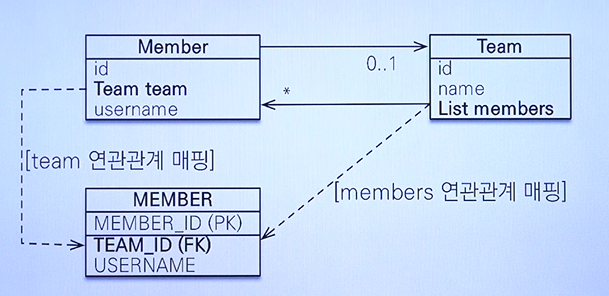

# 양방향 연관관계 매핑

Member와 Team이라는 엔티티를 가정한다.

### 양방향 연관관계에서의 객체 업데이트

엔티티의 경우 한 쪽의 외래키를 통해 양방향 조회가 가능하다. 즉 방향성의 개념이 없다. 그러나 객체의 경우 Team → Member와 Member → Team의 단방향 연관관계 2개를 통해 양방향 조회가 가능하다.

1. Member의 `team` 필드 업데이트
2. Team의 `members` 필드 업데이트

둘 중 테이블의 외래키가 업데이트되는 순간은 언제여야 할까?...

이를 결정하기 위해서 필요한게 연관관계의 주인이다. 양방향 연관관계에서는 연관관계의 주인만이 외래키를 등록, 수정할 수 있으며 주인이 아닌쪽은 읽기만 가능하다.

### MappedBy

mappedBy는 연관 관계의 주인을 결정하는 데 사용한다.

- 주인은 mappedBy 속성을 사용하지 않음
- 주인이 아닌 쪽에 mappedBy 속성을 통해 주인을 지정
- 외래키가 있는 테이블의 객체가 주인이 되도록 한다. ⇒ Member가 주인

### 양방향 매핑에서 많이하는 실수

1. 연관관계의 주인이 아닌 객체에만 값을 입력
   - ex) Team의 `List<Member> members`에 Member 추가해도, DB에는 반영되지 않는다.
2. 연관관계의 주인에만 값을 입력
   - DB는 업데이트 되지만, 애플리케이션 내 객체 참조 시 문제가 생길 수 있다.
   - 객체 관계를 고려하면 양쪽 다 세팅해주는게 좋다.
   - 직접 하면 잊을 수 있으니 편의 메서드를 추가하는 것도 방법이다.
   - ex) Member 의 `setTeam()` 호출 후, Team의 `addMember()`를 호출하는 메서드 생성
3. 양방향 매핑 시 무한 루프를 조심하자
   - toString, lombok, JSON 생성 라이브러리 등등
   - ex) toString → Team.toString → Member.toString → Team.toString 무한 루프

### 정리

- **단방향 매핑만으로도 이미 연관관계 매핑은 완료**
  - 처음에는 단방향에서 끝내야 한다. 객체 입장에서 양방향 매핑이 좋을게 없다.
- 양방향 매핑은 반대방향으로 조회 기능이 추가된 것 뿐이다.
- 단방향 매핑을 잘 해두면 양방향은 추가하기 쉬움 (테이블 영향이 없다.)

### OneToMany에 관한 생각

Member와 1:N 관계를 맺는 Order가 있다고 가정하자. Member의 필드로 OneToMany 연관을 맺는 Orders가 필요할까?

Order를 찾기 위해 Member를 조회하고 연관관계를 이용하는 것은 관심사 분리의 실패일 수 있다. JPQL을 이용하면 쿼리에 Member 객체를 넣어서 Member에 해당하는 Order 엔티티들을 얼마든 찾을 수 있다.

일대다 관계(양방향 탐색)가 언제 필요한지는 잘 생각하고 사용해야 한다.
