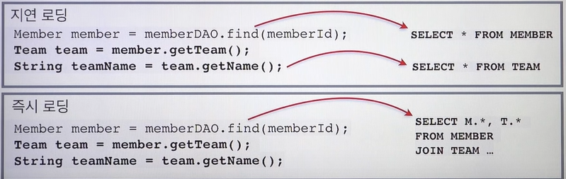

# 즉시 로딩, 지연 로딩

지연로딩: 한 객체를 조회하면 연관 객체는 프록시 객체로 로딩, 연관객체의 실제 사용 시점에 조회가 발생

즉시로딩: 한 객체를 조회하면 연관 객체까지 일시에 조회, 대부분 JPA 구현체는 Join을 사용

### 프록시

지연로딩을 알기 위해서 Proxy를 알아야 한다.

- 실제 엔티티를 상속받아 만들어지는 가짜 객체
- 사용하는 입장에서는 진짜 객체인지 프록시인지 구분하지 않고 사용

### 프록시 객체 초기화 과정 (Hibernate)

1. 프록시 객체는 영속성 컨텍스트에 초기화 요청
2. 영속성 컨텍스트는 DB 조회
3. 실제 엔티티 생성
4. 프록시 객체의 Target에 실제 엔티티 참조값이 채워짐
5. 조회 시, 프록시 객체는 target에서 값을 조회해서 반환

### 프록시 특징

- 처음 사용 시 한 번만 초기화
- 프록시 객체 초기화 시 프록시 객체가 실제 엔티티로 바뀌는게 아니다.
  - 초기화한 객체에 접근만 가능해지는 것
- 타입 체크시 == 비교 주의, isntance of 비교해야함
  - Member와 MemberProxy를 비교하는 경우 ==으로 하면 false가 된다.
- 영속성 컨텍스트에 찾는 엔티티가 이미 있는 경우 프록시 조회해도 `em.getReference()` 실제 엔티티를 반환
- **준영속 상태의 프록세 객체를 초기화하려는 경우 LazyInitializationException 발생**

### 사용 사례

- 실무에서는 즉시로딩 지양
- N+1 문제 발생 가능
  - EAGER 세팅해놓더라도 **JPQL을 사용하면 쿼리 최적화가 안됨**
    - 사용자가 JPQL에서 Join을 명시하지 않는다면? `select * from Member m`
    - → 1회로 모든 멤버들이 조회됨
    - → EAGER로 인해 n개의 Member에 대한 Team을 조회하는 쿼리가 각각 발생
- **모든 애들을 지연로딩으로 설정하고 fetch Join 사용할것**
    <aside>
    💡 FetchType을 변경하는 것은 단지 N+1 발생 시점을 연관관계 데이터를 사용하는 시점으로 미룰지, 아니면 초기 데이터 로드 시점에 가져오느냐에 차이만 있는 것이다.****
    
    </aside>

- ManyToOne / OneToOne 기본적으로 EAGER이기 때문이 LAZY로 설정할것
