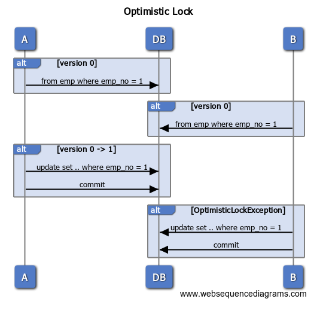

# JPA Lock

요청이 많은 서버에서 여러 트랜잭션이 동시에 데이터 업데이트를 발생시킬 경우 일부 요청이 유실되어 장애로 이어질 수 있다. 따라서 엔터프레이즈 애플리케이션은 DB 동시 엑세스를 적절히 관리하는 것이 중요하다. 즉 여러 곳에서 동시 읽기/쓰기 작업이 발생하더라도 데이터가 일관성을 갖도록 해야한다.

### JPA Optimistic Lock

회원 정보 수정 등, 갱신시 충돌이 발생하지 않을 것을 가정하는 Lock 기법이다. 이는 DB의 락을 사용하는 것이 아닌 JPA가 제공하는 버전 관리 기능을 사용함으로써 충돌을 방지한다.

엔티티 내부에 @Version이 붙은 변수를 구현함으로써 JPA에서 Optimistic Lock을 간단하게 사용할 수 있다. 이 때 다음의 주의사항을 지켜야 한다.

- 각 엔티티 클래스에는 하나의 버전만 있어야 한다.
- 여러 테이블에 매핑된 엔티티의 경우 기본 테이블에 배치돼야 한다.
- 버전에 명시할 타입은 `int`, `Integer`, `long`, `Long`, `short`, `Short`, `Timestamp`중 하나여야한다.



JPA는 트랜잭션 내부에 버전 속성의 값을 보유하고 업데이트 전 다시 한 번 버전 속성을 확인한다. 그 사이 DB에서 버전 정보가 변경되었다면 예외를 발생시킨다. (B의 update 트랜잭션)

```java
@Test(expected = OptimisticLockException.class)
@Transactional
public void 낙관적락예외발생() {
    // 영속 상태의 OptimisticMember
    OptimisticMember member = em.find(OptimisticMember.class, 1); // version 0

    // version 1로 변경되어 DB 반영됨
    member.setName("nklee2");
    memberService.updateMember(member);

    try {
        // update 시 version이 0이므로 낙관적 락 오류 발생 (DB는 1로 되어 있음)
        member.setName("nklee3");
        memberService.updateMember(member);
    } catch (Exception e) {
        e.printStackTrace(); // javax.persistence.OptimisticLockException: Row was updated or deleted by another transaction (or unsaved-value mapping was incorrect)
        throw e;
    }

    fail("Optimistic lock exception 발생!!");
}
```

### JPA Pessimistic Lock

비관적 락은 트랜잭션의 충돌 발생을 가정하고 우선적으로 락을 거는 방법이다. 트랜잭션 내에서 서비스 로직이 진행되어야 하며 이는 DB 수준의 엔티티 잠금을 포함한다.

```java
@Test(expected = PessimisticLockingFailureException.class)
@Transactional
public void 비관적락_예외_CASE_1() {
    em.find(PessimisticMember.class, 1, LockModeType.PESSIMISTIC_WRITE); // where pessimisti0_.id=? for update (H2)
    em.flush();

    // 해당 row에 lock이 설정되어 있어 오류 발생
    memberService.updateMember(1);

    fail("Timeout trying to lock table ; SQL statement:");
}

@Service
class PMemberService {

    @Getter
    @PersistenceContext
    private EntityManager em;

    @Transactional(propagation = Propagation.REQUIRES_NEW)
    public void updateMember(int id) {
        em.setProperty("javax.persistence.query.timeout", 10000);
        PessimisticMember member = em.find(PessimisticMember.class, id);
        member.setName("Lee namkyu");
    }
}

@Data
@Table(name = "PESSIMISTIC_MEMBER")
@Entity
class PessimisticMember {

    @Id
    private int id;

    @Column(name = "NAME")
    private String name;
}
```

### 암시적 잠금과 명시적 잠금

**암시적 잠금**

JPA에서는 `@Version`필드가 존재하거나 `@OptimisticLocking`어노테이션이 설정된 경우 자동적으로 충돌감지를 위한 잠금이 실행된다. 이는 어노테이션만 설정해주면 별도의 추가설정이 필요하지 않다. 삭제 쿼리가 발생할 시에는 암시적으로 해당 로우에 대한 Row Exclusive Lock을 제공한다.

**명시적 잠금**

EntityManager를 통해 엔티티를 조회할 때 LockMode를 지정하거나 select for update 쿼리를 통해서 직접 잠금을 지정할 수 있다.
