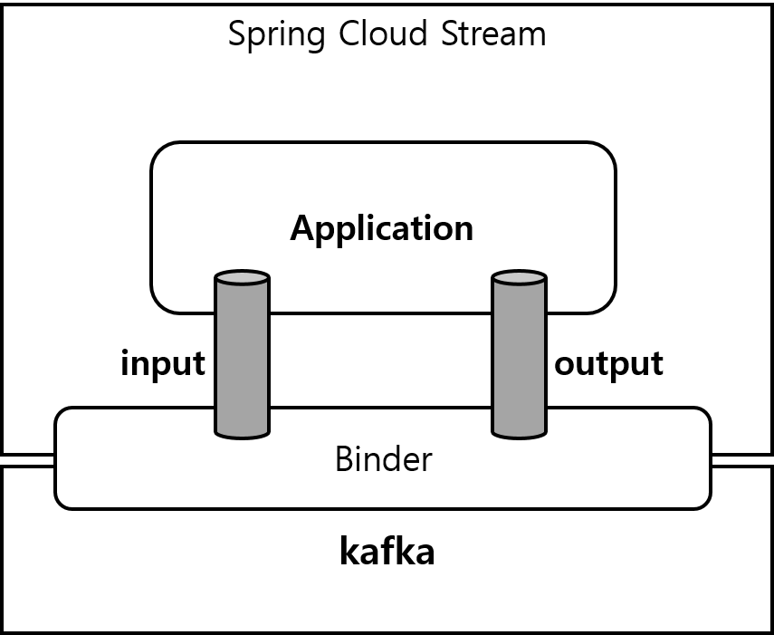

### 0. 용어 설명

- Spring Cloud Stream → 이하 SCS라고 한다.
- 문서 내의 미들웨어는 사실상 RabbitMQ, Kafka 등 메세지큐라고 볼 수 있다.
- destination - 미들웨어 내 메시지의 목적지, rabbitMQ는 exchange라고 할 수 있다.

## 1. SCS 소개

- 외부 메시징 시스템 연결을 위한 애플리케이션을 신속히 구축할 수 있는 Micro service 프레임워크
- Spring Application과 Rabbit 등의 미들웨어 연동
- Event driven micro service 구축을 위한 프레임워크

## 2. 아키텍쳐

### 2.1 Application Model



SCS애플리케이션은 미들웨어 중립적이다. 애플리케이션은 SCS에 의해 주입된 입출력 채널을 통해 외부와 통신한다. 채널은 미들웨어 별 바인더 구현을 통해 외부 브로커에 연결된다.

- input, inbound: 메세지 송신 처리용
- output, outbound: 메세지 수신 처리용

### 2.2 **Binder & Binding**

**Binder란?**

- Spring cloud stream이 제공해 주는 미들웨어와의 통신 컴포넌트
- Spring이 configuration을 읽어 미들웨어 바인더를 구현체로 제공
- 미들웨어(Kafka 등 메세지 브로커)와 producer 및 consumer 연결, 라우팅 등 담당
- 미들웨어 독립적 개발 가능케함

**Binding이란?**

- Binder의 입/출력을 미들웨어에 연결하기 위한 Bridge

**바인더 추상화**

SCS는 클래스 경로에서 바인더를 자동 감지하고 사용한다. 런타임에 특정 채널에 대해 다른 바인더를 사용하는 등 복잡한 사용 또한 가능하다.

### 2.3 예시, Persistent Pub/Sub support


센서가 HTTP endpoint로 전달한 데이터는 `raw-sensor-data`라는 공통 destination으로 보내진다. 이는 각각 다른 micro service application에서 독립적으로 처리된다. 데이터를 처리하기 위해 두 어플리케이션은 토픽을 애플리케이션 input으로 런타임에 정의한다.

pub/sub 모델은 producer/consumer 모두의 복잡도를 줄인다. 또한, 이미 존재하는 흐름을 방해하지 않고 새로운 어플리케이션을 토폴로지에 추가할 수 있게 한다.

pub/sub이 새로운 개념은 아니지만, SCS는 자체 미들웨어 서포트를 통해 각기 다른 플랫폼에서 간단한 pub/sub모델을 사용할 수 있도록 한다.

## 3. Programming Model

SCS의 프로그래밍 모델 소개

### 3.1 Declaring and Binding Channels

**3.1.1 Functional Binding**

SCS 3.0 이상부터는 기존의 @EnableBinding이 Deprecated 되었으며 함수형 인터페이스를 활용한 Functional Binding을 지원한다.
```java
@Configuration
public class BindingConfig {

	@Bean
    public Consumer<T> consumer() {
	    // 구현
    }

	@Bean
    public Suplier<T> suplier() {
	    // 구현
    }

	@Bean
    public Function<T, T> function() {
	    // 구현
    }
}
```

Bean 정의에 사용된 함수명은 SCS에서 곧 binding naming에 사용된다. 명명 규칙은 아래와 같다.
- input - `<function name> + -in- + <index>`
- output - `<function name> + -out- + <index>`
Function을 입력 채널로 사용한다고 했을 때 바인딩은 `function-in-0`이 된다. 

```java
@Bean 
public Function<Tuple2<Flux<String>, Flux<Integer>>, Flux<String>> gather() {
	return tuple -> { 
		Flux<String> stringStream = tuple.getT1(); 
		Flux<String> intStream = tuple.getT2().map(i -> String.valueOf(i)); 
		return Flux.merge(stringStream, intStream); 
	}; 
}
```
index는 하나의  기본적으로 0이지만 바인딩에서 사용하는 인자가 여러개인 경우 더 커질 수도 있다. 위와 같이 하나의 binding에서 여러 유형의 인자를 취하는 경우 
`gather-in-0`과 `gather-in-1`이 정의된다.

**3.1.2 StreamBridge**

```java
@Service
@RequiredArgsConstructor
public Service {

	private final StreamBridge streamBridge;
	
    public void request() {
	    Message<RequestDto> message = MessageBuilder.withPayload(...).build();
	    streamBridge.send("Exchange", message);	
    }
}
```

Functional 인터페이스를 통해 binding 선언이 가능하지만, 실제 서비스에서는 비즈니스 로직이 메시지를 producing 해야하는 경우가 많다. 이 경우에는 `StreamBridge`를 이용해 destination으로 메시지를 producing 할 수 있다.

## 4. Binders

SCS는 외부 미들웨어의 물리적 destination로의 연결에 사용되는 바인더 추상화를 제공한다.

### 4.1 Producers / Consumers

producer는 채널에 메세지를 보내는 데 필요한 구성요소이다. 채널은 브로커의 바인더 구현체를 통해 외부 메세지 브로커에 바인딩 될 수 있다.

## 5. Configuration option

SCS는 일반 Config 옵션과 바인더 및 바인딩 Config를 지원한다. 일부 바인더는 미들웨어 관련 기능지원을 위해 추가 바인딩 속성을 허용한다. 구성 옵션은 Spring Boot에서 지원하는 모든 메커니즘(환경 변수, yaml, properties 등)을 통해 SCS 애플리케이션에 제공 가능하다.

### 5.2 바인딩 속성

바인딩 프로퍼티는 다음의 포맷으로 지원된다.

`spring.cloud.stream.bindings.<channelName>.<property>=<value>` 이 중 `channelName`은 configure되는 채널의 이름이다.

**5.2.1 Properties for Use of SCS**

다음의 프로퍼티들은 인풋/아웃풋 바인딩 모두에서 이용 가능하며 기본 prefix를 포함해야한다.

- destination
  미들웨어에 바인딩된 채널의 destination이다 (RabbitMQ의 경우 exchange), 채널이 컨슈머로 바인딩 된다면 다수의 destination에 바인딩될 수 있으며 destination 이름은 comma로 구분된다.
  destination이 없다면 채널네임이 대신해서 사용된다.
- group
  채널의 컨슈머 그룹이다. 인바운드 바인딩에만 적용된다.
- contentType
  채널의 컨텐트 타입이다.
- binder
  이 바인딩에서 사용하는 바인더를 지정한다.

**5.2.2 Consumer Properties**

다음의 바인딩 속성들은 인풋 바인딩에서만 이용 가능하다.

`spring.cloud.stream.bindings.<channelName>.consumer.`를 prefix로 가져야한다.

- concurrency
  인바운드 컨슈머의 동시성
- partitioned
  컨슈머가 파티션 지정된 생산자로부터 데이터를 받을지 여부
- headerMode
  `none`으로 설정 시 헤더 파싱 비활성화, `header` 설정 시, 미들웨어의 기본 헤더 메커니즘 사용
- maxAttempts
  인바운드 메세지 재처리 시도 횟수

**5.2.3 Producer Properties**

다음 바인딩 속성들은 아웃풋 바인딩에서만 이용 가능하다.

`spring.cloud.stream.bindings.<channelName>.producer.`를 prefix로 가져야한다.


## 번외. RabbitMQ 설정 관련

### 1. RabbitMQ Binder Concept

레빗의 바인더 구현체는 기본적으로 각 destination을 `TopicExchange`에 매핑한다. 그리고 각 컨슈머 그룹을 위한 Queue가 이 `TopicExchange`에 바인딩된다. 컨슈머 그룹을 사용하지 않고 각 인스턴스마다 Queue를 맺게 만들 수도 있다. 이 경우 fanout exchange를 선언하면 모든 인스턴스가 동일한 메시지를 처리하게 된다.
> 이는 현재 이벤트 처리, 채팅 메시지 처리 등 팀 내 비즈니스 로직에 응용되고 있다. 

### 2. RabbitMQ Binder Properties

RabbitMQ 바인더 및 바인딩 채널에 대한 설정을 알아본다.

**2.1 RabbitMQ Binder Properties**

기본적으로 RabbitMQ 바인더는 Spring Boot의 Connection Factory를 사용한다. 따라서 RabbitMQ에 대한 모든 Boot 구성 옵션을 지원한다. rabbitMQ 구성 옵션은 `spring.rabbitmq`접두사를 사용한다.

RabbitMQ 바인더는 Spring Boot 옵션 외에 다음 속성을 지원한다.

**2.2 RabbitMQ Consumer Properties**

다음 프로퍼티들은 오직 Rabbit 컨슈머에서만 이용 가능하다. 속성들은 다음의 prefix를 포함해야한다. `spring.cloud.stream.rabbit.bindings.<channelName>.consumer`

대부분의 바인딩에 동일한 속성들을 적용할 필요가 있다면, 반복을 방지하기 위해 아래의 속성을 사용해서 모든 채널에 다음의 값을 설정할 수 있다.

`spring.cloud.stream.rabbit.default.<property>=<value>`

물론, 특정 속성을 바인딩하는 경우에는 기본 값에서 해당 속성이 재정의된다.

- bindingRoutingKey
  큐를 exchange에 바인딩 할 라우팅 키이다.
  기본값: #
- bindingRoutingKeyDelimiter
  해당 값이 null이 아닐 때, bindingRoutingKey는 이 값으로 구분된 리스트로 취급된다. 일반적으로 값에는 컴마를 사용한다.
- exchangeType
  파티션되지 않은 destination: direct, fanout, headers, topic
  파티션된 destination: direct, headers, topic
