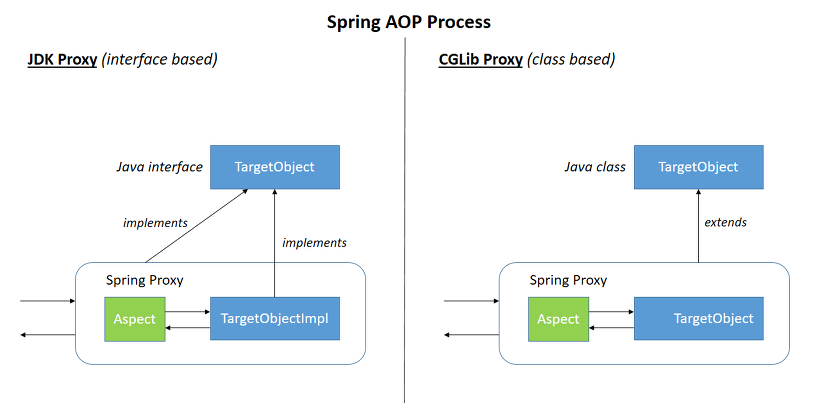
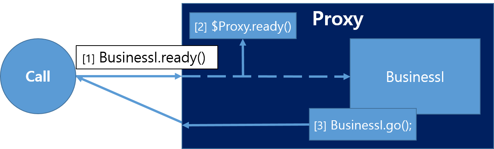

### Proxy

스프링에서는 AOP의 근간이 되는 Proxy라는 기능을 제공한다. 이는 실제 타겟의 기능을 대신 수행하면서 기능을 확장하거나 추가하는 객체를 의미한다. (OCP, DIP 활용한 설계 패턴인 Proxy Pattern과 유사하다.)

Proxy객체는 Runtime Weaving으로 Target 객체를 새로운 Proxied 객체로 생성하고, AOP를 적용한다. 이 때 Spring에서 제공하는 AOP Proxy에는 두 가지 방식이 바로 JDK Dynamic과 CGlib이다.

### JDK Dynamic

- 인터페이스 구현방식
- rflection 사용

구현체는 반드시 인터페이스 구현해야하며 @Autowired를 통해 생성된 Proxy Bean 사용을 위해선 반드시 인터페이스 타입으로 지정해야 한다.

### CGlib

- 클래스 상속방식
- 바이트코드 조작

인터페이스가 아닌 타깃의 클래스에 대해서도 Proxy를 생성한다. 즉 Proxy 사용을 위해 인터페이스를 만들거나 사용할 필요가 없다.

### self-Invocation

같은 클래스 내의 @Transactional 함수를 호출할 때 트랜잭션이 적용되지 않는 상황은 self-invocation의 대표적인 예시이다. 그리고 이런 self-invocation이 발생하는 이유가 proxy 메커니즘에 있다.

외부에서의 메서드 호출은 Spring AOP가 생성한 프록시 객체를 참조한다. 그리고 이 때 해당 메서드의 Point Cut을 비교하여 정해진 Advice를 수행하게 된다. 주의해야할 점은 프록시를 통한 요청으로 Target Object에 일단 도달했다면, 그 이후 동작에서는 this를 통해 자기 자신을 호출할 수 있다는 것이다.

this를 이용한다면 내부 함수를 호출할 때 Proxy를 거치지 않게 되고, 이는 Advice가 그 사이에 실행될 수 없는 이유이기도 하다. (위 그림에서의 `go()`)

**해결 방법?**

다양한 방법이 있지만 가장 대중적인 해결법은 AspectJ Weaving을 이용하는 것이다. (그러나 나의 경우는 self invocation 자체를 없애는 방향으로 처리한다.)

[https://gmoon92.github.io/spring/aop/2019/04/01/spring-aop-mechanism-with-self-invocation.html](https://gmoon92.github.io/spring/aop/2019/04/01/spring-aop-mechanism-with-self-invocation.html)
