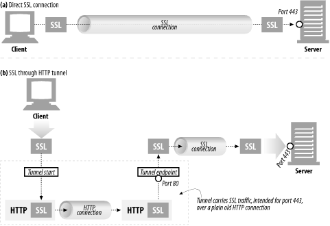

# 8. 통합점: 게이트웨이, 터널, 릴레이

이 장에서는 여러 종류의 리소스에 접근하고, 다른 프로토콜이나 애플리케이션 간의 통신에 HTTP가 어떻게 쓰이는지 알아본다.

## 8.1 게이트웨이

게이트웨이는 리소스와 애플리케이션을 연결하는 역할을 한다. 이는 HTTP 트래픽을 다른 프로토콜로 자동으로 변환하여, HTTP 클라이언트가 다른 프로토콜을 알 필요 없이 서버에 접속할 수 있게 한다.

### 8.1.1 클라이언트 측 게이트웨이와 서버 측 게이트웨이

게이트웨이는 클라이언트 측 프로토콜과 서버 측 프로토콜을 빗금으로 구분해 기술한다.

## 8.2 프로토콜 게이트웨이

게이트웨이에도 HTTP 트래픽을 바로 보낼 수 있다. 브라우저에 명시적으로 게이트웨이를 설정하여 트래픽이 게이트웨이를 거쳐가게 하거나, 게이트웨이를 리버스 프록시로 설정할 수 있다.

이렇게 하면 일반적인 HTTP 트래픽은 원 서버로 바로 보내지만, 특정 프로토콜을 포함한 요청은 게이트웨이를 통하게 된다. 게이트웨이는 클라이언트 측의 요청을 변환해서 처리한 뒤 그 결과를 HTTP로 전송한다.

### 8.2.1 HTTP/\*: 서버 측 웹 게이트웨이

클라이언트로부터 HTTP요청이 원 서버의 영역으로 들어오는 시점에 HTTP 요청을 외래 프로토콜로 전환한다.

### 8.2.2 HTTP/HTTPS: 서버 측 보안 게이트웨이

모든 웹 요청을 암호화함으로써 개인정보 보호와 보안을 제공한다. 클라이언트는 일반 HTTP를 사용해 웹을 탐색할 수 있지만, 게이트웨이는 자동으로 사용자의 모든 세션을 암호화한다.

### 8.2.3 HTTPS/HTTP: 클라이언트 측 보안 가속 게이트웨이

- 웹 서버의 앞단에서 인터셉트 게이트웨이나 리버스 프록시 역할을 한다.
- HTTPS 트래픽을 받아서 복호화하고, 웹 서버로 보낼 일반 HTTP 요청을 만든다.
- 원 서버보다 효율적으로 복호화하여 부하를 줄여주기도 하지만, 네트워크 안전성을 꼭 확인해야한다.

## 8.3 리소스 게이트웨이

애플리케이션 서버는 게이트웨이의 가장 일반적인 형태로, HTTP를 통해 클라이언트와 통신하고 서버 측에 있는 애플리케이션 프로그램에 연결하는 서버 측 게이트웨이다. 이는 API를 통해 서버에서 동작하는 애플리케이션에 요청을 전달한다.

### 8.3.1 공용 게이트웨이 인터페이스

- ~~CGI는 가장 오래되고 널리 쓰이는 웹 서버가 사용하는 표준화된 인터페이스 집합이다.~~
- CGI 애플리케이션이 서버와 분리되며 다양한 언어로 구현할 수 있게 되었다.
- 거의 모든 HTTP 서버가 지원한다.
- 서버와 CGI 애플리케이션 간의 처리 단계를 감춘다.

인터페이스는 확장으로부터 서버를 보호한다는 장점이 있지만, 모든 CGI 요청마다 새로운 프로세스를 생성하는 등 분리로 인한 성능 비용이 생긴다는 단점이 있다. → Fast CGI가 등장하며 거의 해결

### 8.3.2 서버 확장 API

서버 확장 API는 프로그래머가 자신의 코드를 서버에 연결하거나, 서버 컴포넌트를 자신이 만든 것으로 교체할 수 있게 한다. 이를 통해 웹 개발자는 서버 자체의 동작을 바꾸거나 처리 능력을 올리는 등의 목적을 달성할 수 있다.

## 8.4 애플리케이션 인터페이스와 웹 서비스

애플리케이션을 연결하며 생기는 까다로운 이슈 중 하나는, 데이터를 교환하려는 애플리케이션 사이에 프로토콜 인터페이스를 맞추는 일이다. 웹 서비스는 애플리케이션이 정보를 공유하는데 사용하는 메커니즘을 의미한다. 이는 HTTP같은 표준 웹 기술 위에서 개발한다.

## 8.5 터널

웹 터널은 HTTP 프로토콜을 지원하지 않는 애플리케이션에 HTTP 애플리케이션을 사용해 접근하는 방법을 제공한다. 이를 사용하면 HTTP 커넥션을 통해서 HTTP가 아닌 트래픽을 전송할 수 있고, 다른 프로토콜을 HTTP 위에 올릴 수 있다. 이는 터널을 사용하는 가장 일반적인 이유이기도 하다.

ex) ssh 22 포트만 열려있는 경우 HTTP를 사용해야한다면? 터널을 통해 우회 → 책에서는 HTTP 위주로 설명

### 8.5.1 CONNECT로 HTTP 터널 커넥션 맺기

웹 터널은 HTTP의 CONNECT 메서드를 이용해 커넥션을 맺는다. CONNECT 메서드는 터널 게이트웨이가 임의의 목적 서버와 포트에 TCP 커넥션을 맺고 클라이언트와 서버 간 오가는 데이터를 무조건 전달하기를 요청한다.

### 8.5.2 데이터 터널링, 시간, 커넥션 관리

- 터널을 통해 전달되는 데이터는 패킷 순서나 흐름에 대한 어떤 가정도 할 수 없다.
- 게이트웨이는 커넥션이 맺어지는대로 헤더를 포함해 읽어들인 모든 데이터를 서버에 전송해야 한다.
- 터널의 양 끝단에서 커넥션이 끊어지면, 끊어진 곳으로부터 온 데이터는 반대편으로 전달된다. 이후 반대편의 커넥션은 끊어진다.

### 8.5.3 SSL 터널링

웹 터널은 방화벽을 통해 암호화된 SSL 트래픽을 전달하려고 개발되었다. 터널을 사용하면 SSL 트래픽을 HTTP 커넥션으로 전송하여 80 포트의 HTTP만읆 허용하는 방화벽을 통과시킬 수 있다. HTTP 메시지에는 암호화된 raw 데이터를 담고, 일반 HTTP 채널을 통해 데이터를 전송한다.

### 8.5.4 SSL 터널링 vs HTTP/HTTPS 게이트웨이

HTTPS는 다른 프로토콜과 같은 방식으로 게이트웨이를 통과할 수 있다.

클라이언트 대신 원격 HTTPS 서버와의 SSL 세션을 시작하는 게이트웨이를 두고, 클라이언트가 수행할 HTTPS 트랜잭션을 게이트웨이가 대신 수행하는 방식이다. 응답은 프록시가 받아서 복호화한 후, 클라이언트로 전송한다. 이는 다음과 같은 단점이 있다.

- 클라이언트-게이트웨이 간 일반 HTTP 커넥션이 맺어짐
- 프록시가 인증을 담당하기 때문에, 원격 서버에 SSL 클라이언트 인증 불가능
- 게이트웨이가 SSL 을 완벽히 지원해야함

이런 상황에서 SSL 터널링을 사용하면 프록시에 SSL을 구현할 필요가 없다. 프록시는 보안에 관여하지 않으며 암호화된 데이터를 그대로 터널링한다.

### 8.5.5 터널 인증

HTTP의 다른 기능들은 터널과 함께 사용할 수 있다.

ex) 프록시 인증 기능을 클라이언트의 터널 사용 권한 검사 용도로 사용

### 8.5.6 터널 보안에 대한 고려사항들

터널 게이트웨이는 통신하고 있는 프로토콜이 터널을 올바른 용도로 사용하는지 검증할 방법이 없다. 터널 오용을 최소화하기 위해 게이트웨이는 **HTTPS 전용포트인 443 같이 잘 알려진 특정 포트만 터널링할 수 있게 허용**해야 한다.

## 8.6 릴레이

HTTP 릴레이는 HTTP 명세를 준수하지 않는 간단한 HTTP 프록시다. 이는 커넥션을 맺기 위한 HTTP 통신 이후, 바이트를 맹목적으로 전달한다. 단순 필터링이나 진단, 콘텐츠 변환 등 간단한 프록시를 구현하는 방식이 유용할 때 사용된다.

하지만 이는 잠재적인 상호 운용 문제를 갖기 때문에 주의해서 배포해야 한다.

**Connection: Keep-Alive에서 발생하는 문제인데, 내용은 dumb proxy와 동일하다.**

- 클라이언트 - 릴레이 - 서버 관계에서 클라이언트/서버는 keep-alive 통신을 하고 있다고 착각하지만, 릴레이는 이를 알아듣지 못한다.
- 클라이언트가 같은 커넥션으로 요청을 보내면 무기한 pending 된다.
